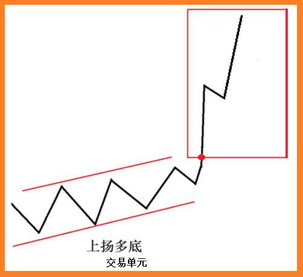

# 【交易蜕变1】世界顶尖外汇交易员成功的真正秘诀

## 前 言

我想很多人都希望跟电影电视里所演的那样，能够成为一名金融交易员，说实在的，现在这个时代，每一个人都可以轻而易举地在外汇市场上进行交易，但是成为一个立于不败之地的外汇交易员的人，那就真的是少之又少了。

众所周知：这个外汇市场当中，80%以上的交易者都是亏损累累。到底问题是出在哪里呢？到底世界上那些顶尖的交易员和我们一般的交易者的差别又是什么呢？这便是今天这份礼物，我将分享的主题。

当你了解认识外汇交易之后，你可能会对外汇交易又爱又恨！那么，我们爱它什么呢？爱它是因为，外汇交易确实可以给我们赚钱，而且外汇市场是一个很自由的市场。恨它什么呢？你会发觉起初都会赚钱，好像都有赚过钱。但是交易到最后吧，你都会发觉什么都没了，好不容易赚来的钱全都亏完了。

不知道作为一个外汇交易者的你，有没有思考过：外汇交易的利与弊到底何在？到底是什么原因导致这些外汇交易者会亏损累累呢？还有，既然80%人是亏钱的，换句话说有20%的人是赢家，那么：赢家到底是怎么做到的？怎么样能够成为赢家呢？

我们所知道的，世界上那1%的顶尖对冲基金经理，如此的成功，那么：他们是怎么成为一个终极的赢家？他们怎么样能够立于不败之地？经过了几十年的交易，他们仍然有那么好的交易成果，到底是什么原因？

为了揭开这些大家最迫切想知道的答案：接下来我将围绕以下几个主干来展开分享：

l 什么是外汇交易者成长的必经之路？

l 外汇交易的利与弊到底是什么？

l 外汇交易的风险到底在哪里？

l 为什么80%以上的外汇交易者亏损累累？

l 如何成为外汇交易者终极赢家？

l 世界顶级基金经理的长胜秘诀是什么？

## 一、外汇交易者成长的必经之路

提到外汇交易，我想每个人都期望我们能够成为赢家。但是说实在的，成为赢家绝对不是一两天的事情，这是一个成长的过程，想要在外汇里面成为赢家，任何人都一定会经历以下五个过程：

**第一个过程：无意识不胜任**

我们刚刚接触了外汇交易，我们非常的兴奋、非常的开心，我们以为找到了一个能够致富的捷径！希望能够在外汇交易里面成功，当我们接触的时候以为我们懂，其实我们不懂！但我们不知道自己不懂，所以我们就很兴奋的复盘和看图表，或者是去上一些课程，学习一些所谓的交易理论之后，我们就投入在了外汇市场。在外汇市场里面，可能你开始的时候也赚了一些钱，但是到后来你发觉怎么我赚的钱都没了，还要倒亏，究竟是什么原因？你会在那里暗自神伤，你搞不清到底是什么原因，这就是第一个过程，我们叫做无意识不胜任。

**第二个过程：有意识不胜任**

到这个时候了，你就会开始知道，唉，原来有很多东西我不懂，所以我才会亏钱，你就会有意识的知道自己不懂，这个时候你会怎么样？知道自己不懂了，那你就去找方法，你就会上网找资料看或者去看一看哪里有好的老师，希望这些老师能够把他们的智慧、知识、交易方式和他们的策略都能够教给你。然后呢，好让你能够成为一个屹立不倒的赢家！但是结果，你还是不能很好的交易。

感觉很多人就是在不断徘徊在这个阶段，我自己也曾经经历过这个阶段，有80%的人，在这个阶段就了结他们的交易之路。为什么会这样呢？因为，要找个好的老师真的不容易。这些都是我之前的学生在跟我学习之前向我倾诉的真相，真的非常有感受。你不断的找，不断的去找，会发觉到最后，上课那么多却还是在亏钱。很多人就是在这里不断地打转、不断地打转，到最后还是没有办法突破。只有非常非常少数的人，他们有这样的福气，能够再上一层楼，能够真正遇到好的老师，而这个老师又愿意真的把他的智慧传授给他们。这个阶段的大多数人都怕了，或者变得很麻木，或者边拜师边悟道，尤其在选择老师时，有了自己的一些主见。

**第三个过程：觉醒时刻**

在某个特定时刻，你会经历觉醒时刻，你开始意识到，成功的交易，**归根到底是要有正确的金融交易思维模式**。你开始了解到，任何人都无法预判市场，赚钱是基于一系列有规则的交易，有赢有亏，而不是单笔交易。这个时候，你渴望稳定，开始敬畏市场，你深刻地明白什么才是你努力的方向，什么才是你要学习的对象，可能你正在寻找一位真正的良师益友。

**第四个过程：有意识胜任**

跟着老师的步伐和方法去做，你开始坚守和耐心地测试你的交易系统，快速止损，让盈利增长，并开始根据系统提示进出交易，不去考虑情绪。不断的，你会发觉，哦，原来我以前犯这样那样的错误！哦，原来什么东西是可为的，什么东西是不可为的！这个时候你开始有意识地去掌握这个交易的能力，然后呢？会根据系统指示进行交易，会更好地应对亏损的交易，因为对你的交易系统有信心，相信随着时间推移，一定能盈利，你现在知道了严格执行和资金管理策略，你开始慢慢的勾勒自己的资金曲线，而不是试图一夜暴富。

**第五个过程：潜意识胜任**

你跟着老师或者自己不断的去操作、去验证，一段时间之后，交易的能力慢慢的就变成了你的潜意识，什么时候干什么事，你都不需要去准备和思考就做了，就像困了睡觉、饿了吃饭那样自如，对于行情的变化，你能够掌握自如，你完全可以成为一个非常稳定，非常有能力的一个交易员。

## 二、外汇交易的利与弊：水能载舟，亦能覆舟。

首先，我们来静静的思考一下：外汇的利与弊，到底是在哪？我们常听到这个成语：水能载舟，亦能覆舟！这个词语就可以很好的描述外汇交易的利与弊，我们来继续分享。一讲到外汇，很多人都觉得外汇风险非常高，外汇是很可怕的投资项目，尤其是有亏过很多钱或者听说过很多人亏钱的话，你就更加认为这是个非常可怕的投资！但是我希望拿到这份礼物的朋友，一定要独立思考，所谓的风险高，到底高在哪里？不要人云亦云，鹦鹉学舌。

**外汇交易利弊之一：充裕的流动性导致长线不容易被操控，但短线交易容易被操控。**

外汇交易有没有优势的地方呢？是有的，外汇的优势之一是流动性（热钱）非常的充裕，每天的交易量，我是说每一天哦，不是一个月也不是一年呢！每天的交易量大概是六兆到八兆美元，比起全球最大的纽约股市还要大出七八十倍，这个是非常非常大的一个市场，流动性非常充裕的好处是什么呢？就是这个市场不容易被操控，因为市场越小的话，就越容易被操控。市场庞大的话，它是不容易被操控的，我是说不容易，不是说不会被操控，短线的交易还是会被操控的。如果你有玩一些短线，比如说一分钟图表，五分钟图表，每天频繁的进进出出的话，说实在的，你都会受到市场操控的影响。所以做短线交易，这个方面一定要真正了解，那些金融财团到底是如何短线操控市场的，我将在第三天的礼物中为你分享。

**外汇交易利弊之二：交易非常简单，但成为投机赢家并不容易。**

外汇比较起其他的交易品种，外汇其实是蛮简单的一种交易方式，只需要下载软件，开户入金，你就可以参与其中。这就是我开头时说过的，成为一个交易者非常容易，可是简单并不代表是容易，外汇交易非常简单，可是要成为一个真正的赢家，也不是这么容易。

**外汇交易的利弊之三：外汇可以双向交易，但交易方向不好把握。**

大家如果有玩股票的话，大部分股票是不能够卖空的，换句话说，只有价格上涨，你才有机会赚钱。可是外汇是双向交易，比如某个货币价格要上涨你可以做多头，方向对你可以赚钱。如果你认为某个货币可能会下跌，那你可以把它卖空，所以它是两个方向都可以赚钱。但是这又带来一个问题，那就是我到底是买，还是卖呢？行情是要上涨还是要下跌呢？很多交易者，在方向上把握不好，很容易做反，市面上很多概率论的兜售者，竟然鼓吹用硬币就可以交易，但是他没有告诉你，实际上资金管理策略的应用，才能证明硬币的厉害，这个资金管理也是交易者远离爆仓的关键所在，我将在第五天的礼物中和盘托出！

**外汇交易的利弊之四：你可以用杠杆撬动财富，也可以被杠杆打得血本无归**。

外汇的另外一个优势，那就是提供杠杆。大家知道，杠杆是能够让我们用很少的钱做很多钱合约的一个方式，但是**高杠杆它是一把双面刃，如果你懂得操控，懂的运用杠杆，就能够加速你致富的速度。如果你滥用杠杆的话，也可以导致你在交易中瞬间蒙受巨大亏损。**

## 三、与股票相比，外汇的风险性到底如何？

外汇和股票来比较的话，外汇交易的风险要比股票交易来得低。我这样说可能很多人都不认同，呵呵，很多人认为外汇的风险高得很呢，怎么可能外汇的风险会低于股票呢？你接下来看的这个分享，你会比较能够理解为什么我会这么说。

为什么说外汇的风险会低于股票呢？我们先取一个例子，比如说如果你要买进一支股票，合约价值10万美元，你投入的资金就是10万美元。但如果你去交易一个外汇的10万美元的合约（大部分的经纪商给你的杠杆一般都可以是100倍、200倍、400倍），假设外汇平台给你100倍杠杆，那你只需要1000元的资金投入就可以交易一个10万美元的合约。

这听起来非常吸引人，尤其是对那些资金不多的人。在股票市场投入10万美元，假设你赚了10%，也就是1万美元，对不对？你的收益率就是10%。可是外汇里面不同啊，因为你动用的本金才1000元，1000块的资金你赚了10万美元合约的10%，也就是赚了1万块，那么你的回报率是1000%对吧？

如果是亏损呢？在股市亏10%，那就是亏了1万美元，你可能会想，没关系啊，我还有价值9万美元的股票，现在反正不等着钱用，继续拿着等股票涨起来，可能三五年就能扭亏为盈，但是你的资金利用率就降低了很多，而且还有可能继续亏损下去。而在外汇市场里面，你这个10万美元的合约，因为你投入的资金只有1000美元，那么最多也就是亏1%就爆仓了。

可是即使这样，你可能会想，股票和外汇的风险应该是相等的啊？为什么说外汇的风险反而比较低呢？很简单，请问你投资股票是不是投资一家公司？你可能相信这家公司他们的管理层能够把这家公司的股票价值增加，能够做出更好的业绩，所以投资了这家公司。那我想请问各位，这家公司有没有可能倒闭呢？有没有可能很长时间都没有改善经营呢？有炒股经验的人，都知道这样的情况其实比比皆是。

可是外汇呢，我们投资的不是公司，外汇是现金的交易，现金是由谁来发行的呢？就是各个强大的国家政府！我们玩的都是一些比较大的经济体的货币，比如说美元、欧元、澳元，英镑这类的，你拿着现金，拿着美金，拿着澳币，相信你去哪里这些货币都是好用的，都是受欢迎的。这类国家经济还是比较扎实的，那么这些国家倒闭的概率和那些公司倒闭的概率，哪个来的更低呢？是不是国家倒闭的概率要低很多很多，对吧！而且，如果公司倒闭的话，你的股票就完全没有价值了，就是一张废纸。

在上面的举例当中，我们看到，外汇交易时，在100倍杠杆的作用下，1000美元就可以交易10万美元的合约，只波动10%，就可以赚1万美元，收益率高达1000%。这些数字听起来非常诱人，尤其是对于那些资金少，又想做投资赚钱的人。读到这里，你会觉得，外汇交易真的是太好了，很多人在外汇市场里面，会被这种美好完全迷惑，甚至有的人会告诉你，hi，你来参加我的课，甚至很多经纪商免费举办公开课，他们宣传学了我的XX策略或者用了我的EA后，可以在短短的几个月里，你就可以把你1000的美金，变成7万、10万，回报率将会是1000%—2000%或者更高！

这种夸张的说法，这种过度的营销，是目前市场里存在的普遍现象，这个其实很多人都应该知道，我就不过多的阐述了。而且那些新闻媒体，天天在如此宣传，而且刻意强化，为什么？不言而喻。

这些人夸张得很厉害，如果他真的能够帮助你长期都能够像这样赚一千倍两千倍收益率的话，说实在，我想第一个去找他的一定是国家级银行、大的投行或者是华尔街的对冲基金，对不对？如果他每个月这样子，利上加利交易下去的话，他在短短的三五年就已经是全世界的首富，但是很不幸的，在这个市场里面，很多人就是被这种误导性的宣传迷惑着。他们都告诉你很美好的一面，那么我们就要思考了，外汇里面为什么会有90%以上的人都是亏钱的？这究竟是为什么呢？

这是因为，人们在低成本、高收益的迷惑下，忽略了外汇保证金交易的最本质的东西：杠杆和波动率的关系，这就是那些外汇交易赢家掌握的最核心的秘密之一！很多人在外汇交易里面之所以亏损甚至爆仓，不是因为外汇本身的性质，而是因为大部分人，他们不懂得运用杠杆，他们过多的滥用杠杆，而导致他们的账户会爆仓，这个才是主要的关键。所以你看很多人说外汇风险非常高，**其实外汇的风险高在哪里？高在你用很少的资金，可是你却去玩很大的合约，外汇的风险在于杠杆的滥用。**所以实际上如果你真正了解外汇本质的话，而且你又不会乱用杠杆，懂得怎样很好的运用，我们通过对比可以看到，外汇保证金交易比较股票交易来讲，其实是更加安全的投资项目。

## 四、为什么90%以上的外汇交易者亏损累累？

我们做投资，因为我们都知道，投资是累积财富的捷径，不管你今天是做自己的事业，还是有自己的生意，都不影响你进行投资，世界上的有钱人他们都一定会做投资，因为毕竟钱赚钱是最轻松的一种方式。可是真的无可否认，在投资的领域里面，现实的状况是，大多数人都是亏损累累，只有非常少数的人是赢家。

**交易者的现实状况之一：良师难寻**

我们一进入外汇市场，了解到这么好的投资项目后，就很兴奋地看盘、看图表，我们就开始交易，亏钱之后我们就去怎么样呢？我们就去上课吗？开始学习各种指标技术，找各种系统各种方法和策略，可是呢，很抱歉的跟你分享一个现实的状况，**课程越多，输的人越多，上课越多，亏得越多！找到一个真正的导师，愿意带着你成长，真的很不容易。真正好的课程只需要上一次就可以了！** 很多人上课学了很多无法落地的知识，结果知识还是知识，当你到真正面对市场的时候你会发觉，是有赚钱的，起初都有赚钱，但到最后都亏掉。如果我们投资没有赚过钱的话，那就还好，至少这样你就不会上瘾，对不对？就是因为你有赚过钱才会上瘾，这也是很多人之所以痴迷外汇交易的很大原因之一。

**交易者的现实状况之二：孤单地行走在错误的方向**

在投资的这个道路上，你有没有发觉有时候是很孤单的一件事情？我们大家做交易，一切的东西都是自己的决定，我要买多还是要卖空都是我自己的决定，对了也是我自己的决定，错了也是我自己的决定！对了倒没什么关系，但是错了你知道多难过吗？我都不懂自己错在哪里？所以这个时候，如果有经验丰富的人来拉你一把，那你是不是会走得比较顺畅？这个是非常重要的一种观念，希望你能够了解。

**交易者的现实状况之三：一群聪明的人沉迷在指标的“地狱”**

那在外汇的这个市场里面，很多输钱的人，会觉得是因为他们的知识不够丰富，很多人会觉得这90%以上亏损累累的人是因为他们的智商不够高，IQ不够高啊！其实都不是。你说他们不了解指标吗？他们都懂的。他们不了解图表吗？他们了如指掌。我也曾经是这样子，我在过去在机构做，开始的时候，不断的在追求不同的指标，不同的图表，当我运用某一个指标运用了一段时间，起初赚钱后来不赚了，我就会想，可能是最近行情太诡异，不好操作所以才亏钱，或者是这个指标不行。所以我就去试试其他的，我又加入了其他的指标，结果越试越多，堆满了屏幕，整个mt4上都是指标。到最后，到底哪一个才是对的，自己都搞不清楚！所以说，指标绝对不是那个能够让我们成为赢家的关键！

很多朋友参加过无数的课程，尝试过无数的系统，无数的交易策略，追随过无数的大师，甚至有很多EA系统。说实在的，如果这种EA系统，真的可以帮我们自动赚钱的话，世界上没有人需要工作了，你认同吗？

**五、如何成为赢家？——正确认知，把握方向！**

到底赢家跟输家，它们的差异是在哪里呢？它们的差别在哪里呢？今天在看这篇文章的你，很期望我能够为你分享我在用什么策略对吗？你或许很希望我能够跟你分享，我在用什么指标？在用什么图表对吗？

我可以很坦诚跟大家分享：指标、图表、系统，统统都不是决定你成为赢家的关键因素，以前我也是不断的在找最完美的东西，因为：**你的成功，5%是在于知识层面、技术层面、指标和图表，他们只占5%，95%是什么？是你怎么样能够战胜你自己！如果你不能够战胜你自己的话，还没有开始，你就已经注定是输的了！那你不如不要玩好了。**

当你听到这句话的时候，我想你还不是很服气，难道知识不重要吗？难道过去学的东西都是浪费的吗？难道都用不上吗？今天由于你我有缘，用文字的形式交流，我不妨直接点明：赢家和输家，不在于他们的知识和指标，有两个**非常重要的关键点：认知和方向，**到底你对外汇交易持着怎么样的观点和认知？你到底了解外汇交易的本质吗？如果你不了解的话，还没开始，你已经是注定一定是亏了。

那么什么是认知呢？你没有发觉赢家和输家，其实他们的观点是截然不同，很简单的例子：你站在广州塔的塔尖，放眼望下去，整个广州城是不是很漂亮？你看到非常美的景色，可是如果你站在底层呢？你能够看到同样的景色吗？看到的东西一定会有差异的，对不对？

我的意思就是说，我们并不是说输家他们都是错的，或者是我们才是对的，我们不是这个意思，重点是你要明白，那些5%成功的投资者，跟95%的一般交易者，他们的观点和他们的做法，完全是背道而驰的。如果他们的观点是一样的话，那结果应该是相同啊！可是为什么结果会不同呢？或者是他们用的策略不同吗？还是在于他们的观点完全是相反？好，那么看一看，赢家对外汇的观点，到底跟输家有什么不同？

**外汇的本质之一：充满变数，赢家不做预测，输家试图预测。**

首先，汇率波动是一个怎么样的特点？它是一种充满变数的东西：不可预测！大家认同吗？你能够推测下一分钟美元是涨还是跌吗？我们没有办法预测，没有人可以预测！ 95%的输家他们是怎么样呢？他们尝试去预测，你在交易的时候，有没有去看一些财经电视频道，老去听一下那些个专家的预测？到底我们的股票会怎么样啊？汇市会怎么样？美元会怎么样？欧元会怎么样？澳元会怎么样？我想很多人都有去上网看一些帖子，看一些博客和评论，或者是去看一些相关的电视节目对吗？你看这些东西的目的是什么呢？你希望听到了一些消息之后，然后你去做出一些预测，对不对？你预测明天市场是上还是下，你有没有去看指标有没有去看图表？你看图表的时候你的目的是什么？你要去预测？你预测到底明天美元是上还是下？不断看图表不断分析，你是不是天天在做许多的预测？**可是你有没有发觉？不管你怎么预测，你总是只有50%是对的，甚至有的时候还达不到50%！**

我时常给我的学生讲，你们预测什么？不需要预测了，你有没有硬币？拿个硬币出来丢一丢，字的话，那你就多头，花的话，你就空头。那你总有50%是对的吧！市场不是上就是下嘛，不需要做预测！赢家他们是怎么做的？他们是从来不做预测，那你就会觉得很奇怪，你说我不做预测的话，那怎么样玩啊？总会有一些方法吧？随着你挑战的深入，你将会寻找到你想要的答案。

**外汇的本质之二：外汇保证金是负和游戏，赢家冷静狙击，输家疯狂扫射。**

在整个投资领域里面最公平的就是零和游戏，零和游戏就比如说，我跟一位A君当面打1000块，赌美元指数今天的走势，我认为美元会上涨，A君认为是美元会下跌，所以我们一个做多，一个做空，结果可能就是美元真的下跌了，那我就输了1000块，A君就赚了1000块，我把钱交给A君，这个叫做零和游戏。

可是在外汇市场不是这样的零和游戏，外汇是一种负和游戏，为什么呢？因为我们中间有一个经纪商啊！我们必须要用经纪商提供的平台来做交易？我们交易都要通过经纪商，所以你会觉很奇怪，怎么我们两个人玩，A君和我打赌，我买美元上涨，他卖美元下跌，可是到最后我们两个人都亏钱，到底我们亏在哪里？你可以思考一下。

我再举一个简单的例子，关于负和游戏的，你可能有去出国旅游的一些经验，比如说你现在要准备到美国去旅游，那你会拿着你的人民币，然后去银行兑换美金。10万块的人民币兑换了美金，那你拿了这个美金之后，你临时有事去不了了，那么你就要把这个美金，卖回给银行或者兑换商，然后你又换回人民币。请问你还能够换回你原来10万块人民币吗？可能你只换回9万多了，如果买价和卖价两个的价位完全不变，你这样子一买一卖三十次的话，你的10万块人民币，到最后只剩下6万块，你的4万块去了哪里？你的4万块已经到银行或者兑换商的口袋里面咯。这就是负和游戏！**所以你看，很多外汇交易者输在哪里？输在交易频率，非常的频繁！**

我想95%的人在这个交易市场里面都是玩短线，可能是一天两天三天，甚至有一些呢，更可怕的就是玩那种叫做抢帽子或者拨头皮，也就是在1分钟图或5分钟图，这种小周期图表里不断进进出出，那么赢家是怎么样？赢家是做波段交易，就像一个冷静的狙击手，猎物来了，才会伺机而动，而且收获颇丰。

接下来跟你分享一个故事，你就会更加了解状况。我曾经认识一个做外汇交易的朋友，他是专门玩那种抓头皮的，就是他专看一分钟图，一分钟进去，两三点三五点他就走，可是那个止损的时候他又不愿意止损。我这个朋友他每天早上8点都会像上班一样很准时的坐在电脑前面，然后就一直这样做交易（所谓的刷单），一直到晚上8点，交易12个小时，你可以想象一下，这跟进赌场有什么区别吗？对不对？你去赌场，你坐在赌桌上面，四个小时下来，你有没有算过你到底赌了多少次？我相信是很多吧！这个朋友就是这样，她一天交易的次数大概是两百次，就是这样子不断的进出市场，跟赌博没有差别，这种交易的成本比实际去赌场大多了，现在去澳门的话，只需要花一些路费就好了。

我们就不讲这种极端的交易者了，我们就讲一些比较理性一点的交易者，假设你一天进出市场10次好不好，假设我们每一次交易做5手，每手的话你就给两个点差好了！两个点的点差，其实是很少的对吗？好了，一天交易十次，每次两点的点差，换句话说你一天就给这个经纪商赚了100点，也就是如果我们用迷你账户的话，大家知道迷你手合约就是1万块的合约价值，那波动1个点的话就是等于1块钱美金，一天十次5手，他每次点差两点，你就给了100块美金给这个经纪商。好了，100美金1天，一个月我们有二十个交易日，换句话说一个月我们就已经缴了2000美金服务费给我们的经纪商了，不知不觉的，你是完全没有感觉到的，那一年有十二个月哦，在座各位，你在不知不觉当中，经纪商已经赚了你24000美金的佣金了！你完全不知道呢。

刚刚开始外汇交易的时候，我就是这样玩，完全不知道，原来这个数字可以去到这么大！在建立自己的交易系统的过程中，经过我认真的计算、统计后才知道，哎哟！难怪我以前输的这么惨，我把我以前的交易记录全部拿出来，来计算我真正的亏损是多少？我才发觉，原来我亏得不多，我全亏在佣金上啦！

很多人不了解，以为才这么一点点，2个点嘛，没什么了不起，两块钱美金能有多少呢，可是真的不知不觉你就发觉那一年24000美金。请问你等于人民币多少呢？将近15万人民币了！如果你不是玩这个小迷你的账户呢！如果你玩的是标准的账户呢？那一个合约十万块的话，换句话说是十倍哦，那你就不是15万人民币了。交给这个经纪商的是150万人民币。

再比如说，你现在放了一个10万美金的资金进去，一年之后给你赚了100%，你赚了10万美金，ok其实你知道吗？你不是赚10万美金，其实你是赚了多少？你实际上是赚了34万美金！但是搞不好，如果你输了5万美金呢？你看，如果没有内行人点出来的话，我们就不断的去做剥头皮交易，你交易的越多，到最后都是亏的，所以这个就是你必须要认清，这是一个负和游戏，不要去做频繁的交易。

**外汇的本质之三：止损位是用来被打的，赢家盘面外止损，输家盘面上死守。**

我们中很多人都喜欢玩每日的高低价，就是所谓的抄底摸顶技术！他们把每日高低价当做一个交易的机会，那在座各位你有没有发觉，你在玩的时候，你是不是会放一个止损点？你有没有发觉每次你放的止损点，比如说你现在是做欧美的空头，好了你放了止损点，你会发觉往往那个价位总是来到你的止损点，把你吃掉，然后又回到你原本交易的那个方向上去了！

你有没有发觉这样，你是很奇怪，好像有人在看着我的止损点，总是给他打到，之后呢他又回到我的那个方向。有时候真的很难过，你知道吗？你会觉得很沮丧，为什么我明明是对的，我就是给他止损了，你就会很不甘心！

真的是有人在看着你的止损点吗？你知道吗？我们现在用电脑，我们每天是用电子盘来做交易，用电子盘交易的话，某个与你对赌的经纪商，他在计算机前面，他只要按一个按钮，他就已经知道下面有多少个止损点，上面有多少个止损点，他只要在那个短线的短短的时间里面动一动那个价位，你们的止损点全都中。然后你会发觉止损之后，那个价位又回到原来的那个位置，你有没有过这种经历？

所以你看我们每天就是玩这种东西，哪里会不输呢！我的做法是怎么样？我们的交易是不放止损的，或者放止损也只是为了防止忘记，短时间的放着，当你听到这个时候，你会觉得好可怕！交易不放止损点那一旦错的话整个账户不就都爆仓了吗？这一点留给看礼物的你去实践，反正真相我已经完全告诉你了，**可是我们要知道我们的止损位置在哪里？所谓止损在心中，说的就是这层含义！**这个事很重要，现在我们都知道了，短线操作中的高低价位都是假象，不值得我们去坚守。

**外汇的本质之四：趋势就是机会，赢家耐心持有，输家想赢怕输。**

很多人都知道，趋势就是机会，95%的人怎么样呢？他们都没有能够好好地享用，一般短线交易者是怎么样的？在一个上升的波段趋势里，我们可能从底部就进场了，一直能够持仓到阶段高的顶部才离场吗？有多少人能够做得到？十之八九都不会呀！**95%的人都是进场赚一点点就走了，赚一点点就走，赚一点点就走，对不对？**所以看赢家和输家的差别在哪里：赢家的话，他说，如果我错的话，我会很快的离场，我会很快的止损，可是只要我对一次的话，我就可以赚回我十次的亏损，这才是赢家的做法。就是说你不要给我对一次，我只要对一次就够了，我过去十次的亏我都可以赚回来。可是大部分人怎么样呢？我们赚，赚一点点，但我们做错了，需要我们止损的时候，我们不愿意。我们可以赚十次，但是一次两次亏损就可以把我们赚的全都亏光了，这就是赢家和输家最大的区别！所以赢家善于利用趋势的机会，如果大的趋势不来，我就是岿然不动，进场之后，我就是等，就是什么都不做，哈，这个才是真正赢家的样子，赢的方式。

**外汇的本质之五：心理游戏，赢家管理自己，输家管理盘面。**

真正的战场，不在市场里面，真正的战场是在你的心里面。这个完全是个心理游戏，我们赚了一点点，为什么你不能够抓住这个趋势？不能够持仓一直到趋势转变才出来？**因为我们怕，我们怕把自己赚的东西又亏回去了！**说实在就是我们不敢去赚，所以呢，这个完全是一种心理的游戏，他不是IQ的游戏，不是智商的游戏。95%的人他们是怎么样？他们把焦点放在哪里呢？放在系统层面，放在技术层面，我怎样能够改进我的系统？我怎样改进我的参数。比如说20均线不好用了，我改22，我改25或30均线，不断的在那里打转转。各位，我们必须要接受一个事实：在这个世界上，没有完美的系统，大家认同吗？

**世界上只有两种系统，一种是好的系统，一种不好的系统。**

好的系统换句话说，他赚钱比亏钱多。而不好的系统就是他亏的比赚的多。如果你要选择用一个系统之前，你就必须要做很好一个测试，你做足了功课，你测试过后认为这个系统可以了，你放心了，你认为这个系统是可行，那你就信任这个系统吧！

我举个很简单的活生生的例子，比如说你开车子，请问你开车子的时候，制造这个车子的供应商，他已经是测试了，做了很多测试，这个车子是各方面安全才能够上路的对吗？那你买了这部车子，你就要相信他了，你就直接用它就行，对不对？所以同样的车子在路上行驶，为什么有些人会发生意外，有些人会安全，就是驾驶者的态度啊。所以这个很重要，同样在外汇交易里面也是一样啊，你选择了这个系统之后，你就完全的信任他，在接下来输和赢已经不是系统的问题，是谁的问题？是你的问题，一个交易员的问题。

所以，把你的焦点放在管理好自己，不要继续去找那些完美的系统，他说你一生也找不到，因为世界上根本不存在完美的系统，再好的系统，也有亏损的时候。

**把握方向：**

对这个外汇有了正确认知之后，很重要一样东西就是说，我们的方向要对呀！如果方向不对的话，那你再怎么做，你会发觉你还是没有办法取得突破。

方向错了，你做的对，结果还是错。如果是方向对了的话，即使你做的不对，结果还是对的。怎么理解呢？给你们举个简单的例子，比如说你是在上海或者是北京，那你要去深圳，那请问你的方向是不是要往南？你一定要往南飞或者往南方走对不对？好了，那现在呢，你不往南，你反而往东边跑！我现在给你最好的工具，最好的车子，最好的火箭，最好的飞机，你的方向错了，你飞到东方，你再怎么走，你也不可能到达深圳。

可是如果你的方向是对，即使你家交通工具不是很好，你迟早也能够抵达深圳，只是时间的问题，大家认同吗？所以方向非常重要。你作为一个交易员，如果你方向都错了，你再怎么做，你都不可能赢的啦！打到最后还是会亏的。

**那么什么才是终极赢家的正确方向呢？所有的终极赢家都是顺势交易者，他们都会采用自己制定出来的顺势交易系统来做交易。**

如果今天，在外汇交易里面，你还是要走超短线，你还是要剥头皮的话，很抱歉，我很坦诚的跟大家讲一句，或许你今天是赚了一些钱，但迟早你会亏回去的，不如趁早离场比较好！所有的赢家都是顺势交易者，世界上所有顶尖的对冲基金经理，他们都是了不起的顺势交易者，我经常对我的学员们说：“我没有那么厉害，我所教你们的东西不是我发明出来的，我都是向那些非常成功的基金经理学习然后实战摸索出来的。”

我相信接下来这些名单，我想很多在这里的名字可能你都没有看过，也没有听过，包括我过去也没有听过他们的名字，这些都是世界顶尖的对冲基金经理。

其中有一个人可能你会认识，就是John Henry，他是利物浦足球俱乐部的老板，利物浦球队值数亿美金，这么多钱从哪里来，都是从他们的基金管理里面来。再来分享一位，Bill DUNN，他是一位非常成功、非常出色的对冲基金经理，他现在已经退休了。

这个图表是他在1974年成立基金开始的，那么这个基金近40年，如果当时你把1000美元的投资交给他，到2011年的时候你的1000美元就会变成55万美元，增长550倍。在几个月前我再打开看他的记录，这个基金仍然不断在增长，并有新的突破，这些都要公诸于世的交易成果。

你有没有注意到，即使这么成功的基金经理他们有没有亏损期呢？他们也有亏损的时候，重要的是他仍然能够顺利的度过这些个亏损期，这个就很重要。你看他最终的成果，是不是比这个市场的成绩要好很多，要学就学这一种人，这种才是真正的常胜将军，这个才是大家要学习的对象。那这种对冲基金经理他们又拥有什么样的秘密武器，他们能够立于不败之地的关键是在哪里？

## 六、基金经理成功的秘诀

最重要的第一个就是风险管理，换句话说你今天有的资金，你怎么样能够经历即使是亏损期，在你交易不顺畅的时候，你仍然能够保得住自己。

举个很简单的例子，如果做生意你就知道，生意不会说一帆风顺的！在这个做生意领域里面，你经历的越久，就越能够感受得到，一个企业绝对不会说每一年都赚大钱。某些年份可能是不顺利，对不对？所以说，如果你遇到经济不景气的时候，你的企业可能要面对一些挑战，那你这个企业能不能够渡过经济不景气时期，关键点在于哪里？关键点在于你的现金流够不够，如果你的现金流够的话，加上你的管理得当，这个不景气的时期度过之后，你又可以再重新创造另外一个高峰。事业是如此，投资也是如此。

你的风险管理能不能做好这一切，另外就是时机。为什么对冲基金经理他们能够这么成功？为什么他们的表现，他们的成绩能够比市场上的标普500指数高出这么多？高出几十倍，甚至更多，原因在于哪里？因为对冲基金经理他们都懂得怎么样掌握时机，那要等时机的话，最大的挑战在哪里？最大挑战在于耐性！

还有一点，所有成功的基金经理，他们都懂得怎么样写下他的交易计划，我完全知道什么时候进场，什么时候离场。当我进场的时候，根据我的资金应该投入多少，即使我面对暂时的亏损，我也可以不受伤，这一切东西都已经提前先写好了。我写好了我的交易计划，我就等待，时机到了我就动，动了之后我就再等，时机到了，我就出，所以这种才是真正的专业交易员的做法。

除了他们的交易系统之外，我们总结出，**风控、时机、耐性、纪律**，这四个词语是重要的关键点，才是世界顶尖对冲基金经理长胜的秘诀。世界顶尖的对冲基金经理他们是怎么样掌握时机的？他们是怎么去计算时机的？他们是用什么方法和策略来掌控这个时机的？有没有一个公式？

答案是有的，**我将在后面的礼物中揭秘这个公式**，让珍惜这份礼物的朋友，了解到原来风险也是可以量化的！但是请记住，不要等、靠、要，而是自己主动地、独立地去思考，只有开动脑筋，你学到的东西，才是自己的。

当我们掌握了这些基金经理操盘的秘诀之后呢，你就能够真正的达到一个每一个投资者都梦寐以求的结果，就是低风险、高回报。那我们讲高回报的话，到底有多高？你说我们讲合理的平均50%的年回报预期，如果你投入的资金是10万块，平均每年50%的回报，你知道6年之后，你的10万块会变成多少钱吗？你的资金会增长11倍，114万块！你还记得刚才我给你看的那些顶尖的基金经理的成绩吗？1000块，最后变成了五十多六十多万，对不对？所以其实投资是一个长期财富累积的一个方式，绝对不是那种一夜致富的方法。而且我们这种做长期投资还有一点很重要的就是说，我们能够保持心情的平和。

好了，今天的礼物已经奉送完毕，我们明天见，有没有很期待呢？

# 【交易蜕变2】外汇交易者靠什么技术成为赢家？

## 一、波浪理论新解

**1、波浪理论严重的缺陷**

波浪理论从根本上就有很多的严重缺陷，无论是初学者还是精通人士，均未能发现甚至未能解决，但是很多人为了牟取利益，对行情走势蒙对几次之后呢，就开始宣称自己已经掌握了“波浪神功”等等。当然，这些人是不愿意走下神坛来为老百姓解答一下波浪理论的不足之处，应该如何去解决？那么就会导致有一些付费买了他们教程的一些大众，会了一些皮毛，蒙对了几次行情之后，就开始错误的幻觉自己已经“会了！”。其实这种自以为会了，根本就是一厢情愿的想当然！

不论人们如何深入的研究波浪理论，当研究到终点的时候，最终都会被无法量化这一难题给难住。不论研究多么牛，最终都无法走向控制大资金，因为有一个铁铮铮的事实就是，当我们真正去接触大客户的时候，大家会发现这些所谓的大客户，都是人精中的人精。其实他们这些人很多都见多识广，有一些自作聪明的人以为可以蒙住他们，其实是不可能的事情！因为他们非常了解国外运作的对冲基金以及套利套息等模式，这些大金主也非常深知量化带来的巨大优势，所以如果你研究的波浪理论无法量化的话，那么他们是不会重用你的。没有了大资金的支持，任何人都不可能凭空变出巨大的资本来，那么没有了大财团的支持，大家又怎么可能把金融玩转呢？

其实大家来这个市场的目的都很简单，就是为了赚更多的钱，那么对于技术来说呢，我个人认为是越简单越好，复杂的技术不适合人脑去执行，我是一个**交易思维高于一切技术**这个理念的坚定倡导者，技术越简单越好，不要把交易想的过于复杂！所以在这里我希望大家能够按照我的提示，放弃对波浪理论的深入研究，因为这个理论本身确实存在比较多的缺陷。如果大家只是想随便玩玩，或者用所谓的技术来麻痹自己的神经，制造自己是一个波浪大师的假象，那么对于这样想的聪明人，我是无话可说的！

**2、波浪理论严重缺陷的三大致命伤：**

第一点，当你在研究波浪理论的时候，应该都听说过一句话“波浪理论千人千浪”，这句话是很多老前辈都讲过的，在此我也非常认同这句话。**千人千浪正是波浪理论很难被量化的一个重要原因**！在国外几乎所有的对冲基金，套利套息模型，都不会用到波浪理论，因为做过生意的人都明白一个道理，任何产品如果走不出量，都很难赚大钱。因为真正实际控制过大资金的人，都会和一些高级平台和银行打交道，那么国外这些高级平台和银行在跟我们打交道的时候，一般不会太在意你的资金量，这些银行和高级平台更在乎的是你能产生多大的交易量。

金融市场都是逐利的，而且对利益看的非常重，如果你能够把自己的东西量化并且实现很大的交易量，那么他们会对你非常好。如果你没办法量化这些大理论，他们是不喜欢跟你合作的。正是由于这个原因，很多真正见过世面的大客户大金主，几乎没人会投资用波浪理论的团队或公司。只有那些不懂的客户，才会糊里糊涂的投资。但是据我了解，和大客户沟通我发现，这些人有一个共同的特点就是，他们虽然不懂，但他们是极端聪明的，他们明白，你的东西太理论化，没有成型的模型的话，肯定是赚不到大钱的，他们都是生意人，这些道理他们都很清楚。

第二点，该理论过于陈旧，现在的市场已经和过去不一样了，在艾略特那个年代，人们还没有进行智能程序化交易，所以市场绝大多数都是人在交易。而现在完全不一样了，保证金市场已经有至少50%多的交易量，是智能程序化做出来的，大量的对冲基金，套利套息交易多到数不胜数。自从mt4等电子交易平台进入老百姓市场后，k线图的走势就越来越诡异，越来越难于琢磨，不论是均线理论，道氏理论，波浪理论等，这些大理论都变成了大机构智能算法的一颗棋子，被玩弄在掌上而已。

不信的朋友，可以问问真正在华尔街长期工作的人，还有对冲基金控制资金在上亿美金以上的从业人员。目前已经有专门研究大众技术和心理的程序化交易，不论你们的手法是多么独创，只要你研究的技术长期在赚钱，一旦被监控，他们就有办法和你对抗，至于对抗的方式，这里就不多讲，有兴趣的朋友可以跟我们进行深度交流。其实这个世界永远满足28定律，真正明白的人，懂了就懂了，听不懂波浪理论到底有什么严重缺陷的人，最终还是会成为金融市场的小白，账户任人宰割。

第三点，从数学逻辑的角度来说，由于是判断方向的理论，最终概率都会偏向于50%，也就是说从根本上，该理论是属于低概率分析，由于要求内部结构（子浪）较高，更降低了他成功的概率。为了解决这个问题，我认为国内还是有非常不错的研究波浪的人，用大周期、大结构，用时间换结构稳定性的做法，大为改善了波浪理论原始的缺陷。不过，这又导致了一个新的问题，即不论是谁，只要是用波浪理论应用到各个市场里，都避免不了等待机会的时间太长，这个严重的问题！

那么这里给大家举一个例子，就比如说一个人24岁大学毕业，研究好该理论大概需要3-5年时间，这个时候也就是27-30岁左右，由于符合大周期的结构，优质的波浪形态，大概一年有2-3次机会，当然这两三次机会里，大家参与的话，还不一定是赚钱的。那么等于这个人，算他60岁退休的话，大概就只能玩60-90次而已，并且这个期间你一定要满足以下几个情况：一，你的盈利要大于你的亏损；二，你盈利的钱一定要能满足你日常的生活开销；三，你在等待的过程中，一定要有足够的钱和精力，让你继续等待好的机会。

那么我请问各位，你确定要用一生的时间去赌这60-90次的交易机会吗？如果你愿意赌，那么我祝福你。如果你今天终于恍然大悟，那么我也恭喜你，你至少会少走很多弯路！

波浪理论从根本上就有严重的缺陷，关于这些方面，希望大家可以去多思考多了解。做交易嘛，其实关键是把本质性问题解决了才行，所谓万变不离其宗，那么这个“其宗”说的就是本质。好好把本源理解透彻了，交易要做到赚点小钱也就不难了！现在我们团队所使用的本源交易系统，就是从市场的本质出发的，从市场波动本源的交易思维出发，不是什么大理论！是可以直接应用于实战的一套交易体系。

综上所述，波浪理论是一个基于观察价格的理论体系。第一，它试图把所有的市场波动都归结为完美的比例和结构，就像黄金分割和费波纳奇数列，这是不符合自然属性和人的属性的。第二，波浪理论关于一个推动浪有5浪结构，然后5浪中有一浪延长的描述。可以解释9浪的推动结构。但如果出现7浪结构，波浪理论可以用平台扩散型调整B浪过A浪顶来解释。事后验证全对，但动态中的判断就有太多的不确定因素。因此，最终我放弃了用波浪理论进行实战，只是一种观察市场的方法。

**3、波浪理论并不是一无是处的**

波浪理论并不是一无是处的，这样说并不是怕得罪作为读者的你是一个波浪理论迷，在早年根据实战，我发现波浪理论在股指上比较好用，为什么呢？借着这个机会，我来揭开一下原因。

股指是在一个市场大部分股票基础上结算出来的指数，比如我们的A股市场的上证指数，所有参与人数和参与资金基本是一致的，在一定的时间周期内，市场已经锁定了这么多人，这么多钱，所以指数之前走出某个形态是这么多人这么多钱，后来的走势也大概是这么多人这么多钱，所以参与人数和流动性环境几乎近似，所以波浪理论在股指走势分析时表现的比较好，一般什么样的形态，会走什么样，所以才有一定的预测能力。请注意是一定的预测能力，而不是完全的预测能力，比如我要问一浪的起点在哪？你永远都不知道，除非你结合一些别的东西。

总而言之，波浪理论并不太适合非指数品种，应用于外汇保证金交易的话，就更加难以应用，在国内的单向股票市场上，也并不见得好用到哪里去。所以今天通过这份礼物给你指出这个理论的缺陷，我们把时间花在这个上面，是低效率和非必要的，我们没有必要把简单的东西，搞得更复杂。

对于波浪理论，我最后再强调一句，真正实战中能够赚钱的方法是超级简单的，我们真的没有必要去研究那些看似高大上的高深理论！至于今天的你，若还在不断的亏损、还在迷茫、还没能够参悟市场的奥妙所在，是因为你还没有碰到那个能够给你“三颗痣”的命中之人，以此共勉！

## 二、形态理论新解

在研究形态之前，大家先冷静的思考一下，我们研究形态的目的是什么？形态分析在实战中的用途是什么？打造入场条件一致性是组建交易系统最重要的一个环节，也就是说，你的每一次入场环境都一样，这时候你的入场机会概率分布是一致的，你的风险也是一致的。所以这时候可以完全计算出你的系统的风险，但是大多数人找不到这种，所以他们转而去研究形态，如下图三角形整理：

即使是形态，比如这个三角形整理，有可能向上，也有可能向下，但为什么向上、向下呢？如果你了解了流动性的走向和强弱，你就会完全明白。一般的形态理论不会完全告诉你这些，只会告诉你三角形在这里向上突破概率 75%或更多。用指标就更离谱了，用指标预测等于用结果预测诱因或原因，是挺可笑的一件事情。所以只要基于形态的系统都是不稳定的，但是我刚才说了你能保持入场条件的一致性，也是可以做到稳定盈利的，只是非常困难，我们不能否定这个。符合稳定盈利是有前提的，比如你有明确可以计算出来的资金回撤，还有比如说你是连亏的时候，如果你的入场条件都一样，风险的分布是一致的，就不会造成你系统上的根本性的不稳定。交易系统的不稳定，主要还是人为的问题。

我们来看下面的一幅图：

如上图所示，为一段周期内的行情，图中有多个交易单元，如此便组成了一波连续的行情。如图中A、B均为单一的交易单元，在这里我们很有必要解释一下，什么叫做交易单元？

所谓交易单元，即行情的最小组成元素，它是由一个震荡区间和一个单边组成的，任何复杂的行情，拆分下来，均是由数个或数十个或几十个交易单元所组成，当然这些交易单元之间也会相互重合，但这不妨碍我们把行情化繁为简！以上涨为例，大家看下单一的上涨交易单元（下跌交易单元同理）：

任何复杂的行情，均是由交易单元组成的，即一个交易单元等于一个震荡加一个单边。在平时的实际盘面中，无论当前的行情形态是三角形，还是菱形，或是契形等等，形态这个东西，有人说这个形态是一个必然的东西，其实形态只是一个心理的价格的足迹。是人们资金和心理博弈的足迹。他对下一步该怎么走根本没有预测能力。任何行情都可以简化成震荡或单边，如此一来，我们就能把复杂无序的行情，简化成大家能够识别的简单结构。这种化繁为简的理念和方法，是我认为在图形技术（就比如说是道氏理论，波浪理论，均线理论，趋势理论等等）层面上的终极密码，关于这点希望大家能够牢牢的记住。下面给大家举一个实际案例，如下图：

上图是黄金兑美元的30分钟走势图，从图中我们可以看到，整体行情是复杂的，而行情的演变过程，假如我们不懂得如何拆分成单一可分析的交易单元的话，那么行情将是复杂无序的。如上图中有很多个红色框框，那些就属于震荡区间，震荡后就是简单的单边行情，当然单边是有大有小，那么这些框框和其后的单边，就组成了我们说的交易单元，而且它们之间都是相互叠加的。

同样，几个小的交易单元也可以柔和成一个大交易单元，还是用上面那个图，如下图所示，黄色框和黄色直线为一个大的交易单元，当然这些大的交易单元中，就包含了数个小的红色交易单元。也就是说，我们可以把行情都当做一个交易单元看待，小的交易单元组成大的交易单元，单边实际就是小单元的突破或者大单元的突破！

市场行情的走势，涨涨跌跌，跌跌涨涨，行情的结构不是震荡就是单边，万变不离其宗。要是在实战过程，我们过于纠结一些所谓的经典技术的话，就比如看着一段行情，会思考这个形态是三角形呢，还是菱形，或者是圆弧形等等等，这种思考方式是复杂的，那么长期下来，大家就非常容易被行情催眠，不知不觉中就会忘记原有的交易规则，而最终导致不必要的亏损。以上的这个情况，相信很多玩技术派的朋友都会深有感悟，那么在此我也希望你在今后的分析中能有所改变，走到正确的分析道路上。那么单边的爆发点具体怎么去找呢？以下列举一些大家常见的交易单元：

相信以上的图形，可以对你的交易思维起到一个抛砖引玉的作用，请不要再纠结于任何的形态理论了。

## 三、均线理论新解

我们先来看下，百度百科关于均线理论的介绍，均线理论：在技术分析中，市场成本原理非常重要，它是趋势产生的基础，市场中的趋势之所以能够维持，是因为市场成本的推动力，例如在上升趋势里，市场的成本是逐渐上升的，下降趋势里，市场的成本是逐渐下移的，成本的变化导致了趋势的延续，均线代表了一定时期内的市场平均成本变化，均线是重要的技术分析基础。要想把均线理论研究的比较透彻的话，我们还要去搜另外一个关键词，就是移动平均线，百度百科关于移动平均线的介绍，移动平均线：移动平均线，Moving Average，简称MA，原本的意思是移动平均，由于我们将其制作成线形，所以一般称之为移动平均线，简称均线。它是将某一段时间的收盘价之和除以该周期。比如日线MA5指5天内的收盘价除5。移动平均线是由著名的美国投资专家Joseph E.Granville（葛兰碧，又译为格兰威尔）于20世纪中期提出来的。均线理论是当今应用最普遍的技术指标之一，它帮助交易者确认现有趋势、判断将出现的趋势、发现过度延伸即将反转的趋势。

移动平均线的应用范围下边有一个基本特点，一共列了6点，我认为讲的还是很不错的，如下图所示，是百度百科关于均线方面的一些资料，算是让我们一起温习一下，什么是均线理论：

**经过这么多年的发展，均线理论应用的大致经历了四个阶段：**

均线理论的第一个阶段，就是发现并尝试使用均线，寻找市场规律，而在这个阶段呢，其实是比较初级的。随着技术研究的不断深入，均线的使用也不断的深入，于是大家进入了第二个阶段，就是深度应用各种类型均线，提高准确性。

到了第三个阶段，就比前两个阶段要更高一个层次啦，因为前两个阶段的都是通过均线来寻找这个市场的规律，发现一些规律之后呢，可能在精准度上并不高，于是呢通过调整均线的类型，通过用不同的算法的均线，来提高准确性。那么到了第三个阶段，已经回归到均价，因为所有的这些均线都是通过均价计算出来的，只是算法不同。那么第三个阶段，就是根据不同类型的均线，根据不同的算法，得出来这个均价，然后再充分地结合交易规则，来实现获利！

到了第四个阶段呢，是在算法的基础上深挖有价值的价格住。注意是有价值的价格！我们假设一下，目前欧元兑美元周一的波动率是1.2%，周二的波动率是1.0%，周三的波动率是，周四的波动率是1.1%，周五1.5%的波动率是，那么本周平均波动率大概就是1.14%。那么到了第四个阶段，大家只需要知道平均波动率，大家就可以把风险计算出来，也就是说这个阶段首先是要先把我们的风险计算出来。然后通过交易来冲销掉这个风险，这只是一个平均波动率，当你实际测算的时候你会发现，这五天的波动率累计之和，应该是小于5*n，那么也就是说大家的风险极限值就是这个5*n，也就是说，如果有办法冲销掉这个风险的极限值，那么在这一周的交易当中，你都是没有风险的或者说风险可控的。

这种均线理论的技术，是目前欧美最主流的一种技术，也是目前投资客户最喜欢的一种技术方法，因为他可以清晰、明确的告诉客户，我们在做的这件事情到底有多大的风险？我们如何消除这个风险？我们如何在一个风险可控或者说是接近于零风险的范围之内，来完成我们想要做的事情。

那么我刚才讲到这种先进的技术呢，相对于第一阶段第二阶段那种拿着几根线来蒙行情，要先进得多！这些内容大家在外边可能也是比较难看到的，特别是第四个阶段，算是国外当下比较先进的均线技术的。

刚才我已经跟你讲解了关于波浪理论、形态理论、均线理论的一些看法和我自己的团队是如何看待和应用的，虽然只是讲了一部分，但是相信你已经对这些传统技术的应用，有了自己的些许思考，那么更进一步，我们必须要理清传统的理论，由于我们自己的不恰当应用，让我们走入了误区。

除了这些高大上的理论，我们未能善用以外，市面上形形色色的各种技术指标，也给我们带来了很多伤害。你可能满满的盘面上，都是一些指标，因为你试图用一些指标组合，来构建一个“指标型交易系统”，那在我看来，这真的不是交易系统，这是“指标地狱”！

## 四、摆脱“指标地狱”

为什么说，用指标为主体构建的交易系统，就是一个十足的“指标地域”呢？

我们先来看下面这张图，也许你会明白一二：

也就是说，当影响货币价格的因素的产生之后，全球成千上万个投资者的心理发生了变化，同时产生了投资的行为或投机的行为，那么资金流入市场并导致各银行对报价的重新计算，计算完之后通过同业市场传递给券商，券商都和银行有直接的关系，最上面一级是中央银行，其次商业银行、然后是券商，最后才是我们。计算完从商业银行传到券商那里，券商可能通过很多银行的报价来筛选调整，重新计算新的价格，所以你发现每个券商间的报价不

一样，但都是对自己有利的报价。报价以后交给我们交易者，那么交易者盘面上就会出现一个价格的变化，由于资金的不断流动导致价格不断的被重新计算，然后产生连续的价格变化，才产生了 K 线与指标。K线跟指标产生了，那么我们盘面就会产生连续的波动。原来，我们的分析大多数都建立在这个波动之上，现在可以想一想整个的分析都建立在 K 线产生链条的最末端，也就是说价格下一步该怎么走你是完全不知道的！你想用几根趋势线，想用几个形态，想用一个什么指标把行情约束起来是完全不靠谱的，这就是外汇经纪商都不愿意对外泄露这些秘密！

所以，K 线和指标都是价格的足迹，是人们资金和心理博弈的影子，对下一步该怎么走根本没有预测能力，当然，有的指标基于未来函数，妄图用过去的点位预测未来的点位，这样更会误导你的交易，这些指标的组合根本就算不上什么交易系统，这就是 90%以上的根据指标交易者，不断亏损的原因。卖给你指标的人以及各大券商经纪人们，才不会告诉你这个真相，他们只会告诉你：嘿！哥们，心态最重要！然后重复与你谈情绪管理这个事儿，但是有给不出具体方法，多么的讽刺！

那么我对技术指标怎么看呢，所有的技术指标，都具有一定的滞后性，如果带有未来函数，则具有猜测性。滞后性的话，严格止损可以暂时保命，如果具有猜测性，或者人为去预测，是具有灾难性的。下面我就说说几个有代表性的。

所以现在大家还需要去玩弄指标吗？还想着通过几个指标来搞定市场吗？我们看下面这幅图，留给大家一个小问题：**你所有的思考，所有的努力，所有的纠结，是否都是为了寻找一个交易上的支点？通过上面的分享，我们知道了，找到这个支点的办法不是用指标，具体是什么？请不要着急，我们先打好基础，我会在挑战的最后一天明确的告诉你，敬请期待。**

**1、趋势线和价格通道**

凭啥你就用笔，用尺划两根线，价格就应该在这个通道里运行呢？当然在某种程度上可以解释为这个通道反映了人群总体的市场意愿和市场行进的速度。但你觉得靠这两根主观画出来的两条线进行交易可靠吗？我看有点悬，趋势线和通道线，连指标都算不上，就是一个测量的工具。

**2、KD指标**

KD指标的设计思路借用了物理学里空间的概念，物体在顶部自然下落，在低位自然就会产生反弹。这听上去是那么回事，但细细说来就有问题。为什么一定在高位它就会下跌，难道他就不能高位钝化？只要力量足够强大，飞船还可以离开地球呢！在金融市场，只要推动力大，KD就可以一直在高位钝化徘徊，如果依据指标高位死叉就卖出的话，那这下可好，全玩完。

因此市场进入强势区的时候，这个指标就不太好用了，或者要反着用。在常态市场KD管用，在平衡市，震荡市，整理市有用。但是这些市场，根本是不具有太多的做单价值的，放到单边市就会出大问题。还有就是指标参数设置的问题，有些人喜欢优化参数，但优化来优化去，最后效果也不一定好。

**3、RSI指标**
RSI指标设计思想也不错，反映力量和加速度，但同样存在钝化和参数设置的问题，而且RSI指标太快、太超前。你就说力量吧，市场往上推动，它确实需要力量而且需要有加速度，才能维持行进的角度。但这是自然状况，要是出现筹码锁定和市场交易意愿空前一致呢？它没有力量，但市场照样上推，而且越推越快，物理学上讲，没有阻力，匀速运动和静止是一样的。在金融市场，阻力就是市场反向买卖盘，所以RSI指标也有出问题的时候。

**4、MACD指标**

MACD指标的设计思路反映的是趋势的配合与否，但就是太慢，要是它老人家发出信号了，十有八九，一大半行情已经过去了，太滞后！至于其他的更多的指标，这里就不太说了，建议你不要再陷入指标的地狱当中，好好思考一下它们的利弊。

波浪理论、江恩理论和道氏理论以及基于价格和这些理论衍生出来的各种指标，也都是基于观察价格，由于我担心有的朋友不习惯篇幅太长，这里就不再展开。所有的理论你会发现根本没有推理性、原理性的东西在里面，全是凭空臆断。因为他们的理论都不是外汇市场的，在别的期货、股指里面或许会有用，那个是有原理支持的，在**外汇市场是个平衡的市场，多少资金进来，多少资金出去，价格的发生永远是遵循着短暂的一致和不一致。**现在我们知道了，原来的误区非常的多，因为外汇市场就是外汇市场，跟股市、期市等等别的市场完全不同，它有自己的特点。没有主力建仓拉升，只有看法一致和不一致，只有短期内资金的博弈，大的资金吃小的资金，筹码多的吃筹码少的，活筹吃死筹等等。

传统理论给我们带来的误区，一个就是我们平时做交易，经常说盈亏比这个概念，盈亏比是什么？只有你知道你会亏损多少，才能准确计算盈亏比。你盘面都看不懂，你怎么计算？没有任何计算的基础，难道根据那些浪头或者浪底去计算吗？

还有一个就是很多人说自己心态不好，所以做单不好。心态不好，你吃饭也能被噎住！为什么你心态不好，还不是因为你看不懂？所以最终还在为看不懂盘面找各种理由。我们明白要顺势而为，那么真正的顺势而为，应当是顺应资金的真正流向，你看得懂才能抓的住。这些分享给你的礼物等你完全消化之后，**你一定会迎来属于你自己的觉醒时刻：稳定盈利，就是做到，抓住我该抓住的行情！**

## 五、走上悟道之路

今天从第一个主题直到第四个主题，我相信很多人都或多或少的想过，可能没有深入思考，可能思考过，但想不通后，又随波逐流了！要成为一个稳定盈利的外汇交易者很难，我们除了种种理论的错误性解读和独自任性地摸索技术指标给自己找麻烦以外，还要受到外界的不断干扰和诱惑。

我们知道，大多数做市商跟我们基本上都是对赌性质。在英国，客户开户时要告知本身有对赌性质，如果客户不知道的话，这个平台就属于违规展业。对赌不是什么贬义词，但你要知道他们和我们是对赌关系，所以做外汇保证金交易就会有陷阱。

现在“分析师”很多，实际上就是受雇于这些做市商，为了开户而讲所谓的课。这些人你别指望着他们会真心教你什么，他们也没想让你学到什么，只要你开户入金、平仓他们就有佣金了，只要亏钱别怪他们就好了，偶尔给你讲一些东西，安慰安慰你，还美其名说，你看看，江恩都是这么说的，这个技术指标老外用的，看看，多么高大上啊！因为他们也要吃饭，得创造点东西，没有点东西不好混，除了这些传统理论的套用和胡乱解读之外，他们还兜售技术指标，兜售一些技术指标的用法或者是EA等等。当然，归根揭底，还是我们自己的原因，是我们自己面对外汇市场的诱惑，不够理智，想当然了。

成为一个稳定盈利的外汇交易者很难，**难在自己本来就存在很多陋习，而且所谓的“专家”还在才断地怂恿你强化这些陋习，这样你离交易成功的大门将越来越远，让你徘徊在成为交易赢家的第一个阶段和第二个阶段，觉醒的时刻，迟迟不能到来。**

也就是说，我们自己自愿或者某些人拉我们进入这个市场之后，我们就成了是一群被观察、被研究、被操控的羔羊中的一只。市场时刻准备收割我们设置的止损，这就像一个巨大的迷魂阵。能跳出这个迷魂阵的人，少之又少，绝大多数的人落入该网而不自知，还以为自己过得不错。在市场中“轮回”而不“觉悟”，不懂还以为自己越来越懂，代价就是周而复始的爆仓，最终在痛苦中败完自己的血汗钱！这话并非危言耸听，这个真的是很多很多散户的真实写照，希望有缘看到这些文字的朋友，能够从梦中惊醒！

那么我们怎么才能从“轮回”中解脱出来呢？只有完善自己的金融交易思维，才能真正地掌控自己的命运，才能真正觉悟。最好的方法是内外兼修，不仅要向内深刻反思并认知市场的本质，同时也按照符合交易原则的具体方法进行操作。

**真正的外汇交易赢家，之所以不去用这些传统理论，或者利用这些传统理论的漏洞把握市场的交易机会，是因为他们对市场有足够的认知，更重要的是，他们拥有一套正确的金融交易思维和交易系统，任何指标和交易理论他们才能真正做到善用。**今天，我把我的认知分享给你，相信在你的深入思考之后，一定会主动地清空你心中的那些被神话的理论，主动地拆除你的“指标地域”。

# 【交易蜕变3】交易者如何克服天性的弱点及外界的误导

## **前 言**

外汇交易者必须有足够的纪律性，能接受他们的策略，即便在经历一连串失败的时候。成功的外汇交易者必须始终记住，赚钱并不只是取决于某一单笔交易，而是取决于一系列的交易。人们刚开始学习交易时，会犯的最大错误，就是想当然地认为通过市场分析就能取得成功，当情绪影响外汇交易者时，这会不可避免地影响他的交易结果。当外汇交易者的心态能够做到冷静思考，不受情绪影响时，我们就说该外汇交易者处于专注状态。

个人心理包括思想和情绪，都会诱导人去采取行动。比如说负面情绪，包括贪婪和恐惧，有时是不可避免的。在交易的时候，这种情绪会妨碍你做出客观的决定，尤其是在刚开始的时候，没有经验的外汇交易者或新手外汇交易者容易心生恐惧。因此学习如何控制你的情绪，对于成功交易是至关重要的！

最常见的两种负面情绪为贪婪和恐惧，这些情绪会导致外汇交易者偏离计划，贪婪会对你的交易产生负面影响，因为你可能会想榨取更多利润，超出了你的交易计划的范围，这样的话，你的交易不会在预定的止盈价位关闭。但实际上，价格可能会转向返回到你的买入价位甚至止损价位。至于恐惧，举个例子，你可能会在赚了几个点差利润的时候就提前关闭交易，还没有达到利润目标，因为你害怕价格会逆转给你带来亏损。虽然你觉得这样赚了利润，但是你并没有考虑到你的止损，也没有遵循交易计划中的资金管理。例如，如果你在赚了点小利润的时候，就因为恐惧而关闭了交易，那么你可能会因为单笔较大的亏损，而丢掉之前n笔小的利润。

有些外汇交易者总是希望自己是对的，这就是自我心理在作祟。如果价格朝不利方向移动，你可能不会因为恐惧而关闭交易，你可能会坚持交易，但是你之所以坚持交易，可能是因为你无法接受自己决策失误这样一个事实！结果被迫接受亏钱，这可能导致你偏离交易计划，一心只想着赢回钱。这种交易行为，称为复仇性交易，这可能会导致更多的亏损！当外汇交易者不顾交易计划的指示，坚持进行一笔又一笔的交易时，就会出现这种情况。

外汇交易者的成功取决于其纪律性，以及能否根据波动背后的原理性指示来交易，即便是在亏损期！百分百盈利的策略是不存在的，你必须准备好接受一些亏损，说简单点，就是你要给市场点好处费，你才有可能从市场里得到更多的回报！因此，你必须信赖你的交易系统，你可以用模拟交易账户来培养信心，用经过检验的系统来交易并接受相应的风险。

情绪影响着交易决定，因此个人心理是最重要的交易要素，情绪控制对于避免仓促交易和不必要亏损是至关重要的。如果外汇交易者因为恐惧或贪婪而不能客观的进行交易，那么再好的盈利策略都会失效！纪律性是获得持久交易绩效的关键，影响外汇交易者纪律性的重要因素有：外汇交易者对策略的信心，接受风险的能力，以及研究和分析的知识。

## 一、人性的弱点

市场中的大多数输家都是败给了自己，投资过程中，我们最大的敌人是源自我们的内心。翻开外汇市场图表，历史上的峰谷间的巨大落差带给精明投资者极大的机会。投资市场不同于社会生活的任何其他方面，当人们从事任何其他社会职业时，人性的弱点还可以用某种方法掩饰起来，但在投资市场上，每个人都必然把自己的人性弱点充分地表现出来。所谓公开竞价，其实就是公开展示人性。

人性的弱点主要表现为：贪婪、恐惧、心理偏差。

**贪婪的具体外在表现为：**

1、交易过量，期望一夜暴富。

2、赚小钱赔大钱，当赚钱时觉得“众鸟在林不如一鸟在手”，急于获利了结。而在赔钱时，希望价格返回，能打平再出手而导致越亏越大。

**恐惧的具体外在表现为：**
在市场反复攀升达到或接近最高点时，怕自己误了班车而不怕市场已十分脆弱而买入。而在市场长期下跌周围一片悲观，怕世界末日到来而挥泪斩仓。

上述的市场现象，在我们的周围不断的被重演。人类历史上的杰出人物如牛顿、爱因斯坦、罗斯福都在证券投资中遭受挫败。牛顿在事后说：“我可以计算天体运行的轨道，却无法计算人性的疯狂”。由此可见，在市场中保持理性和清醒是何等的难能可贵，而要成为赢家则必须克服自身的弱点。敢于坚持独立思考，不人云亦云。正如巴菲特所说：“我们也会有恐惧和贪婪，只不过在别人贪婪的时候我们恐惧，在别人恐惧的时候我们贪婪。”

**心理偏差的具体外在表现为：**

人们的思想和情绪非常复杂，用“贪婪和恐惧”还不足以概括影响人们投资决策的全部心理。事实上，对投资决策的心理偏差才是真正要处理和面对的对象，它往往会影响人们做出正确的投资决策。人们可以通过克服心理偏差，探寻交易大师们的心路历程，从而提高投资水平。

在所有的心理偏差中，有几个是比较显著的。**首先是过于自信**，人们往往扭曲了自己对风险的认知，要么低估了风险，要么高估了自己对风险的控制能力。**一般做外汇的人都有一个通病，下单前只看到盈利的可能，下单之后却陡然升起对亏损的警惕和恐惧！**贪婪在前，恐惧在后，为什么不把这个过程反过来呢？在真正进场之前，首先将风险看得很清楚，将最坏的情况考虑进来，想好对抗风险的措施，将初始止损制订出来，进场之后安心地按照出场的客观要求去持仓。

如果我们在交易之前恐惧一点，交易之中贪婪一点，交易之后谦虚一点，就能尽量杜绝下单时候的冒失和持仓时的胆小。人的天性使得大多数人不能平衡地看待风险和潜在的收益，要么眼中只有无限的获利可能，要么眼中只有令人提心吊胆的巨大风险存在。

还有一种严重影响外汇交易者实际操作的心理偏差，就是“**倾向性效应**”。就是指交易者不能平等地对待潜在收益和亏损的特点。这个心理偏差是如何影响交易者行为呢？当交易者持有的头寸出于浮盈的时候，交易者有强烈的兑现愿望，随着盈利进一步增加越来越强烈。而当交易者持有的头寸处于浮动亏损时，交易这有强烈的继续持有头寸的愿望，随着亏损进一步扩大越来越抱有侥幸。从而会导致长期下来胜算虽然非常的高，但是账户的盈亏比却非常的差。

为什么人们追求高胜算率？这是教育熏陶使然！现在你明白了这个道理后，请记住，交易不是一次考试，答对问题不代表着你能打100分，盲目追求胜率100分，是你亏损的源泉。交易中的人性弱点，是人与生俱来的本性，想要完全克服是很困难的，但是它们的表现程度是可以控制的，成功的投资者是能够成功地把它们控制在一个适度的范围内，不使其影响理智的思维。

## 二、交易心理误区

**1、主观教条**

参与外汇交易市场，每个人都会有自己一套想法，总会人为的认为某些事会发生，有些事不会。但是这种主观认定、教条拘泥，却是投资者之大忌，因为市场只有一个，价格走向也只有一个，“市场永远是对的”，如果自己的观点与市场发生矛盾，要研究自身错误在哪里，而不能一味认为市场是错的，坚持客观很重要。

外汇上突发事件经常发生，不管当时看来怎样难于想到，都一样可以出人意料地发生。甚至发生之后，还有无数人以为难以想像，指为偶然，或曰异常。工具或方法是死的，人却是活的。后来人学他人手段，因为工具方法都是静态或滞后的，人与事却是永远的动态。不管曾经多少次出现了某种情况，外汇市场怎样运行，下一次，却不一定。市场上次这样反应消息，下次同样的消息出来，掀起的却是另一种波浪。唯一不变的是，市场永远会选择少有人猜到路去走。

人对未来的预测，永远都只是推断。回顾外汇市场历史上每一个大顶大底，抄到的、或逃掉的，很少是同一班人。而做为交易者，最忌就是自作聪明，某事若属突发，事件必会显示在剧烈波动的价位上，只要不主观臆断，大胆假设，小心求证，步步为营，想要不赚钱，也不是太容易的事……但想获暴利，却需冒大风险。长期连续的战胜市场，不过是某些人的一厢情愿。

**2、重蹈覆辙**

“人贵有自知之明”，经常分析自身的错误才能不断提高。人在成功的时候，总是认为是自己高明，而很少归结为运气。但是，人在出错的时候，总是以运气不佳为借口，害怕承认错误。我们分析错误，以致以后故态复萌，就不会再犯同类的错误。成功的投资者能从一次错误中面对现实，分析原因，吸取教训，采取措施，避免重蹈覆辙。

外汇市场的投资者就像运动员一样，有时在状态中，有时却不在状态。因此，应该经常有意识反省、检讨自己的行为：“目前是在做明智的投资或投机，还是在赌博？”“是在顺势而为，还是在逆势而动？”“是否太接近市场上大多数人的行为？”“继续交易下去机会大还是风险大？”“这笔交易的动机是做短线，还是做中长线？”等等，这样就可使你对相关的交易守则的印象更加深刻，并可及时发现和纠正错误的念头。

“犯错——改错——再犯错——再改错”，即使最成功的外汇投资者也经历过这种过程。从未在外外汇市场场犯过错误的人，根本不存在。犯错并不可怕，可怕的是犯错之后不知改过，或者说连错在哪里都不知道，然后继续一犯再犯，这是非常悲催的！正所谓“过而不改，是谓过也”。但凡在外汇市场角逐中被市场淘汰者，都不是被一个地雷炸死，而往往是被几颗相同的地雷炸死。所以有错要改，非常重要，第一次追涨杀跌是正常的，毕竟市场充满太多诱惑，但每次都追涨杀跌，就是一种悲哀了。

**3、固执己见**

“三人行必有师”，外汇市场风云变幻，多向周围人请教，往往受益非浅。“三人行必有我师”，不仅要向成功者请教，更要多与失败者探讨。“历史会重演”，今天别人的失败就可能成为明天自己的失败，成功者固然有好的经验，但失败者更有血的教训。外汇市场投资避免失败比获得成功往往更重要。但请教不代表全盘接收，“取人之长，补己之短”才是上策。

**4、手脑不一**

一些投资人事先已经订好了投资的计划和策略，但步入现实的外汇市场时，却被外界的环境所左右。例如，预先决定当某种汇价继续下跌时就立即买进，但一看市场，众人都在抛售，他买外汇的手又缩了回来。也有人根本就没有计划买入那种外汇，只是当众人抢购时，他也经不住诱惑。

还有些人又是一直要等到更便宜的价格，似乎认为目前所有的外汇合约(即使是在大势上涨时)也不值得购入，应更廉价才可以入市。于是乎，越等价越高，越等越不敢入市。结果是汇价爆涨，他却白等了全过程。

错误的分析形势和错过买卖时机，这两种错误是密切相关的。正由于错误的估计了形势，投资者往往会坐失良机。政治、经济形势的变化经常会给外汇市场带来影响。因此，在投资外汇市场时，不能光重视外汇市场动态，而且还要密切注视当地和国际政治和经济形势。把对形势的估计和对汇价走势的技术分析结合起来，这样才能及时捕捉买入或卖出信号。作出该买时买，该卖时卖的实际行动。

**5、羊群效应**

外汇投资，人多不一定势众，当大家都抢着买进的时候大势就到顶了，当大家都抢着割肉的时候大势就到底了。所以从众者往往是赔钱客，走出从众误区，就会体会到“曲径通幽”的妙处和“众人皆醉、唯我独醒”的乐趣了。

暴涨暴跌时候，可能是投资者最忙碌的时候，一旦行情出乎大家的意料，只要一个人率先砍仓，其他人就回一拥而上，忘了所有的计划、方法、原则，惟恐晚了半步。企不知这时候是最需要冷静的时候，如果统计下来，但凡大家一拥而上的方向往往都是错的，或许只是笑话，但却都有事实可依。行情一好全仓杀进，一有风吹草动，落荒而逃的做法，在外汇市场尤其要不得。跑的快未必是好事，一两次或许能赚便宜，跑的多了恐怕就不见得了。

**6、投资饥渴**

外汇市场中有些投资人无法忍受手中持有太多的本金，随便草率地进场，在这山又望那山高时，往往会有“买了就跌，一卖就涨”的经历。没有耐心，在后悔成了为人打底的垫背时，可否想过“投资饥渴症”其实是可以避免的。

首先，探讨投资饥渴症的原因有二：

1、介人太早：此时投资人未了解外汇市场中各类外汇合约的层次走势，进而发现太早介人时，卖出又买入，反反复复之中，丧失许多赚钱良机。

2、缺乏耐心：许多外汇市场的基金，操盘时喜欢用阶段炒做的方式，即分段洗盘，好让筹码适度换手，降低来自早期介入的投资人获利了结的多杀多卖压。此时一般投资人若能分辨基金制造的假象和炒作外汇的伎俩，耐心的保留手中的持仓，不要在这山望那山高，并适时地修正获利了结点，才不至于受骗上当，甚至还可顺势搭轿，从中赚钱。

至于如何才能避免自己“投资饥渴症”呢？

1、不要‘先天下之乐而乐”：有些“深谋远虑”的投资人，在汇价起涨之前便行介入，自信地以为可以大赚一笔，结果往往被牛皮走势拖得自己心力交瘁。因此，投资人不可单单依据图表来做判断，应学习区分影响汇价的“基本因素”市场和“技术因素”市场，综合判断介入的时机，才不至于出现“挂一漏万”的遗憾。

2、采取正金字塔的卖出方式：为避免卖得太早，宜采取正金字塔的卖出方式，即当汇价到达自己设定的第一个获利点时，卖出六分之一的合约；至第二个获利点时，卖出三分之二的合约；至第三个获利点时，再卖剩余的六分之一。除非投资人非常有把握，否则同时杀出合约时，极易产生孤注一掷的危险。

## 三、应对技巧

**1、坚持自己判断**

靠天靠地不如靠自己，汇价波动受诸多复杂因素的影响，其中汇民的跟风心理对外汇市场影响甚大。有这种心理的投资人，看见他人纷纷跟风买进时，也深恐落后，在不了解外汇市场规律的情况下，也进行自己并不了解的外汇交易。有时看到别人止损离场时，也不问他人砍仓理由，就糊里糊涂地平掉自己手中后市很有潜力的合约单。这样往往会上那些在外汇市场上兴风作浪，用意不良人的当，往往会被这些人所吞没而后悔莫及。因此，投资者要树立自己买卖外汇的意识，不能跟着别人的意志走。

跟风听内幕消息或许确实让一部分人大发横财，一两次还可以，时间长了恐怕会被害死。靠天靠地不如靠自己，与其把赌注压在别人身上还不如自己判断，即使赔钱也赔的明白。但凡内幕消息都跟主力有关，都想借主力之力大发横财，可主力如果傻到连家底的事情都告诉你，恐怕他也做不了主力，打听消息被害死的原比成功的要多的多。坚持自己判断，多研究市场，少听消息。

**Ps：新闻媒体为什么会误导交易者？**

人类不仅受到长期进化形成习惯的影响，而且还因为人类的群居性和社会性而受到影响，这些影响也对交易产生了很大的作用，新闻媒体往往就是通过这些机制来误导交易者。

你自己内心深处的天性与你一知半解的财经新闻，共同让你的账户净值不断下降，而你采取的补救措施往往加剧了这种局面的恶化。这就好比你正在沼泽里，为了自救而不停地乱动一气，结果加速了你的下沉。我们的天性对我们而言并不是有利的，而是有害的，天天受到有害观念和方法的影响。被这些有害的观念和方法熏陶，最终你会变成什么样子？

**那么，新闻媒体为什么会误导交易者呢？**

第一，新闻媒体只有迎合大多数人才能赚钱，而大多数人的天性对于交易而言都是失败的；

第二，掌握新闻媒体的人的很少自己亲自做交易，对交易的深层次的观点通常也是错误的，他们自然为了饭碗，总是发表着含糊其辞、模棱两可的言论误导交易者，因为总有一半是对的，每次预测总能得到一些粉丝嘛；

第三，掌握新闻媒体的人有可能属于某个利益团体，而这个团体恰好参与了市场，为了完成利益输送，他们有可能误导交易者。

**2、连续成功后减少交易**

外汇交易没有长胜将军，连续成功后，最好了冷静冷静。调节一下身心，看看原则性的东西，研究研究成功的战绩中是否还有不足。特别是周围人为你的成功一片喝彩时，往往或许就是失败的开始。稳扎稳打，步步为营，扩大战果固然是好事，要看在什么背景，程咬金三板斧，打了还有跑这一招可使。外汇投资要跑可是要丢半条腿的，赔钱的。

外汇交易既是一种投资活动，又是一种心智活动。因此，它很具刺激性。但是，若把刺激变为频繁交易，就会患“市场病”。因为在单边行情中，汇价往往沿着一定方向运行一段时间。若单边操作频频得手后，往往会使人有种成就感，而忽略了潜在的风险，一旦方向反转失去方向感和趋势感，若还继续频繁交易，就如刀口舔血。

聪明的投资者往往会在成功后，尤其是连续成功后，感觉如鱼得水时，开始逐渐减少交易频率和资金投入比例，或者干脆休息一段时间。赚了钱放松放松也是应该的，等精力充沛了，再战外汇市场，即回避了头脑发热导致失败的风险，又攒足了精力。

**3、耐心比决心重要**

笑的最后才笑的最好，急噪必败，这是外汇市场的大忌。炒外汇如同上车，争先恐后，怕赶不上车，好不容易攀上车门，一遇到大震荡，又会不幸地掉下去，掉下去之后，短时间是爬不起来的。要记住的是，市场今天有好的行情，明天后天还会有，所以不要太急，心急是不能吃热粥的。

急躁和缺乏耐心是很多投资者的通病，因为投资者入市炒外汇的主要目的就是为了赚钱，急于赚钱和发财心切都是可以理解的，关键是急躁本身于事无补，反而有害。**“急躁”是影响投资成功的最大的心理误区，而“耐心”则是投资者最优秀的心理品质**。

投资的目的就是着眼于未来的收益，投资的含义中就蕴含着时间因素，所以外汇投资需要时间，需要耐心。实践表明，急于发财而追涨杀跌很难收到好的结果，反而容易出现操作失误。看不懂的时候“以静制动”就是最好的选择。耐心等待，笑的最后才笑的最好。

相信身处外汇市场中的人或多或少都有过这样一种切身感受：本来你应该冷静下来仔细思考一下近期的操作思路时，同时其他人买的货币涨了，或者市场中出现一个他曾关注的货币大涨，这时他往往会想：“怎么就没买呢？”又错过了一次赚钱的大好机会。往往会按捺不住冲动的心情，在操作思路还没有考虑成熟的情况下，又匆忙的杀了进去，唯恐错过了获利的机会。

**这是一种典型的浮躁表现，经常会导致下述两种操作上的失误：**

1、你会发现你总是在满仓，原因是由于对持单与持币没有同样的耐心，卖出之后再买进的时间较短，有时甚至没有时间间隔的周期，经常因为周围气氛的感染和不可靠的传闻一时冲动而盲目的频繁进出。这样自以为是提高了资金的使用效率，实际上匆忙做出的决定失误的概率是比较大的，这恰恰违背了外汇市场获利的基本原则。

2、使买卖行为的过程变得不合理，手持现金时怕错过机会而匆忙买入，而当手中持有的合约到了目标位该出手时不出手，怕错过更多的获得机会，结果造成了买的时候很仓促，而卖的时候也很犹豫。这便与买要慎重，而卖要坚决，正好相反！

要记住：“机不可失，失不再来”这句话，不适用于外汇市场。外汇市场永远是有机会的，而且每天的不同时段，外汇市场场总会蕴育着不同的热点和高潮。错过了一次机会并不重要，还有下一次机会在等着你。

外汇市场当中抓住机会在于精而不在于多，因为谁也不可能百胜百战，盈利都是一笔一笔慢慢积累起来的。因此投资行为之前的分析研究过程，比较投资行为本身更为重要，也许在分析研究过程中看似错过一些机会，但这不要紧，客观上本来就不可能抓住所有的机会，你只要尽你所能抓好属于自己的机会就可以了。

**4、逆向思维**

外汇市场是必须考虑成本的负和游戏，多数人都是赔钱的。大家做外汇是为了赚钱，不是为了赔钱。所以10个人中如果有7个以上都认为汇价要往一个方向运行，那么这个方向通常是赚不到钱的。

“三连阳”、“三连阴”被作为经典指标判断买卖信号，但在现实当中，如果10人都看到“三连阳”的买入信号和“三连阴”的卖出信号，很有可能这个“三连阳”就是进场多头的葬身之地。

“逆向思维”在外汇投资中尤其重要，不等于跟别人对着干。周围人都看多时，多想想做空利润有多大。“螳螂扑蝉，黄雀在后”，多回头看看，或许会因为蝇头小利而保全性命。

**5、克服贪婪**

从古至今不知有多少人就是因为贪心而导致一失足成千古恨，最终身败名裂。然而贪心也并非一无是处，在外汇投资操作中就需要适当的贪心存在,否则就会常常与黑马失之交臂，令你追悔末及、捶胸顿足。但是，过度的贪心在外汇操作中则是要不得的,过度的贪心常使人置风险于不顾。

想获取投资收益是理所当然的，但不可太贪心，有时候，投资者的失败就是由于过分贪心造成的。有利都要，寸步不让。外汇市场上这种贪心的投机人，并不少见。不想控制，也不能够控制自己的贪欲。比如说，买入后，汇价上涨，不肯果断地抛出自己手中所持有的外汇合约平仓，总是在心里算计，等最高点卖，不要放弃有更多的盈利机会！这样往往就放弃了一次抛售外汇的机会。每当外汇价格下跌的时候，又都迟迟不肯买进，总是盼望汇价跌了再跌。

这些投资人虽然与追涨、追跌的投资人相比，表现形式不同，但有一个共同之处，就是自己不能把握自己。这种无止境的欲望，反倒会使本来已经到手的获利事实一下子落空。他们只想到高风险中有高收益，而很少想到高收益中有高风险。因此，有如下格言可鉴：“空头多头都能赚钱，唯有贪心不能赚。”所以劝君莫贪心，不要老是羡慕他人的幸运，应相信自己的分析，相信自己对经济形势以及大势的判断而果断行动。美国证券投资上也有名言：多头和空头都可以在华尔街证券市场发大财，只有贪得无厌的人例外。

贪本身并不是错误，如果极端一点说，买外汇为了赚钱是贪，不买外汇是怕赔钱也是贪，买一半外汇留一半钱是既想赚钱又怕赔钱更是贪。所以说，参与外汇的每一位投资者都或多或少的有一些贪的心理。关键问题不是贪与不贪，而是会贪与不会贪。适可而止、贪得有度，就是会贪。不顾现实的贪得无厌就成了贪婪，就属于心理误区了。

有一个比喻非常形象，投资就象吃鱼一样，要去掉鱼头和鱼尾，只吃鱼身足矣。如果不非得买在最低点，也不追求卖在最高点，那么外汇投资其实是一件很容易也很自然的事情。

**投资和对弈一样，舍弃一些局部得失，而求得全局的主动和优势才是明智的选择。**当点位已经很低的时候，还只看到风险而看不到机会，或者在点位已经很高的时候，还不知控制风险而盲目追逐利润，只能是得小利而失大体，得局部而失全局，这都是不知适可而止和缺乏大局观的表现。

**6、克服赌性**

具有赌博心理的外汇投资者，总是希望一朝发迹。恨不得捉住一次大行情，好让自己一本万利。他们一旦在外汇投资中获利，多半会被胜利冲昏头脑，像赌棍一样加注，恨不得把自己的身家性命都押到外汇上去，直到输个精光为止。

外汇市场其实是个借鸡生蛋的市场，当外汇投资失利时，常常不惜背水一战，把资金全部投在上面，这类人多半落得个倾家荡产的下场。所以，外汇市场不是赌场，不要赌气，不要昏头，要分析风险，建立投资计划。尤其是有赌气行为的人，在买卖外汇时一定要首先建立投资资金的比例。参与外汇交易要像打仗一样，不仅要计算得失，还要考虑顾全大局。排兵布阵，该进攻则进攻，该退守则退守。钱就是兵，你就是将，你的决策决定兵的生死存亡。“智者当以谋略治天下”，用兵要精，力求稳、准、狠。

## 附：一些解决交易心理问题的小技巧

**1、真仓和模拟仓切换的时候怎么调节？**

很多人都碰过这个问题，就是操作模拟仓的时候非常顺手，赚钱也很轻松，但是一旦做上真仓，立马就乱套了，接着就是不断的亏钱或赚赚亏亏，相信这点很多人都是深有感悟的！对于这个问题，我教大家一个方法，开两个账户，一个模拟一个真仓，两个账户资金量都是一样的，而且在交易的时候，用桌面上的一些东西把真仓和模拟仓的标示都挡住，顺序打乱，那么你在操作的时候，都不知道哪个是哪个了，这样就可以很好的解决真仓恐惧症，至少刚开始的时候我就是这么干的，效果还是很不错的。当然到后面，单子做久了，当止损和呼吸一样自然的时候，也就不会在乎什么模拟仓什么真仓了！

**2、被止损之后难受的心理**

从事金融交易和人与人之间的交往类似的地方，都是一个舍得的过程，你不舍就想得？就是说你不给市场交点好处费，就想从市场里捞大钱？这是不正常的！那么你被止损的时候，也就不要觉得有什么大不了，这只是你该付出的成本！只是在这个舍得的过程中呢，我们尽量要追求在该舍得的地方舍，而不是胡乱舍，错误地舍。止损这个问题在交易中很重要，要多学习和感悟。就好像我们求人办事一样，有些钱是不能省的，要是连这点道理都不懂的话，就没办法在社会上混了！

**3、如何解决喜欢打短线的心理**

我自己一开始就是做短线的，那么我是怎么改过来的呢？通过实战，我发现频繁的打短线，最终的结果并不是很好，有很多弊端。后来我慢慢地我认识到了日内波段和周内波段的魅力，慢慢的自己的交易习惯和风格也就改变了，现在我建立的《本源交易系统》就是属于做波段的交易系统，可以说真正优秀的系统，大多数是做波段的。

那么如何去解决这个心理难题呢？有句话说得好，要改变一种习惯，最好的办法就是感受到习惯的好处！你可以准备好两个模拟账户，一个专门打短线，一个专门做日内或周内波段。你方法都一样，只不过把周期放大一些。比如说一个你做5分钟，15分钟，另外一个你做30分钟，1小时或者4小时。你自己可以测试一下，当你真正认识到好的时候，你就会发自内心的去改变，这也是我解决短线频繁交易的一个真实过程。

**4、害怕下单和害怕加仓的心理难题**

有些人之所以害怕下单，就是担心亏掉自己的钱，越是害怕做的越差，亏的越多。特别是阶段性做单不顺的时候，人往往容易进入这个死循环。所以说要解决这个问题，根据我的过往经验，有3个办法：

第一，寻找适合自己心率的仓量！就比如说大家手里是一个10w美金的真实账户，那么平时做单的时候，假设做1手心里是很轻松自在的，但是做3手5手的时候，心里明显就会有压力了，那么我们就不要下那么重的仓位。也就是说这个10w的资金量，适合自己心率的仓量是1手，只要平时按照这个仓量去做就行（这里有个大前提，就是符合资金管理原则）。

第二，做单必须有明确的交易规则去约束！就比如说如何开单，如何止损，如何止盈，都要有明确的方法才行，只有这样，我们做单的时候才不会纠结，心里对任何一笔单子才会觉得踏实！

第三，不要用自己亏不起的钱去做投资！就是说，不管是投资也好，投机也好，都不要用自己太在乎的钱去玩。否则你再高超的技术，都是很难赚到钱的，因为用亏不起的钱做的话，心态是完全不一样的。当然这点根据每个人不同，有的觉得亏1w人民币没所谓，有的觉得10w，有的觉得亏100w都不是个事，就是每个人要根据自己的经济情况，拿那些亏的起的钱来玩，这样的话在最刚开始做交易，你就已经有了心理优势。要是说你总共也就10万块钱，都拿来玩的话，亏了肯定会难受了，要是爆仓的话那就直接疯了，所以关于这点希望你能够记住！

另外一个就是害怕加仓，其实很多人都没有达到可以加仓的水平，我觉得要达到这个境界，至少也得练个3年以上，而且还要看天赋。当然有些天赋异禀的也有可能一两年就能练好，这些都是极少见到的，那这些人可能就是未来的巴菲特或者是索罗斯！对于普通投资者，还是先做好一单单的交易后，再考虑加仓的问题！假如一单一单的做，都做不好的话，那么玩加仓怎么可能玩的好呢？所以对于普通投资者，一单一单的做好投资，是最切实际的！

# 【交易蜕变4】交易赢家牢牢把握的交易核心

## **前 言**

我们在一开始接触外汇保证金交易的时候，都会去找很多的资料，不论是视频形式还是文字形式，这些资料绝大多数都是从国外翻译过来的一些版本。但是由于翻译的人，他可能本身并没有从事过外汇保证金交易，还有一些翻译的人，他自己做过保证金交易，但是他对市场的理解深度不够。那么他翻译出来这些东西，你在实际运用的过程当中，就会感觉到很空洞！而且错误率极高，那自然这些资料就很难把大家带到一个非常好的道路上去，不论你是做黄金也好，还是做外汇也好，今天的礼物中分享，用做生意的思维去思考外汇保证金交易，会对你的交易有很大帮助，你实际去用就会发现这其中的奥妙了。

首先我们要去了解一下什么是买卖，百度百科是这么解释的：买卖，一般是指双方通过实物，或者货币进行交换，换取自己所需的物品。为什么我要把做生意的这种观念放到一个很高的位置，然后用这种思维去思考外汇保证金交易呢？是因为做生意和保证金交易最根本的东西很类似，我们在一开始就要树立一个这样做买卖的观念。

如果大家这样去理解的话，对大家做保证金交易是非常有帮助的。比如说，黄金兑美元，那我们可不可以理解成这样：就是说我用美元去买了黄金，然后再把黄金卖掉，换成美元。那么我们再看一下，如果人民币兑换成欧元，我们出国去，欧洲要用欧元，那么有一些在欧洲回到了中国的时候，你还要把没有花完的这些欧元兑换成人民币。

为什么很多的交易者在看图表的时候，价格来回波动，大家就很容易产生较大的心理影响。但是你拿人民币换欧元去欧洲旅行，然后回来的时候，再拿欧元换回了人民币，这里面一样会有一些损失，那么大家为什么会觉得好像没有什么感觉呢？今天告诉大家，主要是因为购汇的过程没有杠杆化！

无论你做什么生意，应该有一个清晰的帐本，你的成本是多少？你的损耗是多少等等。但是为什么大家在玩外汇交易这么高级的投资的时候，却没有把这个账本很好的算清楚呢？很多外汇交易新手对这些非常基础但是又非常重要的东西是重视不够的。

如果你连这个都不去重视的话，那么我可以肯定一点，不论你玩保证金多久，你玩保证金还是一个糊涂账，就是你的账本是个糊涂账，你根本算不清楚你到底损耗在哪了？成本是多少？收益是多少？你很难算清楚。最多也就是看一些表面的东西，比如说看这个点数多少，赔了多少点，赚了多少点，赔了多少钱，赚了多少钱。具体为什么能够这样，这个地方使用多大杠杆？能够极限使用多大杠杆？你根本就是糊涂的。这也是为什么90%以上的交易者亏损累累，最终被市场淘汰出局的重要原因之一。

## 一、90%以上的人亏损累累的源头——杠杆的滥用

大家在分析的时候通常很喜欢看盘面上的k线，对吧？现在你可以做一个试验，就是你捂住数字只看图，然后你再捂住图表只看数字，你会发现你的心情波动是很不一样的！假设现在英镑兑美元从1.3000涨到1.3100，它涨了百分之多少？这个我相信很少有人会去计算，如果我们想用做生意的思维和外汇保证金交易去对接，就一定要每天去算它到底涨了百分之多少，跌了百分之多少，为什么？因为不去算的话，大家就根本无法量化，你根本不知道所做的这些交易是否划算！

这些问题每天的交易过程中都会出现，只不过你可能没有去细想过，那么我就想问下你，如果连这些都不会去计算的话，那么你如何可以做好交易呢？我想要告诉大家的是，如果想做好保证金交易，就一定要脚踏实地，一步一步地去好好研究，真的要沉下心来，不浮躁，不怕苦，一点一点的去琢磨，否则根本就没有办法能够在这个市场成功。

**为什么很多人总是爆仓呢？**这是一个非常现实的问题。大家爆仓有很多的原因，那么今天我跟你分享其中一点，也是我认为比较重要的一点，就是很多的人对杠杆的认知不是很透彻。这也是我经常跟内部学员说的，交易的时候一定不能够滥用杠杆，为什么总是爆仓，主要还是你都对杠杆的认知比较薄弱。

杠杆这个东西，要认清它的真面目，人们通常以为杠杆同步放大了收益和风险，因此是个中性的工具。但是，因为赢家是极少数，所以杠杆实际上是个负面的工具。如果使用了中等倍数的杠杆工具，例如5倍以下，那么它对赢家有利，对输家不利。如果采用了超高倍数的杠杆工具，例如10倍以上，那么它将成为所有人的毒药。因为对于10倍杠杆而言，10％的逆向波动将导致爆仓，而对于100倍的杠杆而言，1％的逆向波动就会导致爆仓。虽然理论上讲，1％的正向波动也会导致账户翻倍，但实际上我们不要忘了这样一个基本事实：我们的资金是有限的，市场上的资金无穷无尽，但属于我们自己的资金却是有限的，是可以亏完的，这是讨论一切问题的前提。

50～100的杠杆，放大了人性中的恶，就是唆使你豪赌的。有些朋友一开始也是小心翼翼，或者准备小赌怡情。但是做着做着，他衣袖一挽，开始大干特干了。有多少次，我们满仓而上，心里在说：“老子这回要赚把大的。”可是结果如何呢？不说你也知道，也许你真的大赚一把，但总体上，从长期看来，你的资金将迅速缩水，直至有一天失去反抗能力。

我们都知道，经纪商给我们提供了杠杆，也就是降低了保证金的要求，但是你知不知道，你下单后，账户里总共这么多钱，总共撬动了多少杠杆，有了杠杆之后，你还可以承受多少个点的波动？这就是涉及到两个重要的概念：可使用杠杆和已使用杠杆。

可使用杠杆是什么？已使用杠杆又是什么呢？他们之间的区别是什么？相互之间逻辑又是什么？我想请问你对此有没有充分的了解呢？我问过很多的人，到目前为止，我没有见到几个认知得非常透彻的。这些都是非常基础的，也就是说，如果我们对这些基础的东西都不是很清楚的话，那么我们就很难把外汇交易做好，不论你是做外汇、黄金还是期货等等。

为什么大家对这个东西认知不够好呢？有很多的原因，其中有一点，就是大家太着急赚钱了，从而想当然了，没有把这些基本的概念都搞清楚，认为这些都是一些概念，不重视。

**第一个重要概念是可使用杠杆**，通俗的来讲就是指可以允许使用的杠杆数，比如说，某平台提供给我们1:20的杠杆，那么它的含义就是极限使用理论值是二十倍杠杆。请注意我说的是极限使用理论值，为什么呢？因为真正的我们去实际交易，比如说他提供的杠杆是1:20，那当我们实际交易的时候，（1：20这种平台香港是比较多的，有在香港的朋友对这个可能理解比较多一点，认识也比较多一点。）是很难完全使用到二十倍杠杆的！因为你占用保证金后，剩余的可用资金根本不能让你经受巨幅的波动了，所以当你使用杠杆时，一开始你就要清楚你使用的后果是什么。

我经常提醒大家的一句话：“杠杆是一个双面刃，要合理利用杠杆而不是滥用杠杆。”所以这些问题要理解清楚的话，前提是我们要知道用了多少，知道了我们才不会滥用。

**第二个概念就是已使用杠杆数，**就是你开仓后，已经使用了多少杠杆。给大家举个例子，比如说某平台提供给我们最大的杠杆是1:100倍，那么也就是说我们最大可以使用100倍的杠杆，那么我们在1.3000买入GBPUSD一手，一个标准手10万美元的合约，那么我们目前所使用的杠杆是多少？ 如果我们的账户是10万美元的账户的话，那么我们现在使用的杠杆就是1.3倍！那么这个是如何计算出来呢？其实网上有很多的计算方式，那么大家都可以去百度一下。

我告诉你一个简单的计算方式，比如说你交易GBPUSD，GBPUSD=1.3，那么它的含义是什么呢？是不是英镑和美元之间相互的兑换，它们之间的比值是1.3，大家能不能理解，10万美元的合约，也就是一个标准手，那么GBP这个地方呢，相应的就应该是13万，那这样相除才能得出1.3的比值，即13万/10万=1.3。（注意我们交易对象都是一个对子一个对子的，比如说XAUUSD、EURJPY等等，都是对子形式，大家一定要知道这些基本逻辑，那就是除法关系。）但是账户只有10万美元，我哪来的13万呢？那你是不是撬动杠杆啦？你看看现在是多少呢？这个时候就是用了1.3倍的杠杆。

**这里给出一个具体的公式：**

**单品种已用杠杆数＝单品种持仓市值/账户总资金**

**因为“持仓总市值”等于“单品种持仓市值之和”，所以整体账户的总杠杆数也就等于各单品种杠杆倍率之和。**
**用公式表示就是：**

**整体账户已用杠杆数＝∑各单品种已用杠杆数**

我们要注意：**已用杠杆数是一个变量，而你的可用杠杆数是一个定量。**这个概念，几乎所有的经纪商都不会着重给你解释清楚，货币对都是以对子形式所表示的，那么这个1.3是由英镑比美元下边是10万美元，正好我们的账户也是10万美元，那上面就是13万，我们得出的这个数值才能是1.3。那么这个时候如果账户变化了，变成了5万美元，然后除以二等于5万美元啦，那么还是1标准手，一手需要10万美元，那么相应的杠杆就会变成2.6倍，也就是说5万美元本金你在做英镑兑美元1.3000这个点位做一个标准手的时候，那么等于你撬动的杠杆是2.6倍。

所以说已用杠杆是一个变值，这点一定要注意，大脑一定要清楚，就好像我们开一个水果超市，好多都是变化的，比如说我囤了10万人民币的货，但每天在卖货，你在记账的时候这些都是变值，只有记录清楚了，才不是一个糊涂账。

**一个小小的练习**

杠杆又要受到交易品种、账户的结算单位等因素影响，所以在计算的时候一定要精细。我们现在通常用的都是美元账户，也就是说我们最后赢亏都是用美元来结算。其实我们账户的结算单位有时候也是欧元账户，如果你在欧洲，那么开的账户可以是欧元账户，账户结算单位对交易是有影响的，在实际交易过程当中也有很多的诀窍在里面，尤其是在做长线而且金额较大的时候，到底使用什么样的结算单位账户，对交易盈亏其实是有比较大的影响的。这一点，尤其是经常做外贸的朋友，可能会比较了解，这里面的奥秘和玄机呢，后面的礼物中我再给大家分享。

为了让你能够把这些几乎所有的逻辑关系都搞清楚呢，我总结归纳出了三道题，当你把这三道题全部都答对的时候，那么我敢说你对杠杆以及对点位的含义以及品种之间如何去更好的计算，以及结算单位账户以及结算单位不同对交易有什么影响，那基本上你都认识的比较到位了。

那么第一道题是，假设都为美元账户，一个提供100倍的杠杆的账户，另一个提供50倍杠杆的账户，同样是在1400.00这个点位做空XAUUSD一个标准手，也就是10万美元的合约，那么如果判断失误，假设是极端情况，一路走多头一直没回来，请问哪个账户先爆仓？

第二道题，就是比如同样使用100倍杠杆的平台，那么一个在1800.00做空XAUUSD，同一时间在1.3000这个地方的做空EURUSD，同样是一个标准手10万美金的合约，那么行情判断失误，一路走多头，哪个账户先爆仓？这个账户的结算单位依旧两个都是美元，这样大家算起来比较好算。

第三道题，还是同样是提供100倍杠杆的平台，也同样是做空XAUUSD同样是一个标准手10万美金的合约，任意点位都可以计算你的盈利和亏损，一个是用美元账户，一个是用欧元账户，那么你判断失误，一路走多头，请问哪个账户先爆仓？

## 二、看似简单却超负荷的运动

下面，我将围绕下面这个表分享一些有趣的东西。（注：表中的计算，手续费暂时都没有计算在内，这个数据当然和你们自己算出来的有些出入，大家一定要了解，因为大家平台点差是不一样的。）

这个表显示的是一个账户亏损后，需要盈利百分之多少才能回本。如表所示，我们现在的账户变成了原始账户的99%的时候，那么我们需要赚1.01%才能回本。那么继续看，当亏损达到账户97%的时候我们需要赚3.09%，那么亏损到95%的时候，需要赚5.26%才能回本，这个数字含义是什么呢？我们大家都知道，正规银行给5年定期存款最高的利息是5.11%，当然根据存款金额可能给的更高，这里是讲一些普通老百姓存款，拿不到银行的最高利息。目前我了解到的是5.11%，那么大家知不知道如果你账户盈利超越这个数字，可以豪不夸张的说，就等于你已经达到了一个比较高的水平了，为什么？因为银行5年定期存款利率是5.11%，**也就是说你真正达到了一个自己保管钱财也能超越银行的高度了！**

当我们账户亏损至79%的时候，需要盈利26.58%才能回本，约等于5.11%的5倍，这个回本难度就是非常高了。当然，如果你说你一年翻个一两番，都不叫什么新鲜事儿，那我祝福你，我的这些苦口婆心，你也不需要继续看下去了，关键问题是你能不能年年都能翻一两番呢？这是一个很大的问题！因此，如果你账户已经亏损到79%的时候，你想把账户返回到100%，也就是还原到最开始入金时的状态，你需要赚26.58%！如果你还不是一个高手的话，那就请你思考一个问题：你是怎么把你的账户亏损到只剩下79%的呢？

当你把这个问题想明白，基本上已经把为什么会爆仓这个问题中的一个非常重要的原因想清楚了！双边市场的魅力在于杠杆的使用，这也是为什么大家都说交易是一门艺术的原因了。虽然这些内容看起来复杂，但是你一旦了解后，你会明白怎么样更理性的去交易。

我们的外汇保证金交易真正的灵魂，就是杠杆和波动率。比如说我们的已用杠杆，目前是5倍杠杆，很小吧，听起来是很小，那么如果我们的波动率为1%的话，那听起来也很小吧，那么我们的盈亏是多少呢？盈亏就是5%了，当然这个是没有算点差和手续费的，也就说杠杆5*1%，盈亏就是5%。说到这里，你可能还是觉得不够震撼，那么我来给你算一笔账，假设你用5万美金做5个标准手，也就是50万美金的合约，假设是在1.3000去做EURUSD，那么我可以告诉大家，这个计算得出的数字是什么？

假如我们是美元账户，首先要把欧元计算出来，那么要想得1.3000的汇率肯定是X / 50万=1.3000，那么大家用心算都可以算出来是多少啦，是65万美元，那么我们现在是5万美金的本金，经计算，也就是说我们已经使用了13倍的杠杆，可怕的东西出来了，我们在这个地方撬动了13倍的杠杆，我们波动率还是为1%的时候，那么我们每天的盈亏就是13%！从做生意的角度来说，13%是一个我认为比较大的数字了，大家可以算一下，**如果你们是100万人民币做投资的话，一天盈亏13%是个什么概念？十几万人民币也许就打了水漂！**

为什么我们在一开始做交易的时候，明明有一些人知道杠杆是如何计算，也明白杠杆和波动率是整个保证金交易的灵魂的道理，大家想一想，为什么他们又没有给你来讲这些东西呢？我想我说的已经非常透彻了，希望给你敲一个真正的警钟，让你充分的了解到，我们每一天的交易看似很简单，盈亏都是很小，但是仔细算起来，其实做的都是一些超负荷的运动。

刚才是用5万美金来举例子，大家想一想，大家当中很多人都是几千美金的账户，绝大多数普通的交易者，尤其是刚入门的，一般资金都不会非常大。想一想你自己的账户，在不是很大的情况下，应该下多少仓量，才是一个合理的数字呢？那么我们该怎么去认知并且运用才是正确的做法呢？且看下文。

## 三、正确认知杠杆和理清杠杆与波动率的逻辑关系

首先我先来说一下，通过这么多年的实战，我自己产生了对杠杆的认知，很想把这么好的理念传递给你，我认为杠杆的魅力主要有两点：

**第一点，就是它可以调节我的交易，让交易处于对我有利的状态。**

这也是其他金融市场所不能达到的，这也是为什么我对比了很多交易品种之后，去选择了外汇黄金原油等等类型的保证金交易，一直让我很着迷，这就是一个很大的原因。

**第二，因为有了杠杆，所以外汇保证金交易是一个很划算的买卖。**

如果说哪天不能用杠杆了，那我肯定会不玩了，因为是一个不划算的买卖，不是每一个人都站在做生意的角度去思考外汇交易的。但是如果你用一个做生意的角度去思考的话，你会很容易把外汇交易看透，因为我们来到这个市场，目的很简单，就是为赚钱。这一点是很多人忽略的，所以我也希望我所认知到的这两条，你可以去反复思考，反复琢磨，并且如果有机会的话，可以实际去应用一下，你就会发现有了这两点在你的脑海当中，再去做保证金的时候，会发现比原来好很多很多。

**孙子兵法云：夫未战而庙算胜者，得算多也;未战而庙算不胜者，得算少也。多算胜，少算不胜，而况于无算乎!吾以此观之，胜负见矣。（古时候人们把庙作为神圣的地方，战前都要在庙里计算筹划，久而久之就叫庙算。）**

**意思是说，做生意也好，做外汇交易也好，在未战之前，经过周密的分析、比较、谋划，如果结论是我方占据的有利条件多，胜算的把握就多，在实战时才可能取胜。不用实战，胜负就显而易见了。**

接下来的分享，会涉及到很多计算，建议你跟我一起看一下杠杆保证金到底怎么计算？这个问题，说简单也简单，说复杂也复杂，之所以说它会很复杂，是因为我们如果要求很精准的话，在计算上面就会变得非常复杂，那我们就需要计算机帮助了。

我们先来看一个实际案例，如图1所示，是美元兑加元的盘面，我们这个地方有一条横线，那么对应的点位是1.34597。大家来看一下，他们的参数在上面，我们可以看到它是1.345969，有的平台还可以显示更多的小数点位数，但是在盘面上是没有显示的，如果你们在计算到底使用了多少杠杆的时候，所选取的价位是我们刚才看到在参数里面那些数字，那么大家的计算就会变得非常复杂！

现在我将给你给你分享一个简单的计算方式，虽然这种计算方式并没有电脑帮我们计算那么精准，但是在大家没有那么高级的设备的情况下，暂时先用这种方式。

杠杆到底怎么计算？其实非常简单，就是计算已持有某一个或多个货币，等于多少美元。然后用得出来的美元总数除以账户净值，这就可以计算出我们提供的杠杆大小！

比如，你在交易XAUUSD的时候，常会不知道用了多少杠杆

假设每盎司黄金1580美元

1标准手是100盎司

公式是：100*1*1580=158000

如果你账户净值是158000美金，那么你是用了1倍的杠杆

又比如，你买进10000交易量的澳日

假设现在AUDJPY汇率在98.00

就是买入10000的澳元，卖出980000的日元

你持有的是澳元等于多少美元呢？

假设：手上持有10000澳元，按澳美1. 0300的汇率计算，是10000*1.0300=10300美元

然后，用10300美元除以账户净值

比如账户净值是10300，那么我们是用了1倍的杠杆

很多人在做交易的时候都不知道是用了多大杠杆，那你玩的是杠杆交易呀，你都不知道的话，怎么办呢？你账户里的资金，可是你的真金白银。

**波动率与杠杆使用之间的逻辑关系？**

刚刚我们知道了，每一次下仓量，在交易不同品种的时候，大家所使用的杠杆就会不同，而不同的杠杆在不同的波动率的情况下就会产生不同的影响，所以它会把我们整个的交易都变得很复杂，谁真正能把外汇交易玩透？非常不简单！

在真实交易的时候，不论你用了多大的杠杆，其实基本上都是浮动的，而由于我们整天面对的都是k线图单，当然还有一些其他图表，比如说棒状图啊，还有一些其他的折线图啊等等，这个因人而异，基本上都是看k线图。大家看k线图的时候，我就想请问你脑海当中有没有知道自己现在启用了多大的杠杆？

比如说你现在做了1手黄金兑美元的空单，用了多大杠杆你知不知道？很多人都不知道，脑子当中是没有这个概念的！发现了吗？正是因为整天看着k线图，就没有这个概念，我们大多数人，都忽略了保证金交易最本质的东西中最重要的两点，**杠杆和波动率**，接下来，我们可以结合波动率来看一看，杠杆的动态变化过程：

假设你现在做空XAUUSD，入场点位是1600.00，你的下仓量是1标准手。如果你本金是16万美元，那么你就使用了1倍杠杆。但是行情走反向开始走多头之后，你帐户净值就会不断的减少，其实这个时候，**使用的杠杆是在不断的加大，赔钱的速度也在放大。这就是很多人赔钱都不知道，这个赔钱的过程是怎么样的都不清楚。**

正是由于杠杆具备的这个魔力，让我们的交易变的非常具有挑战性，且危机四伏。一个不小心，就很容易赔很多钱。就拿刚才我举的那个例子，XAUUSD一天波动率是0.8%的情况很正常，那么我们1倍杠杆如果亏损就是损失账户资金0.8%，如果用了10倍杠杆呢，那么就损失了8%，这是非常可怕的！在国际上有很多机构和公司，在风险控制上面有严格的设计，他们都很难去接受一天8%的亏损，更何况你的资金都远不如这些机构公司了。

**所以清晰、理性的面对杠杆和波动率的关系，是你在外汇交易中继续前行的必经之路。**这个东西都搞不清楚的话，那下面就不用搞了，也不要做成就很高境界之类的梦了，那是骗自己的，不可能的啦！

拿我们团队做资金盘的举例来说，我们一个完整的项目周期是三个季度，假设合理的报酬率是27%，当然有的时候这个合理的报酬率会高一些，有时候会低一些，主要由项目的大小和客户的要求量身设计。那么平均每一个季度就是9%的话，我们只要平均每一个月时间3%即可。而如果我们能够正确的去细分这3%的报酬率的话，你会发现我们真正在保证金里边去获利，并没大家想象中那么简单，但是也没有想象中那么难。特别是你明白了杠杆和波动率的关系之后，你就会变得非常从容。

# 【交易蜕变5】交易赢家稳定盈利的不传之秘

## **前言**

据有关资料所知，大多数交易者所接受的关于资金管理的教育，通常都是行业虚构的“谎言”，助你”慢慢地”推动你的资金，促使经纪商能从你身上获取佣金和点差。大多数人在资金管理上得到的信息在实际交易中是不管用的，在此文，所有我分享的关于资金管理的东西都是基于我个人的实战交易经验，而不是理论推测。

我还要提醒你的是，你读到的这些内容，可能会跟你以往读过或听过的外汇资金管理和风险控制产生矛盾。我只能告诉你，我透露给你的是我的交易方式，也是许多专业外汇交易者管理资本的方式。请做好准备，放开你的思维，享受这些方法是如何有效地管理并增长你的交易账户资金。

我要给你一个在资金管理上的专业观点，并消除一些漂浮在外汇交易界周围常见的关于资金管理的泡沫。我们从各种各样的渠道来源，听到过许多不同的关于风险控制和实现利润的理念，许多信息都是矛盾的，所以并不奇怪有许多交易者感到困惑并放弃实施一个有效的资金管理计划。当然这最终可能会导致他们持续蒙受巨大的亏损，甚至被淘汰出市场。但经过多年的学习和实践，我们团队已经掌握风险回报的技巧，可以有效利用资金管理的手段，在相当长的一个周期内，实现资金曲线的稳步上涨。

## 一、什么叫稳定盈利？

稳定盈利是每个人都向往的，每一个外汇交易者都希望达到一个稳定盈利的结果，那什么叫稳定盈利呢？

上面这幅图是我的一个10万美元账户实现稳定盈利的资金曲线，我的本金经过很多笔交易，每一笔交易的下跌与增长画成的一条曲线，你可以看到，这条曲线是下跌与增长不断交替的一个过程，但是最终的结果呢？结果就是资金曲线是一条向上倾斜的这么一个结果，他是一个缓慢的增长过程，这也就不难理解为什么那些大型机构交易者，年收益也只有20%~30%。

那么我们是怎么做到的呢？那就是因为做到了风险确定，在明天的**的礼物中，我会给你分享将交易风险减小到极致的公式，这就是那个运用的结果。**也就是说，我每一次的交易资金下跌占总资金的比重基本上是确定的。我要告诉你，更大的大资金对风险要求会更高一些，也就是必须控制在3%以内，请你想想，大资金都是3%，那么如果，你是小资金，是不是更应该向大资金进行学习呢？

这里可能还是有朋友会产生一个疑问：资金的稳定跟盈利的次数（胜率）有关系吗？我的答案是，有关系，但不是决定性的，为什么这么说呢？

因为，实现稳定盈利的关键是控制每一次交易的亏损是确定性的，但你不能每次都输，还是要稳定，所以胜率不是决定性的。**决定性的是什么？就是每次亏损的额度，即成本的消耗是确定的！**每次交易盈利金额要比可能要亏损的金额大（盈亏比大）。做到了这两点，就能实现稳定盈利。在这里给大家一个我经过多年实战深有感触的一个公式：

**小赚+小亏+偶尔大赚+绝不大亏=稳定盈利**

这个公式摆在这里可能大家仅仅是扫一眼就过去了，但对于我，一个经过多年实战的老兵而言，是深有感触的，这也是我现在之所以能够稳定赚钱的核心内功心法！具体我是如何做到的呢？大家接着往下看。

## 二、资金管理对稳定盈利的重要性

资金管理是很多人都只是把它定义为风险控制（止损）的概念，其实资金管理包含“头寸管理”和“风险控制”两部分。留得青山在，不怕没柴烧。留住明天还能生存的实力，比今天获利更加重要。

资金管理中，头寸管理即仓位控制，包括资金品种的组合、每笔交易资金使用的大小、加码的数量等等，这些要素都最终影响了你整个的交易成绩。世界上所有的赌场都限制赌徒下注的最高限额，一来是控制赌徒的损失，减少负面影响，二来也是控制赌场自己的风险。不使赌场由于大赌客某一次偶然的运气，大额下注给赌场带来风险。一个好的专业投资者同样也应该限制自己每次的交易金额，因为你是无法预测你下一次的交易究竟是盈利还是亏损的。

国外的专业交易机构，允许他们雇佣的交易员在市场中多次、少量地亏损学习经验，但是不允许炒手出现一次大额的亏损。成功的投资者，是看谁笑到最后，谁就能笑得最好。风险管理就是使投资者能在市场中长久生存下去，笑到最后，笑得最好，在机会最好的时候还能在市场中有资金交易。

我们知道，在市场中交易体系分为“趋势型”和“盘整型”两套体系，其中趋势型体系按照交易次数一般胜率只有30%左右，就好比我现在所使用的本源交易系统，胜率只达到了55%左右，这样低的成功率一样都能在市场中长期获胜，这里最关键的秘密就是资金管理。

每一种交易系统，都必须包含资金管理的部分。否则这种交易系统，就是开玩笑的，不完整的交易系统。很多投资者向交易赢家请教稳定盈利的秘决，以为大师们依靠准确的判断市场方向就能长期在市场中稳定获胜，其实投资大师们最为密而不传的就是资金管理的要诀。在美国，投资大师威廉斯说：“资金管理是我投资生命中最重要的秘诀，除此以外，再也没有更重要东西了。”

项尖的投资大师都认识到，在市场中赔钱是交易的组成部分，关键是你明天还有没有实力继续交易！“金融大鳄”索罗斯在《索罗斯谈索罗斯》一书中回忆说，1944年是他一生中最快乐的一年，“我这样说是令人奇怪的，甚至会冒犯别人，因为1944年是大屠杀的那一年，但对于一个14岁的男孩儿，那是一个人难得的激动人心的神奇经历。这是很有影响作用的，因为我从长辈那里学到了生存的技巧，这与我的投资生涯是有必然联系的。”这位犹太人索罗斯从小经历了“二战”法西斯的追杀，在恐惧和刺激中渡过了童年，形成了独特的“生存技巧”，他父亲教给他一些有关生存技巧的宝贵经验：“冒险没有关系，但当承担风险时，不要赌上全部资产。”在1992年的“英镑风暴”一战成名，后对记者说：“我渴望生存，不愿意冒毁灭性的风险。”

实际上，除了外汇保证金交易这门生意以外，我们做任何事业，哪怕单纯一个人的人生，最根本的法则就是先求生存，再求发展！可靠的资金管理系统就是让你在外汇、黄金等金融市场里生存和发展的关键。所以说，资金管理是外汇交易能否取得成功的一个决定性的因素。然而大多数人没有花足够的时间和集中精力去发展或执行一个资金管理计划，如果你没有资金管理的技能，并始终执行在每一个交易上，你将不会成为一个稳定盈利的交易者。

**关于风险控制，我的交易流程如下图：**

由此流程你可以看到，我们大部分的工作，都是在围绕着风险控制这件事上。总体而言，我们的风险控制策略就是一句话：不要把鸡蛋放一个篮子里，不要把每个篮子都放鸡蛋！

说到这里不得不插入一个很少有人普及的知识，那就是如何利用各交易品种的关联性，分散风险和寻求盈利最大化。交易者运用货币对相关性实现获利的关键在于三点：第一，需要充分了解各个货币的自身属性。第二，需要了解各个货币对之间的具体关系以及相关性强度。第三，需要弄清楚货币对的避险情绪和风险情绪。

我们在实际交易的时候常会遇到一个问题，就是你明明等了很久的一个好机会，结果涨幅或者跌幅不太明显，而其他的没有看好的一些品种，它涨幅和跌幅可能就比较巨大，你就会比较后悔，那时候你就会想，如果早知道是这样，那我去做涨跌幅比较大的那个品种该多好，简直是浪费时间精力和表情！

很多赚钱厉害的人，你根本就看不出来他是怎么赚钱的，你明明看到他这个生意不赚钱，他就赚了钱，就是让你看不透、看不明白。因为这样的高手都是通过运作几个公司来配合赚钱的，有的公司是为了吸引现金流的，有的公司是为了打造影响力的，有的公司是为了做人气的，有的公司是为了把资金杠杆放大的，几个公司配合来做一个生意，所以说你根本不知道他哪个公司赚钱。几个公司彼此扶持、彼此的支撑，就使得他这个生意别人根本就攻不破，也了解不透。在这样高手面前，你根本没有竞争力，这些个公司就好比外汇市场的各种货币，其实道理都是一样的，希望你对市场之间、货币对之间的关联性有一个正确的认知。

你可能未来会成长为优秀的基金管理人，然后就会接一些项目，当你们接项目时候你们会发现有两点非常关键，第一个就是资金规模大小，第二个就是合理的报酬率。所以很多东西你没有做过，你根本就没有一个衡量的标准。关于资金规模大小，我个人认为凡是10万美金以下的项目全部都可以不接了，因为你可以仔细算一下你的成本，再算一下你的风险，根本就是个不划算的买卖，至少在我看来是不划算了。

当你在运作项目的时候，就是去选择当天最优的n个品种，那可能是两个品种，可能是五个品种，也可能是更多。外汇市场中的主要货币有8个，分别是美元、欧元、英镑、日元、瑞士法郎、澳元、加元以及纽元。其中，美元是影响力最大的货币，可以说外汇市场所有货币的趋势都受到美元的影响。所以交易者如果想运用货币对的相关性获利，就必须弄懂美元走势和其他货币的关联性。此外，其他的货币也都有自己各自的特点。比如澳元，纽元以及加元是典型的商品货币，与大宗商品呈正向关系，受到农产品价格、原油价格以及铜价的影响。另外，以日元、美元以及瑞郎为代表的避险货币也是一类特殊的货币群。

整体来说，交易者若果想运用货币对相关性实现获利，需要弄清楚市场行情是由哪一种货币因素引起的。一般分为三种情况：美元驱动行情、商品驱动行情以及避险情绪推动的行情。对于这三种行情，交易者要结合各自相对应的货币群去进行分析。

通过分析和优选品种，计算他们可能给你带来的利润，这个主要是通过波动率来计算。那么以及你会面临的最大风险，而这个要面临的最大风险，是由管理人员去做的，这个是一个团队化运作，具体的细节今天就不细说了，以后有机会再给各位分享这块的内容。总之呢，一个完整的团队分工是很明确的，每个人干什么都是有详细的计划和安排。一个人做不来那么多事情的，你哪有那么多精力和时间，你毕竟是个人，你不是机器，你也不能跟机器比。在完成以上动作后，然后去使用恰当合理的杠杆，去追求大家所需要的报酬率，这样才是一个正确的做法。

好，现在我们继续回到风险控制这个话题。不知道你有没有熟读《孙子兵法》，我认为《孙子兵法》中的很多理念和风险控制有很大的关系，在这里我把其中跟风险控制有很大关系的部分分享给你。首先看下这段：

原文：**夫未战而庙算胜者，得算多也；未战而庙算不胜者，得算少也。多算胜，少算不胜，而况于无算乎！吾以此观之，胜负见矣。**

翻译：**未战之前就能预料取胜的，是因为筹划周密，条件充分；未开战而估计取胜把握小，是具备取胜的条件少。条件充分的取胜就大，准备不充分的就会失败。何况一点条件也不具备的呢！我根据这些来观察战争，胜败也就清楚了。**

这段文字告诉我们，如果我们想把外汇交易做得很好，首先一定要有风险控制的策略，要有一定的认知，而且能够按照这上面的去执行，我认为非常重要，否则的话，根本不要谈什么持续稳定获利获利。

还有一段我认为非常重要的，原文是：**故善用兵者，屈人之兵而非战也，拔人之城而非攻也，毁人之国而非久也，必以全争于天下，故兵不顿，而利可全，此谋攻之法也。**

上面这一段，我认为最重要的就是什么呢？就是**不战而屈人之兵**，这也是我在分享风险控制之前，必须要给你交待的指导思想！如果我们在还没有交易的时候，就把风险控制得非常好，这样的话，我们还没有打仗就已经赢了。也就是说，假如大家在实际交易中，风险控制没有，那么必败无疑！《孙子兵法》也讲到了，准备的越充分，我们的赢面就越大，多算胜，少算不胜，多算的胜率就大，少算的胜率就小，不算的话就不要意淫持续稳定盈利了。

言归正传，风险控制主要包括以下3点内容：

**第一点：胜率** **即获胜的概率。**

**第二点：盈亏比** **即风险回报比**

**第三点：止损** **即每次开仓可承受的最大资金。**

我们再看下面的这个风险表：

从上面这个表格中我们可以清晰的看见，我们实战交易中要想账户不爆仓的话，就必须加大我们的盈亏比，盈亏比越小，账户面临爆仓的概率就越大，这也是为什么我要极力提倡大家做波段而不要抢帽子、剥头皮的原因了，数据能告诉我们一切。

另外，大家在实战交易中，胜率在长期平均下来一般都是接近50%左右，有些人宣称自己的交易系统胜率很高，那是因为他们的交易周期还没有足够长，所以我们以长周期，交易的胜率为50%计算，在3:1的盈亏比下，从表格中我们可以得到账户爆仓的风险仅为0.2%，那么也就是接近不可能爆仓。当然这是理论值，要是大家在实战过程当中忽略了交易规则，仓位任意放大，或者频繁进出，改变了盈亏比，那么结果爆仓的话，就不是表格数据问题了！ 这张表格非常重要，这也是我在看过很多书以后，觉得非常不错的一张表，通过这张表，我们至少可以了解到几个交易上重要的问题，其中最重要的一个就是，为什么一定要做波段，关键就是盈亏比，只要盈亏比够大，账户的爆仓风险才会极大的降低。

关于为什么不能频繁交易这点，在这里我就直接告诉你，能听的进去的话，你在交易这条路上会少走很多弯路。如果还是痴迷于每天频繁交易，用十个点换十几二十个点这种做法的话，那我就只有祝福你了。我觉得这些东西只有多尝试了，受伤多了，才知道什么是对的，什么是错的。

控制风险这块是非常重要的，只要你按照上面那个表格来做，就是从风险控制的角度来说，就已经可以做到永久不爆仓了！按照昨天我分享给你的公式，你就能在捕捉单边时立于不败之地。就像人活在这个社会当中，你首先要有一个立足之地，你得有本事先维持生计，先不说你买奔驰宝马，你要先维持生计，这是最起码的，金融交易也是如此，你首先一定要做到不爆仓，后面再谈持续稳定盈利才有意义！

尤其在进入市场的初期，特别需要的是投资经验和经历，挣钱是其次的事，控制交易量和风险管理。不断向市场学习的同时，自己的资金也不会伤筋动骨，当你经验充足的时候，就能毅然通过资本的投资，充分展现你的才华。

就像一个学生刚刚开始工作，由于没有经验，会出现很多的错误，这是可以接受的。只要不出现重大的失误，老板是会认可你的失误，老板也明白新人是需要一定的培养时间。当你逐渐成熟，老板才会将大的计划、大的项目交给你运作。

重复旧的投资行为，只会得到旧的结果。如果你想让结果变好，就首先要改变旧的投资行为，按照市场中的3%成功投资大师的投资思路操作。

**关于头寸管理**

头寸管理包括投资品种的组合、每笔交易资金的使用大小、加码的数量等。大多数的人的观念都是一直在寻找一个高准确率的交易方法、交易体系。然而，假定同样有相同的交易机会因素，体系中最关键的因素是盈利的时候和亏损的时候投资额的大小。一般的投资者都不太理解这个概念，我在最初几年的投资过程中，也想寻找一套成功率高的交易方法、交易体系。这些方法和体系中，无一例外的，除了强调止损外，都没有提及头寸管理的重要性。在交易中盈利的次数很多，但是最后看帐单，结果是亏损。

要想成功，一定要向顶尖的投资大师学习！学习他们的思路、他们的手法，这是最好的、也是最快的方法。在看投资大师索罗斯的书的时候，看到这样一句话：“把握好的本垒打，你做对还不够，你要尽可能多地获取。”

还有就是索罗斯的接班人，量子基金经理德拉肯.米勒说的：“当你一笔交易充满信心时，就要给对方致命一击，做对交易还不够，关键是要尽可能多地获利。”

将400美元从魔术奇迹般地变成了两亿多美元的投资大师理查.丹尼斯说：“95%的利润来源于5%的交易。”

美国期货比赛常胜冠军马丁.舒华兹说：“一年的200多个交易日中，200个交易日时间是小亏小盈的，而在其它的50个交易日中获取大盈利，也就是 4/5的交易时间打平，1/5的时间交易时间大盈。”

这些顶尖投资大师都说明了把握交易头寸大小，尤其是在做对交易的时候，此时头寸大小的重要意义。

下图显示的是仓位与盈利的关系图：

图中显示随着仓位的增大，我们的账户资金开始是增长的，但仓位进一步增大时，账户资金加速下滑，一直到爆仓。这其中的原因，在昨天关于杠杆与波动率的那个礼物中，我们已经有了充分的讨论，所以你在实际的交易过程中，每变动一次仓位，你都必须知道你所使用的实际杠杆倍率究竟是多少。杠杆是多少，风险就是多少。

## 三、资金管理的误区

## 误区1：交易者应该关注盈利点数

也许，有“专家”建议过你，应该专注于盈亏点数而不是账户资金里美元的盈亏。这个说法误区背后的原理是：如果你专注于盈利点数而不是美元，你不会考虑你的交易账户是钱数的变化而更像是点数游戏，你将变得不那么情绪化。这不开玩笑么，整个交易的目的就是为了赚钱，你需要意识到每一笔交易，你有多少钱在承受风险，那这样实际情况才能有效传达。

交易应该被视为一盘生意，因为它本来就是。如果你想要持续盈利，你需要把每个交易当作一个商业交易。任何商业交易都有风险和回报的可能，正如你执行的每个交易。你用点数而不是美元的方法交易，将使交易看起来更不真实，从而使你开始把它不当回事。

我们必须明确定义风险是“资金的风险或资金的回报”，你承受大量点数的风险，并不意味着你是承受大量资金风险，就如你有设一个小的止损，并不意味着你承受少量资本的风险。

**误区2：在你每个交易承受1%或2%的风险是一个增长你账户的好方法**

这是一个更常见的资金管理误区，你很可能已经听过。虽然这在理论上（对凯利公式的误读）听起来不错，现实情况是：很多外汇交易者的交易帐户，只有5000美元或更少。因此，相信那种每次交易承受$50或$100风险，将会有效的而且相当快地增长你的账户资金的说法，是多么的愚蠢！

假如你承受2%的风险连续输掉5次交易，现在你的账户下降到$4500，现在你每次交易仍然承受2%风险，要让你的账户回到不赔不赚，你几乎要连续赢6次交易。要知道，任何交易者在实际交易时候，要连续赢6次交易，是多么的困难。

交易者使用这样的风险模式最终会发生什么事呢？开始是好的，他们承受1%或2%风险在他们的前几次交易中，且可能全都是赢的。但他们一旦开始承受一连串失败的打击，他们认识到所有他们赚到的都亏完了，且要花一段很长的时间才能赚回他们损失的资金。于是他们开始过度频繁交易，破罐子破摔，因为他们现在意识到，按照这个方法，假如他们每次交易仅仅承受1%或2%的风险，要多久才能令他们取回仅仅不赔不赚啊！

因此，尽管这个资金管理方法能让你每次交易承受少量的风险，因为理论上能限制你在情绪上的交易错误，但大多数人根本没有耐心在他们相对较小的交易账户上承受1%或2%的风险。最终会导致最糟糕的事情，就是过度频繁交易直至你的底线，从亏损期恢复也是一个困难的任务。

这是最重要的事实，如果你开始由$10000，下降到$5000，使用一个固定的N%风控方法。你将要花“更长时间”恢复，因为你开始承受2%风险的交易是$200，但在亏损期，资金回到$5000的时候，你每次交易只能承受$100的风险。因此，即使你有一个良好的连胜，你的资金是在“一半的速度”恢复。所以，我建议你开始使用固定$金额来计算你的仓位，为了达到资金曲线增长和控制回撤的目的，应当将每一次平仓后的账户净值当作本金，如我的资金从$10000增长到$12000，你应该把$12000当作你的全部本金，而不是拿赚的$2000去博。

**误区3：大止损比小止损资金承受更多风险**

许多交易者错误地相信，如果他们设置一个大止损必然就会增加风险。同样地，许多交易者相信设置一个小止损就会减少风险。交易者坚持这个错误的信念并执行着，是因为他们不明白调整头寸大小的概念。

设置头寸的概念是根据你的头寸大小或交易的手数，来调整你的止损位置和风险大小。例如，假如你的风险是每次$200和100点止损，你可以交易2迷你手： $2每点x100点=$200。

假如现在你想进行交易，但上影线异常地长。尽管这意味着这是一个200点的止损，但是你仍然要将止损设置在高点上方。只要你调整头寸大小来迎合这个大止损，调整成1手而不是2手，你仍然能承受同样每次$200的风险。这意味着，**通过调整头寸大小来迎合你要止损的大小，你依然能承受相同额度的风险。这个是比较高级的手法了，我们现在只需要明白这个概念就好。**

现在让我们看一个例子：假如当止损距离增加，你未能有效地实行调整头寸大小来减少你交易手数会发生什么事？

例子：两个交易者，在相同的交易设置每手承受相同额度的风险。交易者A的风险是5手和5点的止损。交易者B的风险同样是5手，但是20点的止损，因为他相信那是一个近乎100%确定趋势，不会出现反向20点扫止损的情况。这逻辑的错误是典型的，假如一个交易开始，趋势不会反向你，在理论上这个趋势是停顿的。而且我们都知道在外汇市场上多强的趋势都可能会变化。

交易者A止损离场了，他预定的风险额度是5手*5点*10美金/点，就是损失了$250。

交易者B也止损离场了，损失大得多，因为行情不如他所愿，反转触及他那20点止损。交易者B因此损失5手*20点*10美金/点，现在他的损失是$1000而不是$250。

我们能从这例子中看到，为什么这个止损的观念，只是扩大你的止损，而不是一个能增加你账户净值的有的方法！而事实上这正好相反，这是一个快速减少你交易账户资金的“好方法”。这正是困扰很多交易者的根本问题，也就是缺乏理解风险报酬比和调整头寸大小的真正威力。

**风险报酬比的威力**

像我这样专注于风险报酬比的交易者，不会过度的分析市场或想着不切实际的获利目标。这是因为专业的交易者都知道，交易就是一个概率和金钱管理游戏，长期交易的胜率一般都是倾向50%的，这就跟扔硬币一样，一千次一万次，正面和反面的次数就是50%。所以在实战中，我不会过多的去思考如何提高自己的胜率，而是专注于在50%胜率的前提下，我是如何做到小止损，大止盈的！换句话说，在胜率50的情况下，我总有办法做到风险报酬比至少在2:1以上，这也正是账户利润能够持续累积的基础！

风险报酬比的威力有效的贯彻并构建着我们的交易账户，大家应该都听说过一句话，就是“截断亏损，让利润奔跑！”。这句话说的非常的好，但其实对于实战是没有任何指导意义的。比如我们如何截断亏损？如何才能让利润奔跑？没有具体的细节，没有具体的量化，就这么一句空洞的话，对于绝大部分人来说，简直就是一句屁话！

你可以通过简单的风险报酬比在市场实现持续的盈利。让我们来比较一下两个例子——一位交易者使用2%规则止损，和一位交易者使用固定金额止损。

例子1：你每次交易的风险报酬比是1：3。让我们假设你的账户数值是$5000，且每次承受$200风险。

你输掉第1次交易=$5000-$200=$4800

你输掉第2次交易=$4800-$200=$4600

你赢得第3次交易=$4600+$600=$5200

你赢得第4次交易=$5200+$600=$5800

从这个例子中我们可以看到，尽管在每四次交易中输掉两次，只要有效地利用风险报酬比你仍然能获利相当可观的盈利。让我们看看同样的例子使用2%风险模式：

例子2—再一次,你的交易账户数值是$5000，但你现在交易风险是2%：每笔交易风险回报比例仍然是1：3

你输掉第1次交易=$5000-$100=$4900

你输掉第2次交易=$4900-$98 =$4802

你赢得第3次交易=$4802+$288=$5090

你赢得第4次交易=$5090+$305=$5395

现在我们可以看到为什么交易者使用2%风险不能比使用固定金额有效率。4次交易后，每次交易相同风险的金额和有效地利用风险回报比1:3，每次交易使用固定金额风险，前一个交易者的账户现在增加了$800，使用2%风险仅增加了$395。

假如你有一个亏损50%的账户，请问使用2%止损规则还是使用固定金额止损规则，你认为哪种方式，更有机会来恢复到本金？事实上，使用2%方法的可能会花费很长的时间来恢复。要不你试试？

其实，外汇交易的成功与否，并没有那么复杂，经过几天的基础和概念讲解，我觉得是时候告诉你了，其实管理风险重在金融交易思维。在下一篇礼物中，我将用逆向思维模式来诠释我的金融交易思维，然后我们一起来组建一个将交易风险控制到最小的

风险量化公式。这个礼物，足可以让你少奋斗5年，节省数以万计的美金！

# 【交易蜕变6】立于不败之地的金融交易思维

## **前 言**

绝地脱险不算高明，根本不陷入那种险境才是真正的高明。金融交易犹如战争，必须灵活自如，绝不弄险，绝不逞强。

——投资家1973

金融交易思维的的魅力就在于我们站在了一个新的高点去思考，审视我们原来所做的一切是否正确，让我们可以在实战交易中体会到“会当凌绝顶，一览众山小”的感觉。那么在今天的礼物中，我将给你分享一个非常有价值的金融公式，将交易风险减小到极致的公式，遵循这个公式，你就能明白，我在前面几个礼物中帮助你清空那些堵塞你继续进步的错误思维的良苦用心。

我曾经历时6年的时间，研究了多套系统，付出了很多很多的努力，当然也耗费了非常多的时间和金钱，目的就是想把我在投资方面的能力提升到一定的高度。但是当我研究到后面的时候，我才发现，我原来所学的很多的技术和方法，都不是市场里本质性的东西！而真正核心的东西，其实就是金融交易思维！我将他称之为“本源交易思维”，在今天的这份礼物中，我将给有缘的你分享我心目中视若珍宝的内容。

在生活中，你是否曾经有过这样的体验：你很开心的把你发现好的东西，作为一个惊喜，一股脑地倒给你身边的一些做交易的朋友，反而遭到了他们的嗤之以鼻，甚至说冷冷地来一句：哦！你说的这个，我早就知道了。这时你会很难过，他们真的知道了吗？还是我根本就没有他们聪明？当你观察一段时间之后，他们仍然抱着他们所谓的技术指标，忍受着持续的亏损，这个时候你的心情是如何？

当然，我们应该理解：人就是这样，他们都在想，你昨天还在跟我一样亏损，还是一个交易菜鸟，怎么可能一夜就成精了！对吧？这就是我为什么安排你进入这个挑战的原因，因为这么宝贵的东西或者说经验，我希望你能细嚼慢咽，消化吸收，真正成为自己的东西，而我现在分享的，已经为你打开了一扇独立思考的大门。

外汇保证金交易这门“生意”的独特魅力之处在于，你悟道的那一刻，正是你屌丝逆袭的那一刻，认同吗？因为这是一门实践的科学，悟道的重点在于你必须拥有一个逆推的金融思维模式！所以我们很多人抱着自己的那点东西，不肯分享还算其次，重要的是不肯学习，自我陶醉、自我麻痹、随波逐流！也许这就是人性的本来面目，同时也决定了大众的普遍心态，但这也正是使你不能真正进步的原因之一。

在本文当中，我希望把大家带入王大圣的一个小小的私人空间里面，这些东西是极少有人分享给你的，所以不喜勿喷。如果你是一个只听技术，觉得金融交易思维无所谓的，就请不要看下去了，因为金融交易思维才是我心中的一个宝！

如果你很认同我以上的观点，也想帮助到更多的人，请你分享我们的公众号给你的朋友，用我们这份独特的礼物去帮助到更多的朋友，独乐乐不如众乐乐！

那么接下来，我用逆推的金融思维模式，从以下四点主题依次铺开：

1、交易的风险到底是什么？

2、如何降低风险？

3、做自己该做的，做自己能做的！

4、把交易的风险减小到极致！

## 一、交易的风险到底是什么？

下面，我带大家正式进入一个新的领域，首先我们来讲一下什么是风险？我在从事外汇保证金交易这么长的时间当中，终于总结出：**所有的风险，归根揭底就是两个字：成本！**我认为风险就是成本，那什么是成本？假设我用1万美元去交易，我的本金1万美元就是我的总成本，成本会有消耗的，它的消耗基本上围绕着以下两点：

第一，是我们的手续费（交易的点差）；

第二，是我们被止损掉的亏损资金；

那么我们来分析一下，哪个是可以改变的，哪个不可以改变。手续费是不可以改变的，所以这个就不用去考虑了，因为它改变不了，因为平台不是你家开的，在这个地方不要钻牛角尖，香港盘的黄金点差比较高，有的还有手续费，这种平台不在讨论之列。我们只要选择点差尽量低的平台即可，我这里的意思是说，你无论选择那种平台，一旦确定好点差之后，每笔交易的都是要扣点差的。

那我们再来说一下这个止损，止损就是我们所有的成本消耗，换句话说，多长时间以来，很多人总是在说风险风险，那风险是什么？说交易有风险，交易的风险到底又是什么？我今天直接给你点破就是：**止损就是我们的成本，所面临的风险。**

## 二、如何降低风险？

在交易当中，止损会对我们的本金构成很大的影响，也就是说，我们要想尽一切办法在止损上面下功夫。换句话说，我们所做的一切努力，学习各种技术各种方法，都是为了怎么样更好的去把这个止损弄好，就是为止损做服务。

现在我们知道，如果交易的时候我不被止损掉，那么我就没有风险！那我们就研究怎么不被止损好吧？首先我们把止损放在哪个地方，怎么不被止损掉呢？

两种方法：

第一，我不交易！我不交易的话，就不会被止损，对吗？

第二，还有就是我交易的很好！我交易都不会错的话，那自然就不会被止损！

但是这两点谁都不可能达到，也就是说这是两个极端点，这两个点，一个连接着不参与，一个连接着完美交易。这两个极端必须要明确，我们不要走极端，也不可能走的了极端！

想通了这一点，你就进入一个新的高度了。从现在开始，你就真真正正的明白了，我们做外汇保证金交易，应该围绕着哪些核心去做？而不是盲目的，不是什么k线理论，形态、波浪或其他的，那些都是些表面，都是些浮云，你不能连应该怎么去做，都没有搞清楚，天天钻研那些表面的东西。

好了，首先我们不能做到不交易，但是我们可以做到什么？就是尽量不交易，读过大专的都知道，在高等数学当中，我们有一个就是概念极限函数，表达的是无限接近、永不相交这个概念。我们要把数学的这个绝妙的概念，放到实际的交易当中，这样才能为我们赚钱提供更好的服务。毛泽东曾经说过，精通的目的全在于运用。你不会运用，那你就不可能会精通，就是你还不知道这东西用在什么地方。

那么无限接近、永不相交，是什么意思呢？这个地方给你一个答案就是很少，也就是说我们尽量少交易，把交易的节奏和频率都放低，那这是为了达到什么目的呢？目的只有一个：即**我们做该做的，把不该做的交易全部都不做，把交易推向极致！**交易一定要很少，这样就做到了无限接近，永不相交的目的了。

说这么多，要表达的意思就是说，你要减小交易量，因为他有可能对我的止损有用，止损又对应什么？止损对应成本，成本对应风险，这是一个很缜密的逻辑关系。

这个地方，可能你会跟不上，不过绝大多数都应该能懂，这个并不是非常复杂。我说的这个不是什么心态，也不是什么心理问题，这完全就是一个逻辑问题，策略问题。

有些心态不好的朋友，听到我这样讲，就会着急了，为什么着急？因为他觉得我这样说，太影响他赚钱了，每天必须干个几十单才有可能赚大钱嘛！这个问题，我在给你第一个礼物中就分享过了，你如果到现在还这么认为的话！那不要想了，你根本不可能成为最后的交易赢家。

好，我们知道啦，这个逻辑关系我们搞清楚了，就是风险到成本，成本到止损，不交易是不行的，我们只能尽可能的少交易。那么少交易推到什么极致呢？那就是只有一种情况：做自己该做的，做自己能做的。

用通俗的话来说，我看不懂，不打你！打不过，不打你！但我打你的时候，我一定能打赢你！你如果没有读过的话，有空多学学！包括毛泽东选集中的《论持久战》等等著作。

我们接下来继续我们的主题。

## 三、做自己该做的，做自己能做的

我们做事情一定要知道核心是什么？很简单，就是做自己该做的。

什么时候我们该做呢？拿最理想的情况来说，就是我们不会做错的时候。怎么样才能不做错呢？具体什么时候？知道是什么吗！今天直接把这个给你点破，就是确定性，或者我们说的底牌！就好像我跟你玩炸金花一样，某种原因我看到了你的底牌，发现我的底牌比你好，那么我就会跟你押注，一个道理。

我们来举个好玩的例子，假如说我和一个朋友在玩扑克牌，假设我的对手是中国首富马云，我们两个玩的规则非常简单，就是一人一张扑克牌，我比他大我就赢，我比他小，那我就输。

如果我现在手里边抓到的是数字4，马云现在手里边是数字是3，那么我就会思考，我的数字并不是非常好，这就跟我们经常看到盘面一样，现在这个盘面我看得并不是很清楚，一样的道理。这个时候，马云也不知道我手里面的牌。我就寻思，马云这么聪明，他是中国首富，如果他下的赌注大一些的话，估计他可能会自信牌比我大，当然也有可能是诈牌，他下完赌注后，机会到了我手里了，这时候轮到我下决定。

说到这里，要先跟大家提出一个观念，就是我们在实战交易过程，大家记住：在交易中，对于机会的把握，我们是有绝对优势的！我们的优势就在于我们可以先下赌注。请你仔细琢磨琢磨，我们下注之前，可以决定下1手，可以下0.1手，也可以下0.01手，或者是下10手，是不是这个道理？

好，那么我们怎么样才可以赢？我只需要知道马云的底牌是什么，比如说马云的底牌我看到了是5，我现在是3，我就知道这个绝对不能做的。我们在做技术分析的时候，经常可以看到底牌的，只是大家没有留心。比如说现在EURUSD走势震荡得的乱七八糟的，我知道我现在做一定输的，这就是看到了底牌。

你有没有看过《动物世界》？交易赢家和交易输家的区别就像食肉动物和食草动物的区别一样。食肉动物大部分时间是在养精蓄锐，等到捕猎的时候，就会潜伏在草丛里静静的等待，寻找最适合下手的猎物，当出现最佳攻击机会的时候，就会果断出击，所有一系列的动作都是经过精心策划的！

而食草动物正好相反，走到哪吃到哪，毫无安排，吃草都是很随意的，最终它们养肥了膘，都会沦为食肉动物的盘中餐。

这就跟那些交易输家一样，震荡想做，单边也想做，突破想做，摸顶抄底也想做，短炒想做，隔夜的也想做。总的来说，就是什么行情都想做，不想放弃一点点的利润，对于机会的把握，完全没有概念，完全不懂的取舍，这也是为什么90%以上的交易者最终会亏损累累的原因。

所以在这里我们不难看出，动物的天性决定了它们在食物链的位子，动物尚且如此，何况是人！我们要是想站在金融食物链的顶端，成为优秀甚至是杰出的基金管理人，那么就必须像食肉动物一样，每一次交易都是精心策划的，每一次交易都是一次精心的谋划，而且对机会的把握要知道取舍，伺机而动，因势而行，这样最终才能有机会成为塔尖级盘手，最终达到大道至简的交易境界。

那么，我们**第二个金融思维要点就出来了，这就是底牌理论，这个特别重要！**也就是说，我们要搞清楚现在市场有没有让我们看清楚他的底牌？有时候他的底牌是模糊的，比如我继续拿打扑克来说，马云他突然接了个电话，索罗斯给他打的，这个时候，马云一手拿着牌一手拿着电话，我一晃眼，突然看到他手里边的牌有可能是数字是2，也有可能是6，而我现在手里面数字是4，现在有了不确定性，不过我看到曙光了，这总比一点都没有看到马云的牌会好一些，而现在这个不确定性就升了一级，叫做不太确定。

我们做技术分析时，经常会遇到这种情况：黄金兑美元会跌下来吗？有没有跌下来？好像要跌下来的样子，但是现在可不可以入场呢？可以吧？再等等？我说的这个状态，就跟刚才我看到马云的牌是一样的，我看到他可能是2，也可能是6，我不太确定！

这个地方给我想给你一个思考题，我现在猜他手里面的牌到底是2还是6，我手里面的牌是4，如果是2我就赢，如果是6我就输。那么和我一点都没有看到马云手里边的牌，也就是我不确定和我现在晃了一眼变成了不太确定，有区别吗？对于我打这个牌，能不能赢？有没有什么影响？

我想这个答案很简单，就是这种不太确定性对我是没有任何用处的！因为他手里的牌是2还是6我还是不确定？那么我假如跟注的话，就有可能赢，也有可能输，所以这种不确定性放在交易中，实际上是然并卵！

那么假设现在，有一波行情已经跌下来了，但是我还不确定在什么地方开仓，或者说我现在已经开仓，我不确定行情是不是真的是空头，请问我这个时候要下多少单量呢？假设1%为最小，这时候资金管理的重要性就体现出来了。我现在不确定，又觉得必须下的话，你要下多大？聪明人都知道，这个地方最大就是1%，我不能再下大了，为什么？因为我再加任何的n%，都是没有必要的增加，把这点永远记住，你们仔细思考一下，我们原来所做的一切，很多亏损，就是由于在这1%上面多加了这个n%，他对我们的本金，造成了很大的影响，是不是这样？

好，现在我们知道不确定和不太确定都是不行的，那我就必须要知道马云手里面到底是什么牌。假设我现在确定了，马云手里面的牌是2，我的是4，这个时候我需要做的就是在这个1%的上面，再加上n%，而且要想办法把这个n%最大化，这样我就可以利润最大化，可以赚更多的钱对吧？

问题来了，我怎么样才能确定马云的牌一定是2呢？

玩过牌的应该都知道，什么时候才能确定？就是在马云揭开底牌的时候，就是底牌已经被揭开了，我们才能知道，对吗？那么这个时候你可能会想，真的是好天真，k线的行情怎么会有这种底牌被揭开的时候呢？请看下面这个图，你就会知道：

我们经常见到这种走势对吧？现在就给你揭秘这个答案：

**震荡区间被突破的那一刻，就是底牌被揭开的时候！**

**那么如何，去抓住底牌揭开的那个时候？在市场交易时，依据重要的法则去抓住呢？**

今天这份礼物之所以非常的宝贵，就在于此！我之前花了很长很长的时间就是在思考：

在什么地方才有很好的确定性？

在什么地方我才能做到比其他地方更有优势？

在我百思不得其解的那段时间，我好多天都睡不着觉，突然有一天，我在半梦半醒中悟到了其中的奥妙！然后马上复盘，马上验证，最终我明白了，就是单边，而不是震荡。所有的高抛低吸都不好弄！为什么？因为高抛低吸的地方必然就是震荡，震荡的话，你就不可能知道对方的底牌。

所以今天就直接就告诉大家答案：揭开底牌，就是单边！而**单边怎样才能有很好的确定性呢？我告诉大家，就是突破，突破，突破！因为它每一次突破，就好像翻牌一样，你就能看到底牌！**就好比我看到了，马云他现在手里的牌就是2。

## 四、把交易的风险减小到极致

现在，底牌也揭开了，那么请问你，我现在最大的风险是什么？今天直接把秘密揭开，行情突破以后我们最大的风险如下图，就是价格返回去打掉止损。

现在我继续带你进入了一个更好的领域，让我们来静静地思考，你们会慢慢喜欢上金融交易思维。因为你们会发现，很复杂，很狡猾，很诡异的行情，可以把它给简单化，就是所谓的化繁为简。只有真真正正的理解了市场本质性的东西，理解了市场的本源，理解了市场波动背后的真实含义，我们才能理解市场，看透市场，才能由繁入简，最终实现轻松交易，这也正是我经过多年摸索创建的本源交易系统的魅力所在。也因此，我得到了最终打开了金融交易大门的钥匙。

那么我们来看看这些风险，如下图所示，从开仓到止损的这一段距离H，我可否承受？他有否满足资金管理中的那个1%？1%和H代表的点数（止损金额），他们之间的关系是什么？如果我1%可以承受，那我可不可以去下单？

好，那么假设现在行情的反转有以下几种可能，如图所示A、B、C三种情况：

我们来看一张欧元兑美元的4小时图：

假设图中ABCD行情依次怎么走，我们都不知道。我们需要去研究，ABCD哪个地方介入最好？现在告诉你一个秘密，如果我们去捕捉单边，我们的风险要想降低到最低，就是找回调最小的H，为什么？因为这个时候的H的点数越小，我一共每一次有1%的仓量，这个资金管理一定要明白，如果我知道1%的仓量=10倍H，那我就可以玩10次。

我再详细的告诉你为什么，如果我是1%的仓量不能变，H是代表止损的距离，我们来加一个参数n，n可以是任意正数，代表可以玩的次数，公式是：1%=H*n，也就是说，我们要让n最大化，要怎样做呢？那我们就知道了，我们要想办法使H最小化，所以我们要找回调最小的地方。

继续来看，图中我们的风险来源于突破回调的第一次A、第二次B、第三次C、第四次D中的哪一次？很显然就是第一次A，A抓住了，后面的B、C、D，实际上是没有风险的。哈哈，也就是说，我们得出了一个非常优秀的公式：

我们假设：风险=F 止损距离=H 突破的次数= N

那么，F=H&N （&代表要素的相关性，不代表任何的加减乘除，如果你想要量化，请和我具体来交流，限于篇幅和知识产权原因，在此不做过多的阐述。）

其中N最好是等于1，这就要求我们回归到文章开头的无限接近永不相交的数学逻辑，减少交易次数，我等的就是你这一次，就是这确定性的第一次，并且我要考虑下，这一次的H，是不是可承受的，即<=1%。那么我就知道了，突破回调距离要小，加入趋势越早，总的风险就小，那我们再加一些因素，把风险减小到一个极致：

突破速度=S （速度一定要快，如何把这个速度加快呢？这是一个问题。）

走势的稳定性= M （稳定性要强）

那么我们的公式变成了：**F=H↓&N↓&S↑&M↑<=1%**

**注：箭头向上，代表数值要大，箭头向下，代表数值要小。**

通过H和N，大家已经可以足够解决控制好风险的问题了，S和M如何把握呢？留一个思考题给大家。如果掌握了后面两个参数的用法，你离登峰造极的交易思维境界就不远了。

现在，你应该明白，外汇保证金交易，拼的是思维能力，而不是技术能力。就好像你1天能搬10块砖头，和1天能搬100块砖的人，都不如可以租你们，去给砖厂干活的那个包工头，来得更聪明。

一样的道理：**用思维去驾驭技术，技术就只是工具！**如果反过来，结局是并不太好的。历史上各种建功立业的伟大人物，都是通过思维能力来成就的，而不是通过技术，懂得了这个，对于市场的理解能力就能慢慢提高了。

**现在，经过我们的一起研究，我们已经拥有了这一套优秀的思维模式，你也拿到了量化公式，只需要找到那个应用的点，怎么找那个应用的点呢？我们下一篇礼物见，，，，**

# 【交易蜕变7】个人外汇交易者唯一获利法则

**回顾过去的7天，你还记得吗？**

第一天，我为你揭秘了成为交易赢家的正确途径；

第二天，我们梳理了一般交易者对传统理论的错误解读；

第三天，你开始着重学习如何正确把握交易心理；

第四天，你终于了解外汇交易市场的灵魂——杠杆和波动率；

第五天，你了解到了交易赢家常胜的法宝——资金管理；

第六天，你领略了风险减小到最低的金融交易思维并拿到了量化公式。

现在已经是第七天了，今天我将给你分享：个人交易者实现持续稳定获利的唯一法则！

回想一下，你为什么要参与外汇保证金交易？

因为，你想把闲置的资金投入到金融衍生品市场上获利；

如果，投资成功将使你财富增长速度远比放在银行要快；

一旦，掌握了交易方法，就拥有了不断运转的赚钱机器；

交易者的愿望是非常美好的，然而却非常不幸，就如第一天我就已经告诉你的一个真相：市场里80%以上的投资者始终是亏损的！目前市面上充斥着太多错误的信息和错误的知识，但这些并不适合实战的各种方法和理论，却倍受交易者的推崇，这也是为什么大家看了这些看似高大上的理论和方法之后，依然会像无头苍蝇一样到处碰壁的根本原因！当心理的最后防线被不断的亏损彻底击溃后，一个交易者往往是选择黯然的离场！

这种凄凉的场景，我是深有感悟的，因为我也曾经差不多走到了这一步！包括这些年认识的一些汇友，大部分现在都已经不玩了，还能坚持下来的，也基本上是伤痕累累！这些都是活生生的例子，并非我危言耸听，相信正在看这些文字的你，对这方面会表示认同，或者因为有过类似的经历，而感同身受！说到这里，我想问下，**自从做外汇以来，你是否经常熬夜？是否也曾经在无数个熬夜的深夜中，奋力的思考着各种所谓的技术模型？**结果呢？是否找到了破解波动的方法？或者是找到了持续获利的交易模型？

还有一种交易者，侥幸活在市场中，通过研读很多本书，学习了很多种交易方法，掌握了很多个技术指标，但仍然经常在小盈大亏中挣扎，**有的人怪自己心态不好，有人说亏损是因为没有设立止损。我要告诉你的是，你说的这些都是借口**，如果你还在靠技术指标、靠消息来进行投资交易，那注定你永远不可能成功，注定你永远只是一个输家，**因为你看到的东西，永远都只停留在表面上！**你看看你自己的账户就明白了，做交易要想持续赚钱，一定是有方法的！你亏损的最根本和最终原因，是因为你的知识不够，方法错误。

我们来看看下面这个图，实际上这个图很清晰地反映了投资亏损的原因：方法不对导致亏损，亏损导致情绪的波动，情绪的波动又导致亏损，如此恶性循环！大家往往忽略了交易过程中最重要的部分，也就是亏损的源头，**亏损的源头就是你交易方法出现了问题！**

现在我简单的给大家阐述一下，为什么会出现这种情况？为什么说大家用的方法基本上都是错误的？下面我们先来明确一下金融市场的游戏规则。

**金融市场的游戏规则是什么？**

金融市场到底是怎么一回事？事实上很多人没有思考过这个问题，你必须要知道，因为这好比武侠小说中的学功夫，在学招式之前，你必须要学习心法，如果你没有心法，那么在开始的时候，你努力的方向就已经是错误的了！这个时候你就想突飞猛进，只会欲速则不达，还有可能会走火入魔，甚至丢掉性命！只有心法正确，再加上相应的招式，你才会事半功倍。这点你认同吗？

金融市场的规则，很简单，就是一种资金再分配，大家都把钱拿出来做交易，谁有能力，谁就把钱拿走。没有能力的，那么你只有输钱的份。而且如果你赚钱，就必定有人亏钱。虽然很简单的一句话，但是恰恰点出了金融市场的游戏规则。无论是新手还是老手，假如你连这个游戏的规则都不清楚，如何能够玩转市场？

**哪些人来参与这个“游戏”？**

好了，我知道了市场的游戏规则，但要达到交易的最高境界，我们必须知道我们的交易对手是哪些？

所谓知己知彼百战不殆，那么，在全球外汇交易市场，到底哪些人在参与？

这个市场参与者不仅仅是我们普通交易者，这个市场非常巨大，里面包括：场内交易者如中央银行、银行间同业市场、做市商、国际贸易商等等，与其对应的是场外交易者，就是你和我一样的散户投资者。

这两种参与者在整个市场交易量的比例是，场外交易者的交易资金占每天交易量的5%，而场内交易者的投机资金占95%。有数据显示，单笔资金交易达到100万美元才会计入汇率波动，实际控制投机资金参与这个市场的是数以万计的基金经理。中央银行负责制定政策通过紧缩或者放水来调节参与市场，并传递到银行间同业市场，做市商是从同业市场拿到价格。

**造成外汇市场的波动的主要力量是什么呢？**

国际贸易和银行间的结算加起来，只占当天波动的5%左右，剩下的95%都是投机资金造成的波动。如果95%都是国际贸易和银行结算，技术分析也会失效。因为那将会完全按照结算中心进行波动，这样一来，你是无法做投机的。那么我们现在知道了，每天4兆-6兆美元的资金95%都是投机资金的话，那么我们的分析就有了基础。请你要牢牢的记住这个概念，这一点对市场的判读非常重要。

**外汇市场交易方法为什么失效？**

市场中有太多人就是太聪明，而金融投机市场就是专制各种聪明，专制各种不服！这也是为什么N多老手越做越没脾气的原因。

大家经常是忍受着资金缩水的折磨，忍受着时间消耗的成本，忍受着家人的不解等等，在研究的道路上独行，但我们始终热爱着交易！在这里我想以个人之实际经历，跟大家分享我所经历过的几个阶段，目的是告诉大家：在顿悟的路上，有你有我有他，道路虽然坎坷，但前途却是光明的！

**外汇交易的三重境界**

第一天，我给你分享了成为赢家的5个过程，其实，交易水平也有着三重境界：

第一重境界，无知者无畏！这么形容简直太贴切了，这时的我们像个愣头青。

第二重境界，迷雾重重，彷徨无助！市场里绝大部分人是处于这个阶段的，而且在这个阶段中，会有很多人因为各种不得已的原因，黯然离场！不知道此刻是否一些共鸣和触动呢？

第三重境界，会当凌绝顶，一览众山小！彷徨和迷茫是没有期限的，只有在你真正顿悟的那一刻才会结束！这个要么是有高人给你开悟，要么是自己历经九九八十一难后“还没死”，然后在某年某月某天，忽然灵光一闪，交易上的任督二脉就此打通。真的，顿悟就是一瞬间的事！这个境界是所有人都向往的，处于这个境界中，做单很轻松，交易很自然！

在市场中交易，很多个人交易者，要么是依靠基本分析，要么是依靠技术分析，来研判行情的走势对吧？我们发现这两者在交易的时候都不太好用，为什么？

这里我必须带你复习一下关于**指标的滞后性与消息的虚假性：**

大多数个人交易者就是靠一些消息和一些市场数据来分析，在很多个人交易者眼中：基本面=消息+经济数据。也就是说，个人交易者眼中的基本面，并非非机构眼中的基本面，他们研究的是第一手经济数据，这些数据是经过他们自己进行收集和调查的。还有一个重要的真相就是每一个重要消息公布的背后，并不是我们表面上看到的简单的利多利空消息，而是经过精心策划的，因为它的背后有着众多金融财团、大机构等场内交易者的支持和头寸布局。所以，这里存在着严重的信息不对称，更直白点讲，就是消息的虚假性。这对我们这种个人交易者来说是一个重大打击。当你依据这些消息进行设置头寸的时候，场内交易者可能正在了结头寸。这就是为什么，财经网站上那些利多利空的提示，是如此的不靠谱！从某种意义上说，这就间接的误导了广大的个人交易者，这点希望你早日明白！

那么，个人交易者所谓的技术分析呢？大多数主要是依靠技术指标来操作，技术指标是什么？在第二天挑战的礼物中，我们已经知道，指标是在K线形成以后才形成的，具有滞后性和猜测性。所以不管你用多复杂的分析方法，都是没有用的！你仅仅只能作为参考。有时候反而会扰乱我们发现市场的底牌（确定性）的视线。那么有没有靠谱的技术指标呢？有，比如很多大型的机构，如汇丰银行就基于内部团队的研究理论开发出的技术指标，这些技术指标是用来统计价格数据，并给出决策作为内部交易团队的参考，而不是应用于预测走势。他们也是市场的参与者，利益所在，根本不会放出来，等放出来被大众找到这种技术指标的时候，这个技术指标就已经沦为了场内交易者利用散户的工具了。

大的资金和财团想要获利，靠什么来扰乱对手？一是靠制造消息和对传统理论的错误宣扬，二是靠“发棒棒糖”——即所谓的技术指标。**社会的本质就是一个阶级统治另一个阶级。**所谓“双赢”，实际上就是说：A和B联合，共同吃掉C，然后A和B一致对外宣布“我们实现了双赢”。 弱肉强食一直以来都是自然界乃至社会的生存法则。

由此，我们就得出了一个非常重要的观念：**只要有金融市场，就会有操控。**游戏规则和参与者，已经很明确的告诉你，不要相信某个人告诉你，外汇市场交易量非常非常的巨大，不存在操纵，这些都是忽悠你的，可能他都不知道这里面的游戏规则。所以以后：当技术指标：均线多头排列该买进，均线金叉，我们就买进？当网站新闻：根据美联储主席鸽派，非农利空，我们就卖出？请不要再干这样的傻事了。所谓的技术分析和基本面分析，大家都是在应用一些错误的观念，来使自己主观的去对待这个市场。所以，如果你还在用技术指标，或者是用那些基本面消息去分析金融市场，均是不可靠的，**因为你交易的准则和前提是错误的。**

为什么会有这么多人亏钱？因为大部分人失败的原因是试图用技术指标或者基本分析去预测这个市场，去试图打破信息不对称。作为个人交易者，你唯一能控制的是你自己的情绪和你的操作手法，你根本不可能预测市场。但是很多人，很主观的认为市场的走势会跟着他的预期去运行，这个是非常严重的错误，**我们唯一能做的事就是紧跟着市场**，千万不能主观的对待市场，如果你主观去对待市场，结果只有一种，就是不断亏损。因为只要有金融市场，就必然存在操纵，这一点请大家一定要记住。

这也是为什么说，市场中传递和宣扬的信息中，大多是错误的原因。正是这些错误的观点、理念、方法等等，才导致了我们这些普通投资者继续错下去。所以基于此，也就注定了90%以上的交易者不可能有好的结果，除非他们发自内心的想要改变，或者是碰到能够告诉他们真相和真理的贵人，来手把手地教导他们。

技术指标与消息面不可能作为我们进场交易的依据，它们不能精准地不能告诉我们价格博弈背后的市场含义。假如你至今还沉迷于技术指标当中无法自拔，那么结局已经注定，那就是你的投资不会有好的结果。市场是最好的试金石，现实且残酷，专治各种不服，它最终会让你清醒的！

很多朋友看到这里，心中可能是一种深深的恐惧，照你这么说来，市场哪里还有我们个人交易者的一席之地，到处都是坑，金融市场上难道没有真实可靠的东西了吗？

现在，我正式的告诉你：**金融市场任何事情都可能欺骗你，唯一不会欺骗你的只有：市场价格**市场价格是实实在在就在这个地方，它的上下波动时时刻刻就在那个地方，不多一分，也不少一分，没有未来函数，它没有办法欺骗你的眼睛。然而，多少人却忽略了价格！市场里最真实的元素就是价格，它没有办法欺骗你。价格的波动，隐含了其背后的市场意图，高明的交易者，是那些深刻理解价格波动的背后含义，并运用于实战过程的人。假如至今的你还没能意识到这点，那么后面该亏的还是会继续亏！假如你现在已经能沉下心来研究价格波动背后的真实含义，那么你离真相就已经很近了！

价格的形成是由供需关系来决定的，简单的说，买的比卖的多，价格就会上涨。相反，卖的比买的多，价格就会下跌，这是一个很简单、很明显的关系。深入研究金融技术分析你会发现，如果技术分析法则不结合价格来分析，那么这些方法就都成了空中楼阁，没有任何的意义。

**那么，我们在金融投资市场上，依据价格如何获利呢？能不能获利？**

老规矩，我们先看一下，在金融市场上获利的都有哪些人？这个你首先要搞清楚，**金融投资市场上能获利的只有两种人：**

**一是：市场的短暂操纵者。**

**二是：正确解读其他交易者行为并加以利用者**。

第一种人，就是那些利用信息不对称、制造谣言、放出技术指标解读等手段，利用大资金的头寸布局而得以短暂操纵市场的大机构、大财团。然而，我们大多数人，作为个人交易者，在有生之年，已经不可能成为这第一种人了。

那么这第二种人，怎么理解？我们能成为这第二种人吗？其实，这第二种人，我们人人可以做到用五个字概括，就是“跟随强势者”。金融投机交易是逐利的行为，一切的出发点都只是利益，说简单点，做投机就是唯利是图！所以我们要想在投资市场上成功，就必须成为第二种人，这是我们作为个人交易者唯一的选择。

那么我们就要明白了，我们不能太忠诚，我们必须要做墙头草！要生存、要发展、要壮大，那么我们就必须：谁是强者我跟谁，谁是强势我跟谁！这并非我们的错，这是市场性质决定的。所以我们要牢记：

**追随强势是金融投资市场，真正的获利法则，也是唯一获利法则！**

那么我们如何成为第二种人？如何才能追随强势呢？我们之前已经了解到，**在金融市场上，任何事情都有可能会欺骗你，唯一不会欺骗你的，就是价格！而价格的运行只与一个因素有关，这个因素就是市场动能，也即价格爆发的能量，它驱动着价格的变化，即驱动市场的流动性强弱变化的力量。**

就好比拔河，哪一方的力量大，就往哪一方运动，反应到盘面上就是多头的力量大，价格上涨，空头的力量大，价格下跌。那么我们如何根据市场流动性强弱去交易呢？我们知道，能量有一个规律，它永远是遵循往阻力最小的途径运动的规律，也就是说价格的变动，会选择阻力最小的方向。

事实上，这个规律并不是投资市场特有的规律，这是自然界万物的特性。比如说河流顺流而下，苹果从树上掉下来，并且就连你参加本次7天挑战，都是因为阻力最小的途径决定的这个行为，这个法则适合所有品种的投资交易。

所以，在金融投资市场上，如果你想获利，只有掌握事物发展的本质，你才能明白市场上强者为尊的重要事实，然后才会懂得追随市场之强势，那么才有可能得以生存，得以发展，得以壮大，最终你才会获得稳定的投资收益。这是一个严谨的逻辑思维！那么有没有这样一套，市场流动性强弱的一套成熟的交易系统，或者说交易体系呢？

我通过十年的研究与实践所创《本源交易系统》，就是这样一套基于市场本质的成熟交易系统。本源，顾名思义，万物的本来面目，自然界的一个本质。也就是说《本源交易系统》一个追本溯源、符合自然规律的交易系统。这也是为什么《本源交易系统》具有可靠性的原因。

在我看来，这套系统性的交易方法适合所有用图表分析的金融投资市场的交易者。不管你是在做股票、外汇、期货、黄金、白银等，这套系统可以解决你在投资过程中碰到的所有问题。太阳底下没有新鲜的事，千百年来，我们的饮食变了，衣着变了，科技发达了，但是人性始终没有改变。现在的事，过去已经发生了过无数次，将来也一样会发生。人性没有变，顺强势而为的能量法则就会一直有用。我们只有深刻的了解金融市场的游戏规则，即市场的本质，那么在实践过程才能做到收放自如、应对有序。一切的分析源自波动背后的动能出发，从而有效的解读市场，最终做到真正意义上的顺势而为。

**《本源交易系统》以市场流动性强弱作为方向判断的重要依据，实战中结合走势和数据的发布，着眼当下行情，以突破作为主要入场信号，顺强势而为！系统的交易信号可以总结为：在上涨的时候做多，在下跌的时候做空。所以实践中系统的进场信号基本都是单边行情的引爆点，这也是为什么应用本源系统进行交易，价格可以快速的脱离成本的秘诀。**系统所阐述之内容也是在市面上难于寻觅的，这也是该系统能够得到众多职业操盘手认可的根本原因。

回顾所有礼物的内容，都是你很少能完整看到的交易干货中的干货，都是来自于《本源交易系统》的核心理念，如果你能掌握并运用于你的交易，相信你很快就能度过新手期了。

说实在的，可能由于你之前并没有什么基础，一直在亏亏赚赚中摸索，那么在这七篇文章的分享中，我只能帮助你达到交易员5个成长阶段中的第3个阶段——觉醒时刻，因为我并没有和你直接进行交流，很多交易上的细节问题需要在长期的交流和实战中才能逐步的感悟并渗入骨髓。

**现在，你觉醒了吗？**

作为一个孤独的个人交易者，每个人都希望成为交易赢家，却又时常感觉自己力不从心，相信你也会有同感。我们想要更快地成长，为自己的资金负责，我们一定要学会博众取长。取其精华，去其糟粕，是思想上开悟过程中必须得经历的过程！在这个过程中，你至少会经历三五次不大不小的绝望，不断的推翻原来的自己，这种蜕变的过程是艰难的！

由于一直以来国内衍生品交易爱好者极度缺乏正确理念和方法的指引，所以我特意通过这七篇文章，充分的分享我个人多年的一些交易经验和心得，初心是为了帮助到更多交易爱好者，希望他们通过认真的阅读，能够初步的认知交易的真谛，逐步的理清交易的思维，最终走上持续稳定盈利的道路。

**我所建立的这套本源交易系统，大致的特点罗列如下：**

**1、风险可控，永不爆仓**

**2、轻松抓住大单边**

**3、适合股票、期货、外汇黄金等**

**4、具有标准的做单模型和明确的出场方式**

**5、严格执行，轻松实现年化30%以上的收益**

2016年于深圳完稿

王大圣