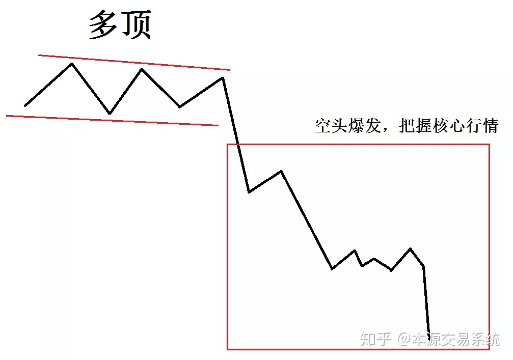
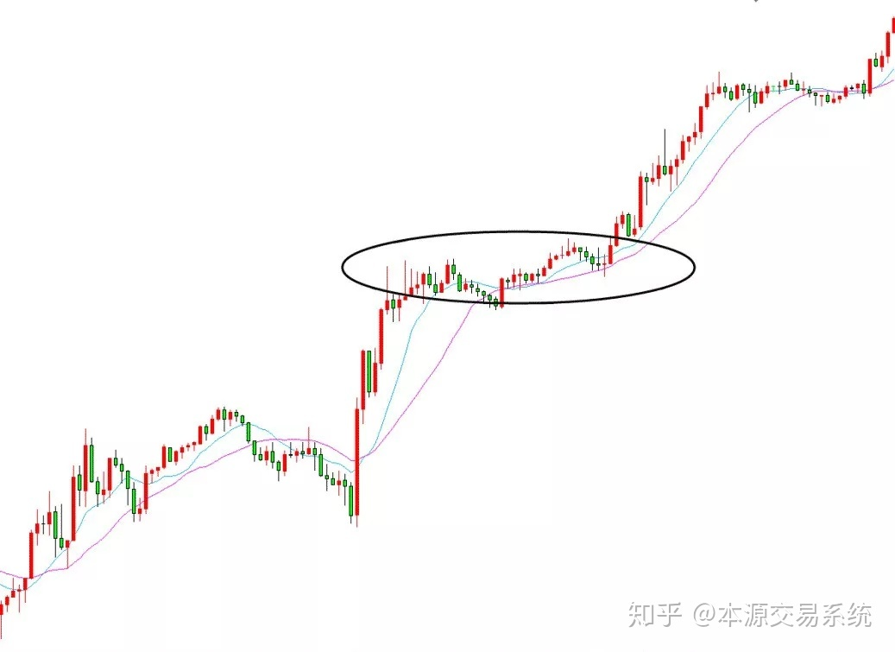
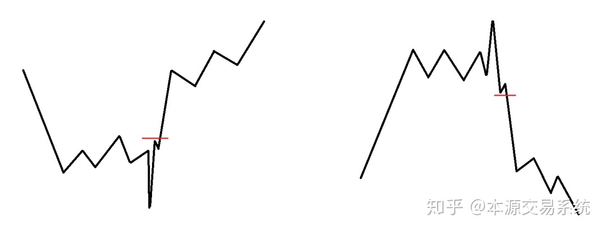
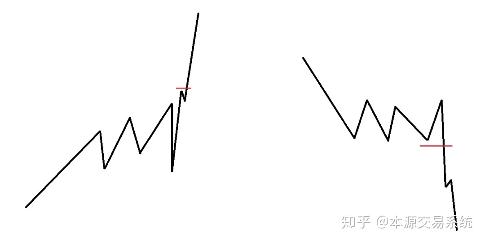
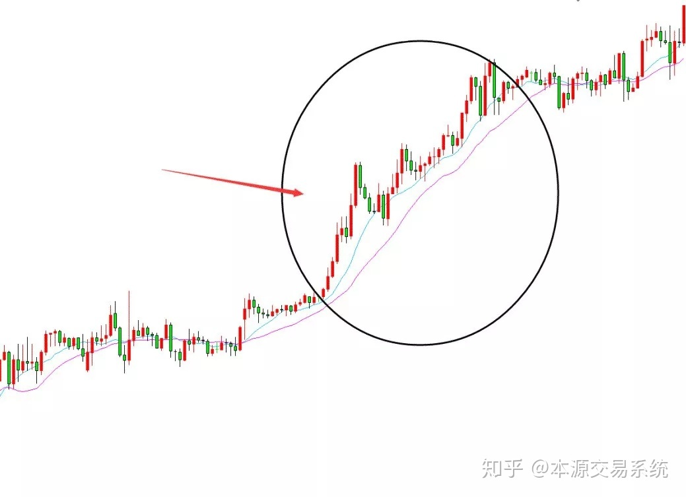
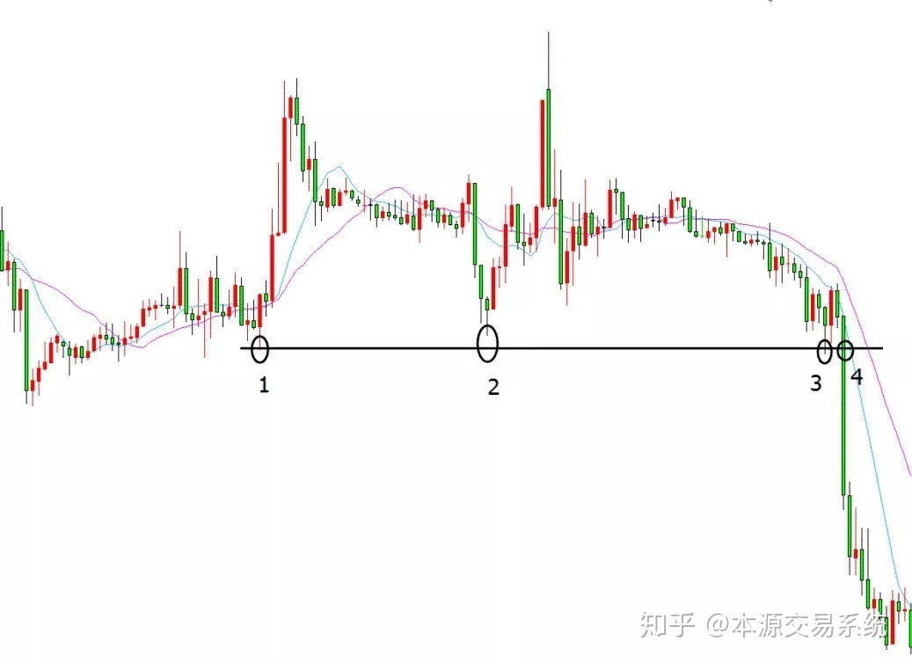
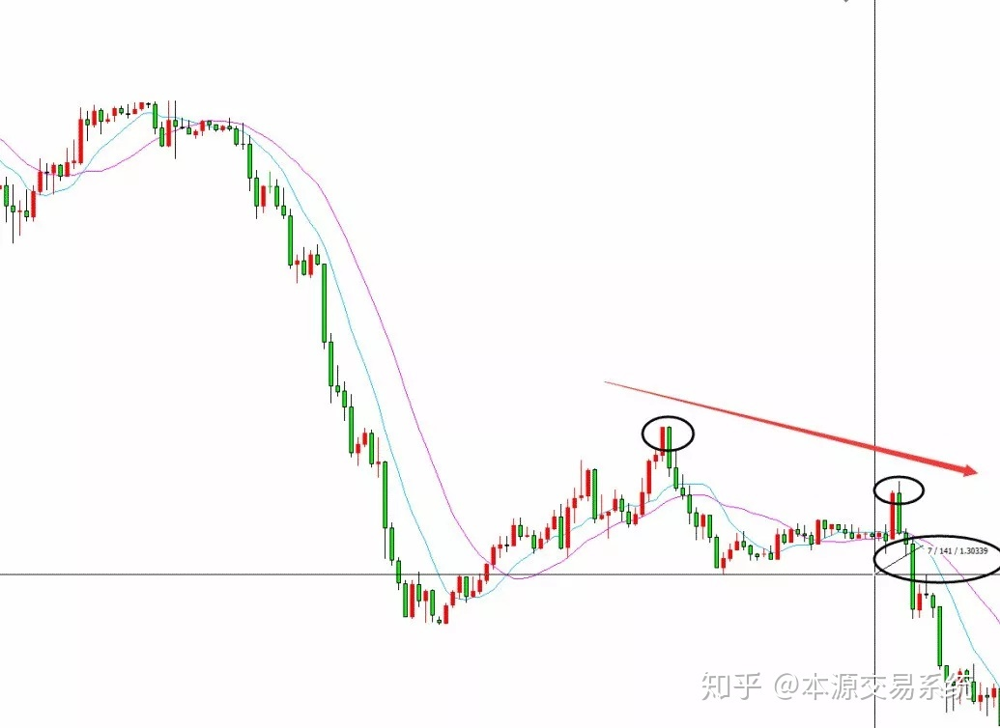

**本源交易系统，只渡有缘人。**

**亏损的根源皆是无知，无知源自不学习正确的交易思维，而正确的交易思维源自深刻的理解市场波动的本质，即价格行为！**

**很多人都说交易要按规则去做，其实这是一个歪理！所谓的规则若是没有以深刻理解市场本质为前提，那么这个规则就是无根之木、无源之水，严格执行的结果就是：不断亏损！**

**逻辑才是核心，凌驾在规则之上。**

**愿此书在交易一途能给你正确的指引，假如你现在是迷茫的。**

**愿此书在交易一途能让你回归正确的道路，假如你现在是错误的。**

\----------------------------------------------

**目 录**

**前 言**

**第一章 稳定盈利的基本要素**

- 稳定盈利3要素
- 交易系统的组成
- 职业交易跟业余交易的区别
- 一些个人的感悟
- 本章小结

**第二章 本源交易系统简介**

- 四个重要的观点
- 进场信号
- 方法与执行
- 何为悟道
- 本章小结

**第三章 交易要解决的两个问题**

- 方向
- 空间
- 本章小结

**第四章 多空转换，认清本源！**

- 复杂行情简化的基本思路
- 认清市场本源
- 本章小结

**第五章 能量的聚集与消耗**

- 宽幅震荡和窄幅震荡
- 跨度
- 本章小结

**第六章 市场波动的划分和特点**

- 单边
- 震荡
- 爬
- 单边的类型和结构
- 本章小结

**第七章 趋势的转变**

- 急变
- 常变
- 本章小结

**第八章 结构交易法**

- 进场
- 止盈
- 止损
- 本章小结

**第九章 一些细节**

- 市场的流动性
- 10、20、30均线的应用
- 交易频率的控制
- 行情在突破前常见的三种走势
- 顶底突破的细节
- 突破的间距
- 容易爆发大行情的三种情况
- 本章小结

**第十章 资金管理**

**第十一章 如何克服交易层面上的一些心理缺陷**

**第十二章 简述传统交易理论和方法上的一些误区**

**第十三章 大道至简**

**附1：一些总结**

**附2：世界顶尖交易员成功的真正秘诀**

**附3：投资者如何克服人性的弱点**

**附4：丛林里的游戏规则**

## **前言**

大家好，我是王大圣，是一名普通的金融交易员，在交易这条路上已经走过了十多个年头。在从事金融行业的这些年里，我见过太多亏损累累的朋友，身边和网上的都有。其中一些至今仍是负债累累，度日如年。更有甚者，痴迷至癫狂，深陷其中而无法自拔。当然在这个过程中，也结识了一些非常优秀的交易员，组建了自己的交易团队。其中的种种经历，至今想来仍是历历在目。

在交易的世界里起起伏伏、大喜大悲或多或少的都经历了一些，对于盘面上的涨涨跌跌，现在的我早已经没有了最初的那些激情与澎湃。在时间的沉淀下变得淡然，这也是多年以来从事金融交易积累下来最为宝贵的财富。

很多人都喜欢做交易，喜欢研究技术，但很多时候研究的方法未必都是正确的。很多人都讲心态，其实他们不知道，先有正确的方法后再谈心态才有意义。方法若不对，讲心态就是空谈。再加上不知道主动去学习，那么最终注定是要被市场收割的。

我很理解交易新手们正在走的路，艰难无助且风险巨大。基于此，我写下了这本书，希望以此能够帮助到一些做投资的朋友，特别是那些打算靠职业交易为生的人。这部分人在未能稳定盈利之前特别的不容易，往往一些很小的失误都会断送自己的职业交易生涯。所以写这本书的最大意义在于帮助那些还未能“通关”的交易员认知金融市场的本质，以正确的交易思维去应对千变万化的市场。也只有通过正确的交易思维，才能够让我们在这个变化无常的市场当中，长期立于不败之地。这也是为什么我一直强调的，其实交易最终是赢在思维。

其实无论是股票还是期货，或者是外汇黄金等等，其价格波动的本质都是一样的，所运用的方法也都是相通的，要想在这些金融市场里长期赚点钱，真的不是什么特别难的事情，关键的核心点还是要回归到正确的交易思维上。

希望每一位有缘看到这本书的朋友，都能够领悟其中的交易真谛，让我们的交易不再复杂，也让我们的投资变得更加轻松和有趣。

## **第**

## **一**

## **章**

## **稳定盈利的基本要素**

### **稳定盈利3要素**

1、稳定的系统

2、稳定的执行

3、稳定的心态

盈利三要素相辅相成，互相影响。好的系统，引导好的执行，好的执行带来好的结果，好的结果带来好的心情，好的心情反过来又会促进执行。

但话说回来，任何一套成熟的交易系统，包括本源系统，能够解决的都只是第一个基本要素。而稳定的执行和稳定的心态，是任何系统本身无法解决的。系统仅是交易的方法，并非交易的结果。就像上图所示，要组成一个可持续运行的盈利状态，需要的不仅是系统，更是自身的交易素质。缺了任何一块，盈利的轮子就无法继续前行。

### **交易系统的组成**

一个稳定的交易系统中包含两块，即理念和方法。正确的理念引导我们用正确的思维看待市场，错误的理念只会让我们越陷越深。正确的理念让我们深刻的理解市场波动的本质，错误的理念只会让我们陷入迷茫。所以交易第一要素，必须拥有正确的交易理念。

方法是理念的延伸，交易的方法有多样性，存在好坏之分，但不存在最好的方法。在正确理念的引导下，适合自身的方法，就是好方法。正确的理念下衍生出正确的交易方法，正确的交易方法往往就会得到盈利的结果。理念和方法实际就是道和术的关系，有道无术，术尚可求，有术无道，止于术！

本书以下的章节将紧紧围绕这两大要素一一展开，之所以要把交易中涉及的理念性问题重点阐述，目的是希望读者通过思考，能够深刻的领悟并认可这些最本质的问题，并能够很好的运用在实践当中，如此交易才能越做越顺，越战越勇。

### **职业交易跟业余交易的区别**

职业交易跟业余交易的区别，不仅仅是时间投入上的区别，而是对市场理解的深度、交易系统的完善程度、执行力度以及交易过程对情绪控制的熟练程度。职业交易注重交易的一致性，而业余交易相对随意很多。业余交易由于缺乏专业的技能和成熟的心态，所以基本上可以看做是市场波动的催化剂而已，并且难以在这个投机市场里长期生存下去。

作为一名合格的职业交易员，应该具备以下基本要素：

1、深刻理解市场波动的本质，是任何顶尖高手都会具备的能力

2、有一套属于自己，并且符合自己交易个性的方法

3、良好的做单心态和很强的执行力

以上三点是实现长期稳定盈利的基础，缺一不可！

职业交易和业余交易就像食肉动物和食草动物一样，食肉动物大部分时间是在养精蓄锐。待到捕猎之时，会潜伏在草丛里伺机等待，寻找最适合下手的猎物，当最佳机会出现时就会果断出击，所有一系列的动作都是经过精心安排的。而食草动物正好相反，走到哪吃到哪，养肥了膘最终沦为食肉动物的盘中餐。这跟业余交易一样，震荡想做，单边也想做，突破想做，摸顶抄底也想做，短炒想做，隔夜也想做。总的来说，就是什么行情都想做，不想放弃一点点的利润。对于机会的把握，没有取舍，这也是很多业余交易最终会亏损的原因。

所以这里我们不难看出，动物的习性决定了它们处于食物链的位子。动物尚且如此，何况是人！我们若想站在金融食物链的顶端，就必须像食肉动物一样，对机会的把握要懂得取舍，伺机而动，这样才能成为塔尖级盘手，最终达到曲径通幽的交易境界。

### **一些个人的感悟**

1、人生求学，目的是通过对世界的认知，最终认知自我。看清别人，只会徒增烦恼。只有认知自我，方能平静处世。内心越是豁达，人生的轨迹往往越是顺畅。

2、能赚钱的方法都是比较简单的，交易方法越简单越好，简单的事情重复做，重复简单，就成功了。

3、交易的方法大致可以总结为两种，突破和高抛低吸，而突破是最纯粹的技术，简单粗暴并且有效果。

4、交易的六字精髓：轻仓、顺势、待时。

### **本章小结**

几乎所有的投资者都在追求一种境界非常高的投资状态，那就是能够实现长期稳定盈利。其实呢作为金融交易圈里的老司机，本人窃以为这对于普通投资者是比较有难度的。

交易的结果包含3种元素，其中两种是人为因素，方法仅是其中一种。方法再好，没有好的执行和情绪管理，是根本不可能实现长期稳赢的。能够让我们实现稳定盈利的除了方法本身，重要的还是我们自身的交易素质。**这也是为什么本id会毫不吝啬的把自己所知完全抖出来的原因：学习了好的方法，不代表你就能够稳定赚钱了，人的执行力度和情绪管理，以及在做单过程中细节的把握和对行情的感悟，才是能够让方法产生正向结果的关键所在。**

本书作为一本阐述市场本源的书籍，希望能够为国内衍生品行业带来一股正气能量，也希望广大投资者通过阅读与思考，能够明白一些核心道理，形成自己的交易体系，最终让交易不再复杂与纠结。

## **第**

## **二**

## **章**

## **本源交易系统简介**

本源交易系统，顾名思义是一个追本溯源的交易系统，从根本上理解市场波动的含义，解决本质性问题，这样我们才能理清交易思路，进而做好交易。

系统本身没有复杂的指标和画线，也不是什么复杂的技术。太阳底下没有新鲜的事，千百年来，我们的饮食变了，衣着变了，科技发达了，但是人性始终没有改变。现在的事，过去已经发生过无数次，将来也一样会发生。人性没有变，技术就会一直有用。我们只有深刻的了解金融市场的游戏规则，实践中才能做到收放自如，应对有序。

系统本身的一切分析均源自价格波动背后的含义，进而有效的解读市场，最终做到真正意义上的顺势而为。本书注重交易思维的阐述，其中内容在市面上各类金融书籍中难于寻觅，这也是本书能够得到业内一些资深交易人士认可的根本原因。

**本源交易系统适用于股票期货外汇等品种，特别是期货和外汇！**

**四个重要的观点**

1、衍生品行情每天都在做简单的重复，对行情走势懂得分类的交易者，我们每天面对的行情走势几乎都是一样的。

2、交易要解决两个问题，方向和空间。方向可以跟随，但空间无法准确预知，就好比我们可以看到事物发展的起点，但永远猜不到结局，所以平仓的方式没有最优，各种方法都有利有弊，没有哪一种止盈方法能让我们每次都吃完整波行情，成熟的老手都会有自己的进出场规则，并且严格执行。

3、震荡属横向运动，没有方向或者说方向难于把握，所以不能参与。单边是直线运动，方向明确，很好的解决了交易中方向性问题，所以趋势交易只参与单边行情，单边实际上就是价格不断的新高或不断的新低，并且短期均线会流畅的排列。

4、突破突破，在突不在破，成功的突破走势必然是大k线实体的瀑布式穿越，假如关键点位突破后，价格依然徘徊不前，则说明市场对于该点位仍存在分歧，那么我们应该择机平仓离场观望。

### **进场信号**

本源交易系统尊重市场波动的客观事实，根据行情走势的强弱和特点，定义了震荡、单边和“爬”三种状态，从而在实战过程可以有效的过滤杂波，把握核心行情。

系统以流动性强度作为方向判断的重要依据，实战中结合走势和数据的发布，着眼当下行情，以突破作为入场信号，顺强势而为！

系统的交易信号最终可以总结为：在上涨的时候做多，在下跌的时候做空。所以实践中我们可以发现，系统的进场信号基本上都是单边行情的引爆点，这也是为什么应用本源系统进行交易，价格可以快速的脱离成本的原因。

以下列举个别实践案例，图中的横杠代表行情可能即将从震荡跨入单边，黑点处为进场信号：

### **方法与执行**

交易的方法有很多种，既然方法存在多样性，那必然存在有好坏之分。什么才是好的方法呢？作为在市场里浸淫多年的老司机，**本id窃以为好的方法应该是：单子进场后价格可以快速的脱离成本，并且在比较短的时间内拉出足够多的利润空间，这样的方法就是好方法。**

这里所说的“比较短的时间”是指操作周期里的一两根k线的时间内，价格能够大幅的脱离成本，并在四五根k线的时间内拉出较大的利润空间。相信能达到这种效果的交易方法，任何一位投资者应该都是不会拒绝接受和学习的，这也是本源交易系统之所以能够得到业内众多职业盘手认可的最根本的原因。

好的交易方法往往能够带来好的交易结果，但交易是一个完整的过程，除了方法还有执行环节和心态上的控制。

交易的过程充满变数，结果往往也会相差甚大。这也是为什么交易会比较难的原因了，交易要真正做到知行合一确实是不太容易的，这是人性问题，需要我们不断的修行。所以在实战中，我们不能因为执行不到位或者情绪失控导致了亏损就否定自己的方法，更不要因为自己有了一套成熟的方法后就忽略了执行的重要性和心态上的修炼。

还有，我们经常会看到一些观点，说做交易方法不重要，执行才是最关键的。只要执行好，任何方法都是可以持续赚钱的。对于这种看法，老司机认为也是不对的。

**所谓迷途知返，人最可悲的不是走在错误的道路上，而是身处迷途而不自知，这才是最悲哀的。路走错了，再怎么走也只会错上加错。所以在交易中首先用的方法要对，方法、执行还有心态，三者共生，缺一不可。交易是一门艺术，是各方面都需要拿捏到位的艺术。**

### **何为悟道**

所谓道，即本质。悟道，实际上就是对一些本质性问题的理解和领悟。交易要想做好，唯一的办法只有把一些最根本性的问题思考清楚，交易的视野才能打开，做单才会不纠结，不纠结了才会没有压力，最终实现轻松交易。

一套成熟有效的交易系统，其核心必然是符合市场的游戏规则，即从本质出发，化繁为简，化简为明，最终达到大道至简的境界。假如平时大家在交易的过程还有一些纠结的情绪，说明还没有最终悟道，至少是还没有把市场里的一些细节琢磨清楚，所以才会纠结。

交易要想成功，一定要把一些最根本的问题想清楚。简单的是市场，复杂的是人心，真正能赚钱的技术，都是比较简单的，难的是对市场本质的思考和对自身赌性的控制。

### **本章小结**

交易是一个完整的过程，是方法与行动的完美结合。我们想要长期稳定的盈利，就必须长期具备盈利的基础。而这三个要素（系统、执行、心态）在实践过程中是互相影响，缺一不可的。很多投资者虽然都清楚这个道理，但实践过程始终无法做到知行合一。究其根源，一则对市场的本质了解不深，二则自身的控制力相对欠缺。所以市场上才会有知易行难这句话了，它深刻的诠译了交易的艰辛。所以说交易这份不太轻松的事情，其实并不适合大部分人，它需要正确的理念，严格的执行，良好的情绪控制，以及健康的身体和充沛的精力。

我们在对交易孜孜以求的过程，如若一开始思维能走在正确的路上，树立了正确的投机观，这样我们后面所付出的努力才会结出盈利的果实，才能让我们最终实现开心交易，快乐赚钱的目的。

## **第**

## **三**

## **章**

## **交易要解决的两个问题**

### **方向**

对与错之间本就是概率的游戏，但判断对错的方法是可以细分的，虽然细分后最终判断的结果也都是概率，但我们要解决具体问题的时候，是有必要对方法进行细分的。

举个简单的例子，就比如老司机要出去玩耍，那么就会出现两种结果：一是玩耍的很开心，二是比较倒霉，碰到了ic、id、iq卡，统统告诉我密码之类的事。也就是说老司机的这次玩耍本身就是对与错的概率事件，而出去玩耍的方式可以细分，比如可以步行，可以开车或打的，甚至可以开飞机开大炮，只要足够土豪任性都是可以的。所以，方向的解决最终都是概率性，但具体的方法我们应该细分。只有明确了分类，我们才清楚自己用的方法所属的类别和优缺性。

解决方向的方法总结下来有三大类，分别是：

1、通过容错和次数来解决方向

2、通过行情概率来解决方向

3、通过流动性的强度来跟随方向

通过容错和次数来解决方向

纯粹的逆市加码是一种很低级的做法，本质上已经失去了投机的含义，跟赌博没有什么区别的。若是配合方法2或3，效果会好很多。

通过行情概率来解决方向

大部分的投资者用的都是这个范畴里的方法，比如均线类、趋势线类、斐波那契类、摸顶抄底类、高抛低吸类、指标共振类等等。这个范畴里的各种手法在判断方向上，本质上没有做到真正意义上的跟随方向，至少是跟随当下的方向。所以实战中对于如何过滤伪信号，依靠经验较多。

通过流动性的强度来跟随方向

通过判断流动性强弱来跟随市场的方法，本质上做到了真正意义上的顺势而为。顺应当下市场上的强势，是投机成功的基础。顺应强势，与强者为伍，这样入场后价格才会更快的脱离成本。

在交易中对于方向的判断，举一个简单的例子来说明第二种方法和第三种的区别：有那么一辆车，我们看见一个老司机在开车，当路面上忽然出现很多石头的时候，我们这个时候是怎么判断这个老司机下一步的行动呢？是继续匀速？还是减速慢行？还是加速前行？或者停车？这就是概率型方法，要判断老司机的下一步动作，需要深厚的经验和很好的细节观察。

还是一样的车和老司机，但这次车子明显开的很快。那么这个时候，我们就可以很明显的看到车子正行驶于某个方向。这就是通过流动性的强度来跟随方向，即老司机往哪个方向快速行驶，我们就认为车子行驶于哪个方向。

## **空间**

谁也无法准确预知未来行情发展的大小，所以空间是无法精准解决的。就像我们看见一辆行驶中的汽车，我们可以说这辆车正在往哪个方向开着，但我们不可能知道这辆车会开到哪去。我们可以看到事物发展的起点，但永远都猜不到结局！

虽然是这样，但在实践过程，我们依然可以用一些方法来度量空间可能出现的延伸，就比如：

1、根据这辆车奔跑的速度去估算（通过行情的力度去估算行情的空间）

2、根据这辆车所在的环境去估算（通过前期的支撑阻力趋势线等去估算行情的空间）

3、根据这辆车的一些特征去估算（通过形态均线指标的变化去估算）

实践中，正是因为空间的不可预知，哪怕是相同的进场点，不同投资者的平仓点位都会有很大的区别。所以俗话说的好，会卖的才是师傅，说的就是这个意思。

### **本章小结**

方向和空间是交易永恒的主题，其中方向的判断是交易的核心，如何判断方向是决定交易结果的关键所在。这也是几乎所有技术爱好者孜孜以求的“武林秘籍”。

本章通过详细的讲解，归纳了市场上各类交易手法，这样非常有助于读者认清投机市场的本源，逐步理清个人的交易思路。所谓的悟性，实质就是归纳和总结的能力，我们只有善于总结，细节的把握才会更加到位，交易的能力才会不断精进，所有这些收获都需要我们付出巨大的成本：时间成本、资金成本、身体健康成本、个人情感成本，甚至是前途命运成本。

所有这些，只有亲身经历过多年交易后的我们才能深刻的体会其中的酸甜苦辣。交易本是场寂寞的独行，在悟道的过程，需要我们承载的太多，珍惜眼前所拥有的健康、家庭和朋友，会让我们在这场旅行中走的更远。

## **第**

## **四**

## **章**

## **多空转换，认清本源！**

### **复杂行情简化的基本思路**

投机市场的k线走势每天涨涨跌跌，跌跌涨涨，看似复杂，实际简单。简单到我们可以认为，这些个k线走势，不是涨就是跌。那么我们要想把复杂的行情简单化，就必须先弄清楚多空的转换，只有弄清楚了转换过程，我们才能归纳转换的状态，知道了行情的状态，实践过程我们对于行情的筛选才能懂得取舍。

多空转换的过程可以总结为：

多头聚集-多头爆发-多头延伸-空头聚集-空头爆发-空头延伸-多头聚集，，，，

多空转换的过程，实际上是能量积累和释放的过程，深刻理解本章内容，对交易有着非常重要的意义！

多空转换原理图一

### **认清市场本源**

金融市场的价格每天都在不停的波动，其本质是资金的流动。把资金看做一种能量，那么这种波动实际上就是能量的波动。而市场的能量分为多头和空头，那么价格的波动实际上就是多头能量和空头能量的不断转换，其过程可表述为：

阶段性空头衰弱，多头能量开始聚集，当能量达到临界值，多头能量开始爆发，行情不断上涨，经过一段时间发展，多头能量开始衰弱，空头能量开始聚集，当空头能量达到临界值，空头开始爆发，行情不断下跌，市场如此不断循环。

多空转换原理图二

多空聚集过程：多空能量聚集的过程，行情的力度一般较弱，k线走势基本是处于震荡或爬的状态，方向容易折返，所以这种行情不能参与！

多空爆发过程：多空能量聚集到某一临界值的时候，行情必然会爆发出来，这种爆发行情就是我们需要把握的核心行情，而这种爆发临界点，就是我们的进场信号，在实践过程，这种进场信号需要我们非常耐心的等待。

多空转换的过程，多头能量的聚集会以多种形式完成，总结下来分为单底、双底、多底和平底等，如以下各图：

多头聚集以单底、双底的形式完成

多头的聚集以多底的形式完成

同理，空头能量的聚集也会以多种形式完成，总结下来一样是单顶、双顶、多顶和平顶等几种，如以下各图：

空头聚集以单顶、双顶的形式完成

空头的聚集以多顶的形式完成

### **本章小结**

这个章节讲解了市场波动的本质性问题，重点揭示了多空行情转换的过程，其内容是本书的精髓之一，且对于本书的整体思想架构，起到了承上启下的作用。

对于本质性问题的深入思考，是任何一个市场参与者能否打通交易任督二脉的关键所在，所以请千万不要忽略这些基础性问题的思考。往往能够引导我们大彻大悟的，并不是那些复杂的盘面，而是一些看似简单并且无关紧要的问题。所以，只有我们彻底想通了这些本质性的问题，我们的思维才会发生改变，然后我们的交易行为和交易心态才会跟着思维的改变而改变，最终一步步的引导我们走出亏损的泥潭，迈入盈利的行列。

这个市场上任何一个顶尖级高手，虽然交易的手法会有所区别，但无一例外他们对这个市场本质性问题的领悟都必然是非常之深刻和透彻的，否则他们也不可能成为所谓的高手。所以在此希望有缘看到此书的读者，能够认真的通读本书，多思考本书中提到的一些关键性问题，相信细心的你也一定能从本书中发现一些交易上非常核心的窍门。

**第**

**五**

**章**

**能量的聚集与消耗**

**宽幅震荡和窄幅震荡**

宽幅震荡的走势，市场分歧大，能量在震荡中耗损，所以很难酝酿出单边行情。而窄幅震荡的走势，市场分歧小，能量可以不断的积累，所以相对而言更容易酝酿出大的单边。

所以请大家记住：

**宽幅震荡=能量消耗，即使突破震荡区间，也大概率不会有什么力度，因为能量已经在宽幅震荡中消耗完了，所以容易变成所谓的假突破。**

**窄幅震荡=能量聚集，跨度较大的窄幅震荡突破后，力度一般都会比较强，延续性也会长一些。**

宽幅震荡和窄幅震荡最直观的判断是，宽幅震荡走势一般会反复的穿越10、20、30短期均线，走势的重心飘忽不定。而窄幅震荡走势一般不会出现这种来回的穿越，而且走势的重心会明显的不断往上或往下。如图所示：

上图中，左边是宽幅震荡的走势，很明显价格在区间里是无序的震荡走势，无组织无纪律，能量极易在这种震荡区间损耗殆尽，所以后市难出大行情。

而右边是跨度比较大的扁平走势，这种走势震荡区间小，运行时间较长，能量和人气会在这种区间里沉淀，所以价格一旦突破区间，就很容易出大的单边行情，而且价格在突破前往往会有挖坑回踩的动作，就像弹簧一样，要压一压才能弹的高。

**所以我们可以总结为：凡混战，不参与；凡单边，必有坑。**

**跨度**

跨度指的是能量聚集的时间长短，一般来说，走势酝酿的越久，一旦突破，力度就越大。

**上图中所包含的细节，希望读者细细体会。从本质出发，找出其中的区别，如此对实战大有裨益。**

上图中，行情之所以没有在虚线箭头处爆发，是因为当时市场的多头能量不足以突破新高，能量在当时区间积累太仓促，所以价格需要回抽做二次聚集，这是价格波动包含的信息。那么行情走势表现出来的就是跨度和区间宽窄的问题了。**本节内容对实战至关重要，希望读者能认真思考，深刻理解两种走势的市场含义和区别。**

**本章小结**

期货和外汇市场是一个巨大的资金运行体，像自然界一样，也是由人组成的，所以存在一些规律性的东西。有些时候k线的走势杂乱无章，多空分歧巨大，市场处于无序的混战状态，这种时候尽量不要去做单，容易两边挨刀。而有些时候市场意见趋于统一，大家都认为会涨或者会跌，所以行情走势的重心就会出现不断上移或下移，这个时候k线的走势是有规律的。基于此，我们才能抓到价格的爆发点，才能抓的住这种流畅的单边走势，才能获得一些投资回报。

## **第**

## **六**

## **章**

## **市场波动的划分和特点**

市场是震荡和单边的循环交替，市场既复杂又简单，如何把复杂的行情简单化，再把交易信号明确化，是悟道的过程，也是手工交易致胜的关键。

震荡是横向的运动，其特点是方向容易改变，或者说是没有方向，所以说震荡行情解决不了交易中方向性问题，那么我们的交易系统在行情的选择上，就不能参与震荡走势。

单边是直线运行，方向明确且存在唯一性，很好的解决了方向性问题，所以我们的交易系统一定是捕捉单边的系统。

### **单边**

单边是每一个趋势型交易系统都想要把握的核心行情，同时也是本源系统要捕捉的行情。单边的特征是：价格流畅的排列在均线左边，且斜率一般大于45度。流畅的单边有两种表现形式，如图：

第一种接近90度的单边一般是在数据发布时段出现的，或者是主力资金发动的突袭行情，k线走势简单粗暴，是突破交易中最暴利的行情。

第二种单边的斜率一般是45度不断上扬或下挫的n型走势，结构稳健老成，一般是数据前的预期走势或数据后的消化走势。

### **震荡**

震荡的特征是：价格在均线上下来回穿插，k线的毛刺多。趋势型交易捕捉的是单边，所以必须要规避掉震荡走势，即过滤伪信号。实践过程，很多投资者对于如何区分震荡与单边都非常困扰，往往大家会有这么一个观念，就是知道单边的时候，行情都已经走的差不多了，再追进去的话就很容易被套。我相信很多投资者都会有过这个想法，其实要解决这个大众化的疑难杂症，我们需要清晰的明白以下两点：

**1、震荡与单边的共生关系，震荡包含单边，单边包含震荡；**

**2、对于进场信号的选择，我们需要判断的不是单边，而是单边的即将产生。**

如上图所示，方框1为震荡走势，方框2为单边走势。在实战中我们需要明白：行情的走势，震荡中包含单边，单边中包含震荡，你中有我，我中有你，这是一个辩证关系。

所以当行情处于即将爆发单边的时候，即上图红色圈圈区域，实际上行情已经开始出现了单边特征。**这种单边特征后期能不能形成比较有力度的突破走势而形成单边，跟数据的发布和行情的走势结构有着极大的关系。**

如何提高震荡垮单边判断的准确率是交易的难点，同时也是交易的精髓。

### **爬**

除了震荡和单边，还有一种变异的走势，即爬的走势。这种走势的斜率一般小于45度，且走势凌乱，经常在10、20均线之间来回穿插，看起来既不像单边，又不像震荡！这种爬的走势力度明显不足，方向容易折返，所以对于单边交易来说，爬的走势是不能参与的。

### **单边的类型和结构**

分析的目的是摸单边，单边就是不断的新高或新低，实践中我们一定要避开震荡行情，因为震荡行情难以把握方向，可以说震荡没有方向。而单边存在唯一方向，单边行情不是涨就是跌，方向确定，所以摸单边的方法才能解决方向，研究单边的方法才是正确的方法。而研究单边的类型和结构，实际上就是研究震荡的类型和结构，两者互为辩证关系。

摸单边的方法之前说过有三种方式：一是通过容错和次数来解决方向，二是通过行情概率来解决方向，三是通过流动性的强度来跟随方向。这三种方式各有特点，而第三种方式从实践上说，效率相对较高。

摸单边的方法落实到具体上有：突破系统、均线系统、趋势线系统、指标系统等等，**其目的就是以一种方式表达单边可能的存在或即将的发生，进而用一些规则和技巧来辅助交易，以期达到正期望值。**

单边常见的3种结构（以多头为例，空头同理，故省略）：

1、左下边的方框为大底部震荡，其特点是：行情大跌，而后转势，震荡区间是“转势”行情下的震荡。转势行情，因为第一波反弹一般是能量的蓄势过程，所以波动的幅度和速率是比较弱的。这种走势可以理解为多头能量和人气的聚集过程，此时大多为“爬”的行情。行情走势脆弱易折返，所以第一波反弹一般是不能参与的。转势行情要出单边，一般是从第二波反弹过程中的突破区间后开始的。

如上图所示（30分钟周期），转势行情下，第一波反弹走势一般是比较脆弱的，走势上也没有连续性，所以第一波反弹最好是不要参与，真正的主行情基本都是从第二波反弹突破区间后开始的。

2、中间的方框是顶部震荡，其特点是：行情不跌，方向继续延伸。震荡区间没有出现明显的跌幅，这种就属于典型的顶部震荡不跌走势，这种行情一般走出跨度后即可顺利突破新高。

如上图所示（30分钟周期），行情高位震荡不跌，随后走出跨度后一般都能顺利突破新高。

3、右上边的方框是小底部震荡，其特点是：行情整体小跌，而后转势，震荡区间是“延伸行情”下的震荡。这种行情由于势头整体向上，对于多头突破点的选择，更在乎当时或当日行情的走势和结构。也就是说对于整体势头向上的走势，在进场点的选择上，更关心当日关键位的突破，而非前日或之前关键点位的突破。

如上图所示（30分钟周期），行情整体小跌，价格走至横线时，对于行情爆发点的选择，应该更关心当时行情的走势和结构，而不是之前的。所以上图中，当价格突破横线时，果断进场做多。

一波完整的上涨或下跌行情基本是由以上三种单边类型和结构组成的，明白了这点，在实践过程我们就可以知道，当下的行情大致是处于趋势的某个阶段或某种状态中，这直接决定了我们的后续操作，比如在哪里开仓，止损应该设在哪里更为合适等交易决策。市场里所谓的高手，一般就高在这里了。

### **本章小结**

市场所有的走势无非是驱动和调整的反复交替，**在实践中如何准确判断震荡的即将结束，是交易的核心之一，**同时也是突破手法的关键所在。关于这点，希望读者多多揣摩本书中有关内容的文字叙述，相信细心的你在认真研习过后一定会有所顿悟。除此之外，在实践中我们还需要明白行情的所处的阶段或状态，这对于我们处理一些细节问题有很大的帮助。

**第**

**七**

**章**

**趋势的转变**

趋势的转变无论如何变化，来来去去就两种，即急变和常变。这两种趋势转换形成的内因同样是遵循能量的转换，即积累-爆发-延伸，不同的是这些转变，要么以常态进行，要么比较仓促。

**急变**

价格原先呈跌势或涨势，由于数据等原因，价格快速逆向反转，形态上呈v形，此为急变，模型如下：

趋势末端的v形反转

行情中途的v形反转

一般来说，一波跌势或涨势的末期，价格刚破位的时候就快速反转，这种急变的成功率会相对较高，行情的延续性也会比较强。实战中碰到类似的情况，我们一般会在价格大力突破10、20、30均线时顺势建仓，然后快速拉好止损。

**常变**

所谓常变，即趋势正常的转变，以多头为例，形态的演变过程一般呈现双底、三底、多底或平底，模型如下：

左边的走势若是比较标准，则圈圈处可以少量参与，实战中，我们一般会等k线走成右边的走势后，再在圈圈处进场。

左边是三底走势，短期均线都拉平了，价格在第三个底处做了一次假动作后快速反转，突破区间就可以进场，一般都能赚不少。右边是平底走势，即k线在一个相对窄幅的区间里有序的震荡较长的时间，这种趋势的转变基本是捡钱模式，比较容易把握。

**本章小结**

趋势的转变来来去去就那么两种情况，所以本书在开篇的时候提出一个重要观点，即衍生品每天的日内走势几乎都是一样的。我们只需要把握好行情演变的核心思想，就不会被那些乱七八糟的震荡行情所迷惑，就能清楚的知道明确的进场位置，也能经常抓到行情的起爆点。

**市场如婴儿般简单，小级别的走势驱动大级别的走势，大级别要走出流畅的单边，一定是在更小的级别里已经开始了单边，筑好了炮台！**

## **第**

## **八**

## **章**

## **结构交易法**

再复杂再诡异的行情，无论是日内还是隔日，都可以简化成一个独立的交易单元，如下图：

万能交易模型

那么对于上面这个交易单元，我们要做的只是区分出两种不同的状态，以及等待我们该做的那个点，仅此而已！趋势交易者抓单边，进场点要么是突破进场，要么是回调进场，两种方式各有利弊、各有千秋，具体应用看个人喜好而定。在这里，结构交易法是以突破作为进场信号的，为什么呢？我想应该是因为突破比较纯粹吧，简单粗暴，适合自己，您值得拥有。

### **进场**

在之前的章节里我们了解到了多空的转换过程，能量的状态有三种：能量的聚集、能量的爆发和能量的延伸。能量聚集完后就会爆发，那么爆发就必然会有一个爆发点，结构交易法的进场信号实际就是抓这个爆发点。

实践过程我们不难发现，这种爆发点往往都是关键点位的突破点，而突破就是最纯粹的交易技术！

说到突破，很多投资者会立马想到“假突破”这个概念，而且心里会想突破要玩不好的话，很容易被上下扫止损，非常容易亏钱。其实呢，突破不存在真假，关键是选取的参照物，而且任何一种方法玩不好的话都是容易亏钱的，不仅仅是突破。想要完全掌握一种手法，至少需要实盘训练半年以上，才能消化里面的一些细节。

行情要出流畅的单边，就一定会是以下两种情况之一：

1、要么价格快速脱离震荡区间，走v形反转

2、要么价格缓慢脱离震荡区间，在均线左侧形成标准的n字突破

如下图所示：

v形反转

n字突破

从震荡区间刚冒头的突破不能做，特别是双顶和双底的突破。

一般顶底要顺势突破，基本都会横盘一段时间，走出一个比较标准的n字后再突破的。

或者会打下去，再v形反转。

小总结：单边的产生分两种情况，快速出现和正常出现。快速出现是v形反转，一般都是主力资金的突袭行为或者是数据发布的结果。正常酝酿出的单边一般都会伴随n字突破，它们的共性是价格必然会在短期均线（10、20、30）左侧流畅排列。也就是说，抓单边比较合理的进场点是均线流畅排列或即将流畅排列时，当价格站在均线左侧形成的n字突破时进场。

### **止盈**

**空间无法精准解决，每一种出场方式各有利弊，没有最优。不要幻想着每单都能利润最大化，一波行情抓到底，这相当的不现实！**

常用的止盈方法如下：

1、根据均线金叉死叉平仓

2、根据固定点数平仓

3、根据固定盈亏比平仓

4、根据行情的力度择机平仓

5、根据k线组合平仓

6、根据形态组合平仓

7、根据指标组合平仓

8、根据固定时间平仓

9、根据黄金分割平仓

10、根据前期高低点平仓

11、根据趋势线平仓

12、根据盘感择机平仓

平仓方式选择其中之一二严格执行即可，实战中本id是根据单边的流畅度、前高前低和价格力度择机平仓的，一般来说一波流畅的单边行情，收盘价不会轻易站上或跌破10日均线。

一般来说，行情走势跨度大，并且关键点位上经过了多次确认后的破位，能量的爆发往往是比较大的，突破后的延续性也会比较好。而行情走势跨度小，能量聚集有限，这种走势突破后延续性会差一些，止盈的期望也不要太大，一般做个短单就差不多了。

### **止损**

交易是一场马拉松，我们不必拘泥于某一单的得失，任何单子都是有风险的，所以进场后必须要设止损。保证金交易就是一个以控制风险为核心的金钱游戏，投机是一门艺术，如何设置止损则是这门艺术的关键所在。

对于突破单止损的设置，我们一般是20-30个点之间，而且是动态止损。

1、单子进场后，止损拉n字前高（以做空为例），一般来说，只要不是v形反转，价格反扑的力度都不会超越n字前高。

2、若关键点位被突破后，第二根线又收了回来，那么说明市场对该点位的破位认可度有限，这种情况要止损，一般是在第二根k线收盘之前择机平仓。

总的来说，好的起爆点应该是价格形成连续的上涨或下跌，均线流畅排列，说明市场此时已经形成一致性看多或看空。但是起爆后价格陷入震荡，那么说明市场对这个关键点有分歧，凡混战，不参与，这种时候及早撤退是上策。

实践经验表明，这种止损办法的缺陷是会错过一些机会，但优点是不会次次都扫硬损，亏的都是很小的钱，一旦价格顺利突破，一单的止盈基本可以覆盖至少四五次的止损。（经验之谈：突破突破，在突不在破。关键点位突破后，市场分歧解除，行情走势出现一边倒，价格连续大阳上涨或大阴下跌。若是价格突破后还在关键位一带徘徊，则说明市场存在较大分歧，行情短期内难以出现连续单边走势，所以碰到这种情况应尽早出局。）

### **本章小结**

每一次下单我们都可能会输，所以止损的设置是想在衍生品交易市场里长期生存最基本也是最重要的第一步。因为忘记了这句话，无数的投机者离开了这个市场，若不想成为其中一员，很简单，每次进场后立即设置好合理的止损即可。

对于止损的重要性，说多少次都不为过，这也是做了多年老司机后才逐渐明白的道理。**在某个时段，当一系列连续的盈利不断推高账面数字时，潜意识里的风险意识就会开始降低，于是在不设止损的情况下，市场又一次深刻教育了我。所以经历过n+n次惨痛的教育后，现在记牢了，下单得跟止损一块来才行！**

关于止盈，不要期望每一单都能做的很完美，一种交易模型对应一种进出场的方式，只要这种模型理论和实践都靠谱，好好执行就可以赚钱啦。

我们在实战过程中，亏多少自己可以说的算，但要赚多少，确实不是我们可以决定的。对于持仓的止盈，关键是看个人的当时状态、临盘的功底和对交易规则的执行纪律。事实上，没有哪一笔订单我们可以做到绝对的完美。投机本是一种艺术，是贪婪和恐惧平衡的艺术。这是一个以控制风险为核心的金钱游戏，如何在恐惧和贪婪中找到一个微妙的平衡支点，是这个游戏的精髓所在。

**很多新手总是认为技术是最重要的，希望弄一个公式、指标或者系统就可以搞定交易了。只有沉浸多年的老司机们才知道，当我们面对盘面的时候，不是价格在跳，而是我们的心在跳。**

## **第**

## **九**

## **章**

## **一些细节**

### **市场的流动性**

期货市场中，各种消息和各种价格背后的阴谋诡计，形成的资金推动；外汇市场中，国际汇率金价原油的各种数据和消息，最终仍会形成资金的推动，并且这种价格波动受数据的影响非常大。所以当价格处于临突破状态时，能否顺利形成单边走势，关键要看当时市场的动能是否充裕，而能够引起流动性充裕的因素有以下三点：

1、消息面刺激引起的流动性充裕，这时候的流动性最具爆发性，所以这种时候行情若是能突破震荡区间形成单边的话，走势基本都是一泻千里。

消息面刺激引起的价格暴涨

消息面刺激引起的价格暴跌

2、数据发布前后，市场对数据的预期走势和消化走势，这种时候流动性会相对均匀，所以走势一般呈现n字型结构。

3、由于市场心理共振的因素，大跨度和多重确认的技术走势破位后，就会引起市场流动性的充裕。

### **10、20、30均线的应用**

普普通通的几条短期均线作用还是蛮大的，平日里团队操盘用的是10、20、30三条普通的均线，主要是用来观察整体k线的流畅程度，所谓落霞与孤鹜齐飞，秋水共长天一色，就是这几条小均线要表达的意境了。

趋势交易根本上抓的是那些流畅的单边行情，而流畅的单边行情必然是均线流畅的排列，而且实践中我们不难发现，往往那些大的单边行情的启动，都是在三条均线比较规则的多头排列或空头排列时产生的。

从上面三个例子中我们不难发现，一般大行情都是在三条均线即将交叉时产生的，所以说这个小小的细节在实战中非常重要，其中奥妙需要读者多多揣摩，多思考市场的本质性问题。价格的波动无非就是能量的波动，之所以大部分单边行情的爆发都是在均线粘合并且即将发散时启动的，实际上就是一种市场的心理共振。

### **交易频率的控制**

对于不同交易频率的手法，市场上大致分为三种：

1、日内刷单

2、日内、周内波段

3、中长线交易

三种手法各有特点，没有最好，只要适合个人习惯就行。但在这里，笔者提一下对这三种手法一些见解：笔者认为这三种手法中，日周内的波段交易是比较适合大众投资者的，同时这种手法也相对符合期货和外汇黄金等保证金交易品种的特性。

其一，就拿每天外汇黄金的波幅来说，其实是非常小的。当下市场，外汇每天的平均波幅大概是0.8%，黄金大概是1.2%，这种波动的幅度相对于国内A股市场和期货市场，简直就是小巫见大巫。之所以有些投资朋友会觉得衍生品的波动幅度很大，那是因为他们杠杆用的很大。

其二，期货外汇等衍生品大级别的趋势行情是比较少的，绝大部分时间k线都是在几百点的震荡区间里上下乱晃。所以说衍生品的特性，实际上是不太适合中长线交易的，特别是期货还有个跨期的麻烦。而日内刷单需要很好的盘感和时间，交易过程还要消耗大量的脑力和体力，所以这种手法不适合一般人且难以持久。

所以综合以上，日内波段和周内波段的交易手法，是期货等衍生品的主流手法。

一般来说，日内波段的交易频率是每天3次左右，因为每天一个品种出单边的次数基本都是1次，所以也就注定了日内波段的交易次数是比较少的。所以平时做单的时候，我们空仓看盘的时间就会比较多。在职业交易中，养成这种长时间空仓看盘的习惯，对交易有很大的好处。做交易要有一定的格局，不能把注意力放在那些小区间里的小行情上，这样我们的境界才会更上一个台阶。

频繁交易就像食草动物，走到哪吃到哪，永远只会在食物链的底层。频繁交易最后就是疲劳交易，人长期处于这种神经紧张的疲劳状态，是很容易被市场催眠的，然后就会失控。就像老司机，有再高超的技术，一旦疲劳驾驶，离悲剧也就不远了。

要做到轻松交易，曲径通幽，就一定要养成良好的做单习惯，并且这种习惯是可以跟生活作息形成良好的共振，这样长期从事交易才不至于产生厌倦的情绪，交易最后才会越做越好、越战越勇。

### **行情在突破前常见的三种走势**

实践经验告诉我们，行情突破前有三种走势：其一，单根k线直接破位。其二，连续两根k线破位。其三，反k出现后再破位。

1、单根k线直接破位：关键点位被单根k线直接突破。

2、连续两根k线破位：关键点位被连续上涨或下跌的两根k线突破。

3、反k出现后再破位：价格行至关键位时停顿，市场出现大量对手盘，价格形成反向k线，但其后又快速被市场合力击溃，关键点位被突破，行情走出区间形成单边。

单根k线直接破位

单根k线直接破位

单根k线直接破位

连续两根k线破位

连续两根k线破位

以上圈圈里的k线就是破位前挣扎的反k，市场背后的含义大致可以理解为，多头想反扑，结果被空头一记闷棍就game over了。

### **顶底突破的细节**

顶底震荡期，不能纯粹的突破前高前低就挂sotp单，因为震荡没有动能，价格很容易回抽扫止损。实战中，我们必须要等出现明显有动能的k线时才可以挂sotp单。一般来说，顶底即将突破的走势，都是有一定跨度的。跨度大、走势扁平的行情就容易爆发出大的单边，背后的原因是行情积累的时间比较久，能量和人气聚集的比较充分，即所谓的憋大招。

圈圈1处之所以难突破有三个原因：其一，行情没有走出跨度；其二，均线尚未交叉；其三，突破的间距略大，行情从底部跑到突破点已经消耗了一些能量，要往上突破的话一般说都需要休整休整。除非是大数据发布时段能量充足，行情瞬间爆发无需休整。

圈圈内是比较有跨度的走势

### **突破的间距**

启动点与突破点之间的间距不能太大，否则能量到达突破点的时候容易衰竭。要是启动点离突破点比较远，正常行情下一般会在突破点前或后，继续走出蓄势结构，然后再突破。

好的突破走势，启动点与突破点之间的间距一般都是恰到好处，而且突破k线的开盘价，一般都位于ma20下方（这是往下突破的情况，往上突破同理）。

上图圈圈里，突破k线开盘价与突破点之间的间距是11个点，间距较小，价格往下突破耗能较少，k线开盘价位于ma20下方，并且整体走势有跨度，所以突破成功的概率较大。

上图中行情单根k线暴跌75个点，至关键点位处能量耗尽，空头在关键点一带蓄势休整，重新聚集做空能量和人气。

### **容易爆发大行情的三种情况**

在实战中，我们要把对市场的理解和认知变成对盘面最直观的本能反应，那么需要对我们脑海里的知识结构做进一步的压缩，总结出一些更加简单和方便记忆的信息条码。以下总结了实战过程中容易出单边的三种情况：

1、大数据发布的时候

大数据发布的时候，市场能量充足，极易引起价格暴涨暴跌。在实战中，我们需要结合行情走势来决定这些品种的交易。类似的例子在期货市场和外汇市场里比比皆是，比如英镑经常是下午四点半发布数据，那么这个时候就要根据技术面判断多头是否已经聚集完毕，行情结构是否处于一个临突破的边界等等（空头同理）。

2、跨度大且结构扁平的走势

跨度大说明能量积累的时间很充分，结构扁平震荡区间小，说明能量和人气在区间内得到充分的聚集，所以这种走势一旦突破区间，很容易走出大的单边行情。类似的走势在期货里经常能够见到，外汇里也挺多，只要有耐心，这些行情都是可以做到的。

3、关键位经过多次确认的走势

震荡区间的上轨和下轨一般都属于市场的心理敏感位置，而且假如这些关键位置经过几次碰触而无法形成突破的话，那么这种敏感度就会增加，一旦市场的合力击破这种关键位，价格就很容易形成一边倒的走势。

### **本章小结**

交易的方法说一千遍一万遍，无非就是轻仓、顺势、待时，至于如何轻仓，如何顺势，如何待时，就是我们在实战过程需要掌握的细节。一套交易体系中，理念是一个框架，它的作用是指引我们怎么做才是正确的。就比如说本源交易系统的理念告诉我们，做单要顺强势而为，不能顺弱势，更不能逆势。还有做单的时候，我们应该放弃第一波弱势的反弹，在涨中做涨，在跌中做跌等等。

这些基本的理念会在我们实践过程中指引和规范我们的交易行为，而细节的作用则是帮助我们更好的过滤掉一些盘面上的伪信号，提高我们的交易质量。

交易的细节是任何一套交易系统的核心部分，对细节把握的熟练程度决定了我们是否能够保持长期的稳定盈利。就比如很多人都在用均线系统，但真正用的好的又能有几个！包括做突破也一样，能做的好的也是寥寥无几。归其根本，还是细节没把握到位。细节决定成败，这话放哪里都没错的！

## **第**

## **十**

## **章**

## **资金管理**

所谓资金管理，简单的理解就是如何管好交易账户里的钱，或者说如何用好里面的钱，会更加贴切实际。实践过程，资金管理最重要的环节应该是：不同行情下仓位的调节和止损的设置。但据我所知，大多数人在资金管理上了解到的信息，在实际交易中并不是特别的管用！所有我下面分享关于资金管理的内容，是基于我个人实际的交易经验总结，而非理论推测。

资金管理在整个交易环节中，是非常重要的。投机本身就是一个以控制风险为前提的金钱游戏，如何在不同行情下配置不同的仓位和止损，是玩转投机的重要技术，同时也是做单的艺术！良好的资金管理能力，是大家在一个周期内实现资金稳步上涨的基础。

关于仓位和止损的关系，举个例子，比如某个进场点，合理的止损设置偏小，那么我们的仓位就可以适当的放大。相反，某个进场点，合理的止损设置偏大，那么这个时候就要把仓位适当降低。仓位的运用相当灵活，不同的仓位应对不同的行情。

另外，期货等衍生品投机属高杠杆的游戏，切不可抱着赌徒的心态重仓豪赌。因为人在重仓的情况下，心态明显会发生扭曲，在常态下本该坚决执行的止盈止损，在重仓的时候就会变得犹豫不决，这也是导致很多人爆仓的重要原因之一。

在期货交易中，资金使用率我个人一般控制在5-20%之间，过于重仓和过于轻仓都不太合理。又比如外汇中10w美金标准仓，根据行情力度和止损大小，仓位可以在1-5手之间做适时的调整。当然，这仅仅代表个人意见，喜欢重仓裸奔者，可以不用考虑！

很多人会把资金管理跟风险控制两个概念混淆，其实资金管理包含了头寸管理和风险控制两部分。在资金管理中，头寸管理即仓位管理，包括资金品种的组合，每笔交易资金使用的大小，加码的数量等等，这些要素最终都会影响整个交易的结果。世界上所有的赌场都限制赌徒下注的最高限额，一来是控制赌徒的损失，减少负面影响。二来也是控制赌场自己的风险，不使赌场由于大赌客某一次偶然的运气，大额下注给赌场带来风险。一个专业的投资者同样也应该限制自己每次的交易头寸，因为我们不会知道豪赌的结果是暴富还是爆仓，而现实情况往往是爆仓的居绝大多数！

国外的专业交易机构，允许交易员在市场中多次、少量的亏损来学习经验，但是不允许他们出现一次大的亏损。良好的风险管理能力，能够让投资者在市场中长久生存下去。在交易的世界里，谁笑到最后，那么谁就笑的最好，只有懂得先活下来，在有机会的时候才能有资金继续在市场中交易。

我们知道，市场中的交易体系可以分为“趋势型”和“震荡型”两种，其中趋势型的胜率一般只有30%-40%左右，虽然胜率不高，但一样能在市场中长期获利，这里最关键的秘密就是资金管理。

每一种交易系统，都必须包含资金管理的部分，否则这种交易系统必然是不完整的交易系统。很多投资者会以为那些交易大师是靠高胜率的市场方向判断，从而能够长期在市场中稳定获胜，而投资大师们最密而不传的恰恰是散户们最看不起的资金管理。项尖的投资大师都认识到，在市场中赔钱是交易的组成部分，关键是你明天还有没有实力继续交易！

金融大鳄索罗斯在《索罗斯谈索罗斯》一书中回忆说，1944年是他一生中最快乐的一年。“我这样说是令人奇怪的，甚至会冒犯别人，因为1944年是大屠杀的那一年。但对于一个14岁的男孩，那是一个难得的激动人心的神奇经历。这是很有影响作用的，因为我从长辈那里学到了生存的技巧，这与我的投资生涯是有必然联系的。”这位犹太人索罗斯从小经历了“二战”法西斯的追杀，在恐惧和刺激中渡过了童年，形成了独特的“生存技巧”，他父亲教给他一些有关生存技巧的宝贵经验：“冒险没有关系，但当承担风险时，不要赌上全部资产。”在1992年的“英镑风暴”一战成名后对记者说：“我渴望生存，不愿意冒毁灭性的风险。”

实际上，我们无论是做期货还是做任何事业，最根本的法则就是先求生存，再求发展！可靠的资金管理技巧是让你在期货和外汇等金融市场里生存和发展的关键，换句话说，资金管理的能力是交易员能否取得成功的决定因素。然而我们大多数人却没有对此有足够的重视，如果实战过程中你没有很好的运用这项技能，那么你必然成不了一个稳定盈利的交易者。

风险控制主要包括以下三点内容：

第一点：胜率，即获胜的概率；

第二点：盈亏比，即风险回报比；

第三点：止损，即每次开仓可承受的最大亏损。

我们看下面这个表格：

风险表

从上面这个表格中我们可以清晰的看出，实战中要想账户不爆仓的话，就必须加大我们的盈亏比。盈亏比越小，账户面临爆仓的概率就越大。这也是为什么我们要做波段的原因了，数据能告诉我们一切。

做趋势的投资者，在实际交易中，从长期来看大家的胜率一般是40%左右，甚至会更低一些，这是正常的现象。有些人宣称自己的交易系统胜率很高，其实那是因为他们的交易周期还没有足够长！

假设我们以长周期交易胜率50%计算，那么在3:1的盈亏比下，从表格中我们可以得到账户爆仓的风险仅为0.2%，那么也就是接近不可能爆仓。当然这只是理论值，要是大家在实战过程当中忽略了交易规则，仓位任意放大，或者频繁进出，改变了盈亏比，那么结果爆仓的话，就不是表格数据的问题了！

通过这张表，我们至少可以了解到几个交易上重要的问题，其中最重要的就是为什么一定要做波段，关键就是盈亏比，只有盈亏比足够大，账户的爆仓风险才会大大的降低下来。

至于我们为什么尽量不要刷单，不要频繁交易，不要剥头皮、抢帽子，除了成本的因素，还有就是盈亏比的问题，这个表格希望大家可以亲自算一算，研究研究，个人认为还是挺有价值的，能够想明白其中道理的，可以少走很多弯路！

交易过程中的控制风险，我觉得说多少都不为过！大家在实战过程中，只要能按照上面的表格来做，即坚持以合理的头寸配置、低频率、高盈亏比去做交易，那么我相信大家要想做到亏钱也是不容易的，更别说爆仓了！我们在交易中，只有先做到了不爆仓，再谈别的才有意义。

最后，送大家一个我经过多年实战，感触非常深的一个公式：

**小赚+小亏+偶尔大赚+绝不大亏=稳定盈利**

这个公式看起来简简单单，但其中却蕴含了很多的交易哲学，包括交易手法、心态控制、资金管理等等。这个公式大家可能会不以为然，但对我却是意义非凡！在市场中浸淫多年，对此我深有感触。这也是我之所以能够在衍生品市场上实现盈利的最大秘密武器！

**第**

**十**

**一**

**章**

**如何克服交易层面上的一些心理缺陷**

在实战交易中，我们多多少少的都会出现一些心理层面的问题，这是不可避免的，因为我们是人！是人就会有问题，人性本身放在交易上是有缺陷的，谁都一样，这点是我们必须要接受的事实，没有完美无缺的人！

其实市场中的大多数人之所以亏钱，基本都是败给了自己。而之所以会产生诸多心理层面上的纠结，其根源还是对市场的认知不够深刻。

翻开图表，历史上的任何一个波峰和波谷之间巨大的价位落差，给每一个高明的投机客都提供了绝佳的淘金机会。投资市场不同于社会生活的任何其他方面，当人们从事其他社会职业时，人性的弱点还可以用某种方式掩饰起来。但在投资市场上，人性的缺陷就会充分的展现出来，所谓的公开竞价，其实就是公开展示人性。

很多时候，高手和菜鸟之间的差距，往往都只是心理层面控制上的差别！在通向塔尖的路上，要时刻铭记，我们最大的敌人不是市场，是我们自己！

接下来，我罗列出一些大家实战过程中最常见的心理问题，以及我对这些问题的个人见解，和根据过往实战经验总结出的应对方法。

**1、厌恶止损和亏损的心理问题**

对于止损，我相信大家都是非常讨厌的，包括我在内，谁愿意亏钱呢！但是我想告诉大家两点，其一，止损是交易的一部分，我们必须要接受合理的止损。止损其实就是给市场好处费，这么说大家就比较容易理解，也就是说，我们在实战中，跟市场打交道，那么我们就必须打点打点，给市场一些好处费，那么市场才会给我们行一些方便，这样我们才有机会从市场里赚到大钱！其二，合理的止损，即严格按照交易规则执行而出现的止损，这个不叫亏损，其实应该叫做成本，即所使用的交易系统的成本。只有那些不按照交易规则执行所出现的止损，才叫亏损！对于这点，我希望大家能够清晰的对待。

**2、喜欢打短线急于求成而厌恶波段交易的心理问题**

喜欢打短线的人，往往是有急于求成的心理问题，关于这点我是这么理解的：首先赚钱是一个缓慢积累的过程，妄想着一夜暴富，在衍生品市场往往是行不通的，这是一个铁铮铮的事实，我们必须要接受。其次，从以上章节的风险表中我们知道了为什么做交易盈亏比要大的原因，不想让爆仓在概率上占优势的话，只能选择做波段。

那么对于做波段的人来说，比如说大家倾向做日内波段的话，那么我们就要知道日内波段的交易频率大致是多少的问题。

日内波段抓的是每天行情的单边幅度，那么一个品种每天出单边的次数，一般就是一次。也就是说对于日内波段的手法来说，一个品种一天交易的次数就是1次。那么了解了这点，我们的交易频率自然而然的就降低了。所以说，只要深刻的了解了我们该做的，那么实战中就不会有那么多纠结的心理问题产生了。

**3、害怕下单的心理问题**

有些人之所以害怕下单，就是担心亏掉自己的钱，越是害怕做的越差，亏的越多。特别是阶段性做单不顺的时候，人往往容易进入这个死循环。所以说要解决这个问题，根据我的过往经验，有三个办法：

第一，寻找适合自己心率的仓量！比如说你做5-10手的螺纹感觉很轻松，超过10手后心里压力就大了，那就不要超过这个仓位，时刻让自己的内心处于一种舒适的状态，对交易来说至关重要。又比如说大家手里是一个10w美金的标准账户，那么平时做单的时候，假设做1手心里很轻松，但是做3手5手的时候，心里明显就会有压力了，那么我们就不要下那么重的仓位。也就是说对于10w的资金量，适合自己心率的仓量是1手，只要平时按照这个仓量去做就行了。

第二，做单必须有明确的交易规则去约束！就比如说如何开单，如何止损，如何止盈，都要有明确的方法才行，只有这样，我们做单的时候才不会纠结，心里对任何一笔单子才会觉得踏实！

第三，不要用自己亏不起的钱去做投资！就是说，不管是投资也好，投机也好，都不要用自己太在乎的钱去玩。否则你再高超的技术，都是很难赚到钱的，因为用亏不起的钱做的时候，心态是完全不一样的，特别是不要刷信用卡来做这些东西！！！

当然这点根据每个人不同，有的觉得亏1w人民币没所谓，有的觉得10w，有的觉得亏100w都不是个事。就是每个人要根据自己的经济情况，拿那些亏的起的钱来玩，这样的话在最刚开始做交易，你就已经有了心理优势。

要是说你总共的存款就10万块钱，都拿来做投机，亏了肯定会难受的，要是爆仓的话那就直接疯掉了。特别是有一类人，直接套信用卡的钱来赌，这是相当不理智的行为，往往这种做法的结果只会让自己越陷越深。

**永远记住一点：再穷也不要刷信用卡来赌！！！**

**第**

**十**

**二**

**章**

**简述传统交易理论和方法上的一些误区**

说到交易的方法，在这里我想说下传统交易理论和方法上的一些误区。大家有没有发现，就是市场中绝大部分的人做投资或投机，为什么都是亏损的？难道是我们的心态有问题？或者说是执行不够坚决？还是这个市场根本就不可能赚的到钱？其实我觉得，这些都不是问题的根本。我个人认为之所以会出现这种大面积的亏损现象，原因肯定是出在使用的方法上。

假如方法本身是错误的，那么谈心态就是空谈。讲心态的前提是自己已经有了靠谱的方法，在实战过程中能不断积累财富，这样心态才会慢慢变好，慢慢变的自信。还有执行环节，方法若是不对，执行的结果也只会越做越错，就好比我们走在错误的路上，越往下走只会越走越偏。

那么是什么原因造成国内大面积应用方法上的错误呢？要知道中国人是非常聪明的，从古至今，中国向来都是一个伟大的国度。远的不讲，就拿近几十年来说，中国可以从一个一穷二白的国家，发展到今天的世界强国，这一点相当的不容易。所以我们一定要认清这一点事实，就是我们每一个人并不笨！既然如此，为什么还会出现这种结果呢？那肯定是被一些错误的东西误导了，这就是我想告诉大家的，市场上流转的一些传统性的交易理论和交易方法，其实都是有很大缺陷的，或者可以干脆说是错误的！因为大家接触的都是这些东西，所以都会被这些错误的理论和方法所污染，才会导致最终的交易结果相当的不理想，这才是国内大面积亏损的根源。

市面上很多理论、很多思维、很多方法，都存在严重的缺陷，甚至可以说是胡扯瞎扯，比如说波浪理论，这个是最扯淡的，千人千浪还不如不浪，根本就是误人子弟的东西。还有很多乱七八糟的理论和方法，这里就不一一点名了。这些错误的理论和方法，无一例外的都把交易给复杂化了，这点是非常扯淡的！这也导致了很多新手刚接触交易的时候，都喜欢把技术研究的非常复杂，不复杂还觉得没高大上的感觉，不复杂还觉得不可能赚的到钱！

在行业内流传着这样一句话：做交易，知易行难？大家想一想，真的是知易行难吗？“知”真的就那么容易吗？我认为这个观点是严重错误的。

在知的层面上，一知半解才会“行难”。就比如我们上山的时候，不知道山里有没有老虎，那么我们进山以后肯定是非常危险的，真碰上老虎就是爆仓的结果。也只有我们真的“知”了，交易上才会轻松自如。很简单的道理，难道明知山有虎，你还要偏向虎山行？

所以这句话正确的说法应该是：做交易，知难行易！所谓“知”，即悟道！也只有自己真正的悟道了，真正知道交易这个玩意该怎么玩才能赚钱了，“行”还会难吗？

## **第**

## **十**

## **三**

## **章**

## **大道至简**

所谓道，即本源、本质，指的是事物的根本。无论是生活还是交易，做人做事，我们只有弄清楚了事物发展的核心，才能化繁为简，视野和格局才能打开。很多投资者在做单的时候之所以会纠结，根本上还是对一些本质问题认识的不够深刻。

所谓简，即是简单，更是明确。是对交易上一切细节的明确，明确就是一致性。比如做单点位的明确，止损止盈的明确，频率控制的明确等等。只有达到了至简的境界，交易才会真正变得简单轻松。

其实，交易最终坚持的是一种信仰，对一份事业，一种理念，一种方法，或者说是对一种生活态度的坚持和追求。

**附1：一些总结**

1、一种思维模式，延伸出一种交易模型。一种交易模型，对应一种进出场的方式。任何赚钱的方法，无外乎低买高卖。自己的方法能够达到这个目的，就已经足够了，剩下的就是好好的执行，傻傻的执行，钱就会慢慢赚到手，投机也不过如此。

不要轻易去羡慕外边那些看似高大上的方法和牛人，别人的都是故事，自己的才是生活。实际上，他们的方法也不过如此，只不过不同的思维模式，造就了不同的进出场方式而已，但最终都是通过低买高卖来赚钱。在经历了很多之后，你会发现，金融投机的世界里，往往最终能赚钱的，就是那些傻傻执行的傻子。

2、交易要解决的问题有两个，方向和空间。其一，方向有三种解决方法，容错（逆势加码）、概率（抄底抓顶、指标共振、黄金分割等等）、跟随（突破新高新低），本源交易系统是通过跟随价格来解决方向的。其二，空间的延伸无法准确的预知，就好比我们可以看到事物发展的开端，但绝对猜不到它的结局。所以每一种出场的方式各有利弊，没有最优，平仓选择其中之一二严格执行即可。

3、市场是震荡和单边的循环交替，价格的运动即是能量的运动。能量的状态分三种，聚集-爆发-延伸，单边交易抓的就是价格的爆发点。突破的力度越强，行情继续延伸的确定性就越强。宽幅震荡=能量消耗，即使突破也不会有什么力度，因为能量已经在宽幅震荡中消耗完了，所以容易变成所谓的假突破。窄幅震荡=能量聚集，跨度较大的窄幅震荡若是突破，力度一般都会比较强，延续性也会好很多。

4、单边的产生分两种情况，快速出现和正常出现，快速出现是v形反转，正常出现一般都会伴随n字突破，两者的共性是价格必然会在短期均线（10、20、30）左侧流畅排列，也就是说抓单边比较合理的进场点是，均线流畅排列或即将流畅排列时，当价格站在均线左侧形成的n字突破时进场。

5、日内波段一般是看着日线的走势，在小周期里（30分钟或1h）抓进出场点。假如日线是单边趋势行情，那么小周期里顺着大方向做就是了。假如日线级别陷入震荡，那么就需要通过k线组合来判断当日行情是偏多还是偏空，然后再到小周期里抓点。

6、职业交易期货，尽量做30分钟级别以上的行情，多看看日线周线的结构。做的周期太小，看不到行情的整体走势，把握不住阶段性的主流方向，则容易迷失在短期的杂波当中。

而职业交易外汇，每天的工作时间需要合理安排，一般是下午2点至晚上11点，期间不定时休息和室内活动，不能一直盯着电脑不放，很容易被市场催眠，交易就会陷入无规则状态，保持旺盛的精力是交易持续稳定盈利的基础。

期货和外汇都是高杠杆市场，巨大的利润面前伴随着巨大的风险，要想长期从这个大海中获取收益，年化预期不能太大，一般以年化50%为目标较为合理，预期小一些，做单的压力就不会太大，心态自然会好很多。

**很多人炒期货，预期的收益率都很高，动不动就想着翻倍，事实证明，这种心态比较容易把账户做爆仓。对于我来说，每个月能赚5-10个点就知足了，虽然赚的不多，但我承受的风险是很小的，这也是想要长期在市场里生存必须要具备的心理素质。**

7、市场的统计结果显示，成熟的交易员平均交易胜率大致在35%-40%之间，盈亏比一般是2:1-5:1之间。从统计结果我们可以明显发现，成熟老手的胜率不高，他们不会刻意的追求交易上的胜率，而是把重心放在盈亏比上，这也是他们能够长期赚钱的原因。这跟绝大部分新手的做法是截然相反的，新手往往是追求高概率，赚钱的时候就赚一点点，根本拿不住，亏钱的时候就死扛，这也是几乎所有新手面临最大的问题。

8、做单的胜率是基于次数，比如胜率是37%，那么可以理解为100次交易里，总体正确的次数是37次。但在某一个阶段，你很有可能会连续错五六次甚至是七八次，这都是很有可能出现的。那么在这种情况下，重仓交易的结果显而易见，账户必然会折损过半，甚至爆仓。所以在交易中，我们一定要清楚自身资金量对应下的合理仓位。一般来说，衍生品交易中，资金的使用率控制在5-20%以内为佳。

9、任何一个品种，其日线级别的趋势性行情是比较少的。根据这个特性，衍生品的交易手法一般以日内波段或者周内波段较为合适，持仓周期太短或太长都不太好。比如日内刷单，很明显的缺陷是需要支付较多的交易成本，需要消耗大量脑力体力，不利于打持久战。

10、很多人做单喜欢把止损拉的很大，感觉这样会比较安全，但实际效果证明，大止损未必安全，小止损未必危险。止损的大小，应该跟仓位的大小挂钩，才能发挥较好的效果。实战中，资金管理是非常重要的，其中仓位大小的调节就属于资金管理的范畴。在一笔单子进场前，你就要清楚你愿意亏多少钱，假如止损偏大，那么这时候的仓位应该相应的调小，这很重要！

做单要想长期赚钱，就不能猴急。做单不是工厂计件工，不是做的多就赚的多，盘面上好的机会都是等出来的。举一个现实的例子，两个人在打架，刚开始的时候我们一定不知道谁胜谁负，但等他们打了段时间，我们就能比较明确的判断出谁强谁弱。那么在交易中也是一样的，我们只需要顺着强势的一边做就行。把握当下行情的节奏，比看懂行情的趋势更重要。

11、市场无论怎么变，其本质永远不会变，人性没有变，技术就会一直有用。就算以后用机器人代替人工，市场的波动也必然是单边和震荡的循环交替，因为市场不可能永远停留在震荡中，或者永远停留在单边中，否则市场就会崩溃。所以对于单边交易，我们需要的仅仅是抓住那个行情的爆发点即可。市场如婴儿般简单纯粹，它无时无刻不在告诉你它在做什么，所以不要用那些复杂的思维去看待市场，否则只会自讨苦吃。

**12、交易永不逆势，不以己之力，对抗大势之所趋，顺势永远是对的。永不豪赌，不以已之欲，废多年之信仰，一个亿变成两个亿又能怎样！及时认错，这是市场给你反思的机会，薄利远比暴利活的自在。生活不仅有k线，更有诗和远方，我有一个梦想，那就是邀上三五个好友，踩着小毛驴，浪迹天涯。**

**附2：世界顶尖交易员成功的真正秘诀**

我想很多人都希望跟电影里演的那样，成为一名成功的金融交易员。虽然现在开户很简单，但要修炼到稳定盈利这个境界，那确实不容易！

众所周知在衍生品市场里，有80%甚至90%以上的玩家都是亏损累累的，问题到底是出在哪里？还有那些顶尖的交易员和一般的投资者的差别又是什么？

不知道作为一个期货外汇玩家的你有没有思考过，是什么原因导致了投资者大面积的亏损累累呢？还有，既然80%人是亏钱的，也就是说有20%的人是赚钱的，那么他们是怎么做到的？

世界上那些顶尖的基金经理，他们是怎么做到常年赚钱的？他们到底是什么原因可以常年立于不败之地？经过了几十年的交易，他们仍然有那么好的交易成果，到底是什么原因？

为了揭开这些答案，接下来我将围绕以下几个主干来展开分享：

1、期货外汇投资者成长的必经之路

2、期货外汇交易的利与弊

3、期货外汇交易的风险到底在哪里

4、为什么大部分玩家会亏损累累

5、如何成为期货外汇交易里的终极赢家

6、世界顶级基金经理的长胜秘诀

## **一、期货外汇交易者成长的必经之路**

提到交易，我相信每一个投资者都想做到稳定盈利。但实际上，这似乎有一些难度，这是一个缓慢的成长过程。要想在衍生品交易里做到稳定盈利，任何人都一定会经历以下五个过程：

交易者成长的五个过程

**第一个过程：无意识不胜任**

大家刚接触期货和外汇的时候一般都会比较激动，以为找到了一个能够快速致富的捷径，幻想着通过一根网线一台电脑就能实现财务自由屌丝逆袭，然后成为业内顶级操盘手，各种高逼格光环在脑瓜顶上环绕着。基于这种傻傻的天真，刚开始的时候我们会天天复盘研究各种各样的技术和指标，或者在网上找一些所谓高手的帖子来学习，然后傻傻的开户做交易，然后就，，，，没有然后了。账户爆了一个又一个，自信被一点点的抹杀，最后小心脏终于顶不住受伤了，但你始终找不到亏损的根源，一头雾水笼罩着弱小的自己，这就是第一个过程，我们叫做无意识不胜任。

**第二个过程：有意识不胜任**

经历了一系列的亏损，自己也开始清楚的了解到，交易好像不是那么容易做的，于是乎自己也开始变得低调，在网上或者生活中找一些高手切磋交流，请教别人一些交易方面的心得，希望别人能教点干货之类的。偶尔得到一些技术上的指导，马上回家开电脑复盘研究，但最终总结来总结去，还是做不好，账户该亏的一样继续的亏，好蓝瘦！！！很多人都会徘徊在这个阶段，并且顶不住各方面的压力，最终不得不放弃交易这条路。

为什么会是这样呢？关键还是在于你能不能找到一个好的老师，首先这个老师水平不能差，至少得是那20%赚钱行列里的人。其次，他得愿意教你，把交易上的一些核心细节都告诉你，并且在实战中加以指点。

**但能赚钱的人，谁又会那么傻乎乎的把自己的底子透露出去呢？毕竟这些东西都是自己在异常艰难的摸索中总结出来的，在没有很好关系的情况下，正常人谁会愿意教出去？除非是确实踩了狗屎运碰到了一个非常好的老师，佛系操盘，佛系人生，愿意把毕生的功力倾囊相授，就比如本id这种，着实非常难得^_^**

**第三个过程：觉醒时刻**

熬过了前两个阶段，在某年某月的某一天，你会忽然发现交易这个东西，归根结底是要具备正确的金融交易思维。你开始了解到，任何人都无法预判市场，赚钱是基于一系列有规则的交易，有赢有亏，而不是单笔交易。这个时候，你渴望稳定，开始敬畏市场，你深刻的明白什么才是你努力的方向，什么才是你要学习的对象，可能你正在寻找一位真正的良师益友。

**第四个过程：有意识胜任**

在这个阶段，你开始坚持自己的交易系统，根据盘面给出的系统信号进行交易，不受情绪的影响。在不断的实践中你会发现，有些地方是可以做的，有些地方是不能做的，而且原来自己犯的那些错误是多么的低级可笑！

这个时候你开始意识到系统交易的重要性，以及学会了更好的应对止损，因为对自己的交易系统有信心，相信随着时间推移，账户一定能盈利。你知道了严格执行和资金管理的重要性，开始慢慢的勾勒自己的资金曲线，而不是试图一夜暴富。

**第五个过程：潜意识胜任**

这个阶段里，交易的能力慢慢成为自己的潜意识，什么时候该下单，什么时候不能下单，都不需要准备和思考。就像困了睡觉、饿了吃饭一样，对于行情的变化，你能够掌握自如，你完全可以成为一个非常稳定，非常有能力的交易员。

## **二、期货外汇交易的利与弊**

让我们来静静的思考一下，期货和外汇的利与弊到底在哪里？有一个成语叫水能载舟，亦能覆舟，这个词就很好的描述了这种利弊关系。

一讲到期货和外汇，大部分人都觉得风险非常高，是个很可怕的投资品种，尤其是那些亏过很多钱或者听说过很多人亏钱的人，他们会更加认为这是个非常不靠谱的东西。但我希望读这篇文章的朋友，一定要独立思考，所谓的高风险，到底高在哪里？不要人云亦云，跟风扎堆！

期货和外汇交易利弊之一：充裕的流动性导致长线不容易被操控，但短线交易容易被操控。

期货外汇交易有没有其优势的地方呢？这个绝对是有的，没毛病！优势之一是流动性（热钱）非常的充裕，比如说外汇，每天的交易量大概是六兆到八兆美元，比起全球最大的纽约股市还要大出七八十倍，这是个非常活跃的交易市场！而国内商品期货市场的交易量，一点不比股市差多少！

流动性充裕的好处是什么我想大家都知道，就是市场不容易被操控。因为市场越小就越容易被操控，庞大的市场是不容易被操控的。在这里大家注意，我说的是不容易被操控，而不是不会被操控，短线交易还是会被操控的。

期货外汇交易利弊之二：交易非常简单，但想要稳定获利并不容易。

交易其实是蛮简单的，只需要下载软件，开户入金，你就可以参与其中。这就是我开头时说过的，成为一个交易者非常容易，可是要成为一个真正能长期赚钱的高手，并不容易。

期货外汇交易的利弊之三：可以双向交易，但交易方向不好把握。

大家都知道做股票是不能卖空的（就算是融券功能，在营业部里也融不到券源！），也就是说，价格上涨大家才有机会赚钱。但期货外汇是双向交易，比如某个品种价格要上涨你可以做多头，方向对了你可以赚钱。如果你认为某个品种可能会下跌，那你可以把它卖空，所以它是两个方向都可以赚钱。虽然是这样，但实战中我们会发现经常做错方向，这也是双边交易的主要难点。

期货外汇交易的利弊之四：你可以用杠杆撬动财富，也可以被杠杆打得血本无归。

期货外汇的另外一个优势，那就是杠杆。大家都知道，杠杆是能够让我们用很少的钱做很多钱合约的一个方式，但是高杠杆是一把双面刃，如果你懂得合理的运用杠杆，就能加快赚钱的速度。但如果你滥用杠杆，那么在交易中必然会蒙受巨大的亏损。

## **三、期货外汇交易的风险到底在哪里**

期货外汇和股票相比，**在交易的机制上，**实际上投资的风险要比股票小很多！为什么会这么说呢？我相信大部分人会不理解，其实道理很简单。股票投资的是一家公司，退一万步说，万一公司倒闭了，手里的股票实际就是一张废纸，或者说来个临时停牌，各种资产重组，然后重组失败，业绩不良什么的，复牌后转st板块，然后再连续吃十几个跌停板等等。这种不确定性的风险还是非常大的，实际上炒股最担心的就是这种情况。

但期货和外汇不一样，不会发生上面提到的那些风险。比如说外汇，投资的是一个国家发行的货币，美元欧元英镑等等。这些国家的经济还是比较扎实的，很明显一个国家倒闭的概率会比一个公司倒闭的概率要小很多很多。又比如期货，涨跌就在那里，期货市场不会像股票那样临时出个公告然后停牌，也不会像股票那样出现跌停就跑不掉等等的情况，这也是为什么期货外汇在交易机制上风险要比股票小很多的原因。

读到这里你可能会觉得期货外汇交易真的是太好了，很多人会被这种美好所迷惑，很多期货外汇公司举办免费的公开课，他们宣传学了我的XX策略或者用了我的XX程序化后，就可以实现稳定盈利或者是实现多少多少的收益！

这种夸张的说法，这种过度的营销，是目前市场里存在的普遍现象。这些人吹牛都不用打草稿，如果他们真的那么牛叉，我觉得世界首富的位置早就是他们的了，但很显然他们不是！在期货外汇市场里很多人就是被这些误导性的宣传迷惑着，他们都只告诉你美好的一面，没有跟你说在高收益下的潜在风险。

很多人做期货外汇之所以会亏损甚至爆仓，不是因为期货外汇本身的性质，而是因为大部分人不懂得合理的运用杠杆，他们过多的滥用杠杆而导致账户最终会爆仓，这才是关键所在。所以你看很多人说期货外汇风险非常高，其实风险高在哪里？**高在你用很少的资金去玩很大的合约，风险源自杠杆的滥用，风险源自无知的冲动。**

不仅是期货和外汇，其他投资品种也一样，只要你滥用杠杆，结局一般都会比较凄凉！就拿股市来说，2015年的股灾里埋了多少人？！而且股市里那些大资金配资，顶多也就三五倍杠杆，就造成了当时那种碾压式暴跌，更何况是期货和外汇！

所以实际上如果真正了解市场的本质，而且实战中懂得合理的运用杠杆，通过对比我们其实可以发现，期货等保证金交易跟股票相比，其实是更安全的投资。

## **四、为什么大部分的玩家会亏损累累**

投资是累积财富的捷径，不管你做什么样的生意，都不影响你进行投资，世界上那些有钱人，他们都一定会做投资，因为钱赚钱是最轻松的一种方式。但是在投资领域里，现实的状况是，大多数人都是亏损累累的，只有少数的人能够成为赢家。

投资者的现实状况之一：良师难寻

在交易的世界里，要找到一位真正愿意教你的导师，真的很不容易！真正好的课程只需要上一次就可以了，很多人教了不少钱去学了很多理论和方法，但实践中却无法落地，学了也是白学。所谓真传一张纸，假传万卷书，真正能够赚钱的方法，实际都比较简单，以至于一般人不愿意相信这么简单的技术就能赚钱！

投资者的现实状况之二：孤单的行走在错误的方向上

在投资的道路上，你有没有发觉有时候自己很孤独？大家做交易，买卖都是自己决定的，对错都要自己来承担。做对的时候还好，但做错的时候是挺难受的，而且很多时候都不知道自己错在哪里，所以这个时候我们就会想着，要是能有一个经验丰富的高手拉自己一把就好了！自己单打独斗，真的很辛苦，特别是新手。

投资者的现实状况之三：一群聪明的人沉迷在指标的地狱里

很多人都喜欢研究指标，喜欢根据指标的提示刻板的进行操作，实际上这是非常愚蠢的行为。因为不同的指标在某一时刻，提示的方向是不一样的。可能这段时间用这个指标赚了点小钱，过段时间就不灵了，然后你就会质疑这个指标的用处，不行的话再换另外一个指标用一阵子，换来换去，到最后自己都乱套了。

很多朋友参加过无数的课程，尝试过无数的系统，无数的交易策略，追随过无数的大师，甚至有很多程序化系统。说实在的，如果这种程序化系统真的可以帮我们自动赚钱，那么世界上就真的没有人需要工作了！程序再好都是分阶段性的，如何用好一个程序化，关键还是看人！

## **五、如何成为期货外汇交易里的终极赢家**

交易的世界里要么赚钱要么赔钱，两者之间的差距可不是一般的大，那么赢家和输家的差距到底是什么呢？我可以很负责任的告诉大家，指标、k线、系统，统统都不是决定你成为赢家的关键。赢家和输家，不在于他们的知识和指标，而是对市场的认知和对方向把握的能力。你是否了解交易的本质？如果不了解，游戏还没开始，你已经注定是输了。

赢家与输家的重要区别

**深刻的市场认知**

交易的本质一：充满变数，赢家不做预测，输家试图预测。

价格的波动充满变数，不可预测！不知道这个观点大家认不认同？你能够准确预测下一分钟铜价是涨是跌吗？我们没有办法预测，没有人可以准确的预测！而95%的输家他们尝试去预测，螺纹好像要涨，铁矿似乎会破位，橡胶目测会走一大波行情，，，，

但是你们有没有发现，无论我们怎么努力的分析和预测，最终的胜率也就50%，甚至很多时候还达不到50%！那么大家告诉我，预测有用吗？

交易的本质二：期货外汇保证金交易是负和游戏，赢家冷静狙击，输家疯狂扫射。

零和游戏是最公平的，但保证金交易是一种负和游戏，因为我们中间夹着一个经纪商！我们必须要用经纪商提供的平台来做交易，无论是赚是亏，经纪商都是要收交易成本，虽然一次的成本不高，但是假如每天都频繁短线交易，一个月下来支付的成本就非常多了。可能到最后你会发现，自己的亏损实际上都变成了平台商的佣金。

大家不难发现身边做交易亏钱的人，一般都是非常喜欢打短线的激进派，而真正能赚钱的人，往往交易的频率都不多。就像我们团队，做30分钟周期波段模型的，盯几个品种一般一天下来也就一两单的样子，抓到就抓到了，没抓到那就等第二天再来。

输家的交易方式

这个市场里95%的人都喜欢玩短线，那都是做陈年老亏货的命，真正赚钱的人都是耐心等待交易的时机，波段操作，就像一个冷静的狙击手，猎物来了才会伺机而动，而且收获颇丰，胡搞瞎搞都是赚不到钱的。

赢家的交易方式

交易的本质三：趋势就是机会，赢家耐心持有，输家想赢怕输。

很多人都知道，趋势就是机会，但实际上大家又是怎么样的呢？绝大部分的投资者都没能好好地享用！一般的短线交易者在趋势的开端就已经进场了，但他们大都只赚一点点就拿不住平仓了，所以该赚的时候没赚到多少钱，而该亏的时候就死扛，10次小的盈利都抵不住一次大的亏损，这样来来去去怎么能不亏钱呢！

相反的，那些能长期盈利的人都是该亏的时候趁早止损，该对的时候一波抓到底，要么不对，对一次就能赚回很多次止损的钱。所以这就是赢家和输家最大的区别。

交易的本质四：心理的博弈，输赢就在一线之间，就看能不能管住自己的手。

真正的战场，不在市场里面，真正的战场是在你心里。金融投机纯粹是一个心理游戏，为什么我们不能抓住这个趋势？不能持仓一直到趋势转变才出来？因为我们怕，我们怕把自己赚到手的东西又亏回去了！

简单的说就是不敢去赚，所以在这个心理游戏中，大家拼的不是智商的高低，纯粹就是心理的博弈。赢家懂得管住自己的手，控制住自己的情绪，严格按照系统的信号去交易，而输家会被市场的情绪所左右，管不住自己的手，最终造成亏损。然后推翻自己原先的系统，又去研究新的方法。但残酷的事实告诉我们，这个世界上没有完美的系统，这个事实我们必须要接受。

世界上只有两种系统，一种是好的系统，一种不好的系统。

所谓好的系统就是赚的比亏的要多，而不好的系统则相反。如果你要选择用一个系统，在这之前就必须做好相应的统计，做足了功课，感觉靠谱了，那就信任这个系统，按照系统的提示去严格交易！

为什么同样一套系统不同的人用，效果却不大一样？很简单的道理，开车的人很多，为什么有些人经常磕磕碰碰，而有些人十几年下来都不会，关键还是看人。**所以，把焦点放在管理好自己，不要继续去找那些完美的系统，肯定是找不到的。因为世界上根本不存在完美的系统，再好的系统，也有亏损的时候。**

**良好的方向把握**

对市场有了正确的认知之后，还有一件很重要的事，就是我们做单的方向要对！方向错了，付出的努力都是白搭。如果方向对了，即使短期错误，最终结果还是对的。

就好比我们从深圳去北京，方向一定是往北边走才行，但是往南边走的话，那就一定到不了北京。有些人可能会想到，绕地球飞一圈也可以啊！额，，，，咱能不能不开玩笑！

所以说方向很重要，作为一个交易员，如果交易的方向错了，那么再怎么做，单子大概率都是会亏的。那么什么才是赢家的正确方向呢？所有赢家都是顺势交易者，他们都会采用自己制定出来的顺势交易系统来做交易。

如果今天，你读了这篇文章之后，你还是要走超短线，你还是要刷单剥头皮。那么很抱歉，我很坦诚的跟你说一句，或许你今天是赚了一些钱，但迟早会亏回去的，不如趁早离场比较好！所有的赢家都是顺势交易者，世界上所有顶尖的对冲基金经理，他们都是了不起的顺势交易者。

下来这些名单中，我相信大部分的名字你可能都没有看过，也没有听过，包括我过去也没有听过他们的名字，这些都是世界顶尖的对冲基金经理。

世界顶级的顺势交易者

即使这些成功的基金经理，他们也会有亏损的时候，重要的是他们能顺利的度过这些亏损期，这个就很重要！这些才是大家要学习的对象。

## **六、基金经理成功的秘诀**

最重要的一条就是风险管理，也就是说你如何安全的度过自己的亏损期，在你交易不顺畅的时候，你仍然能够保得住自己。

举个简单的例子，做生意的人都知道，事业不会说一帆风顺的！生意做的越久，感受就会越深刻。一个企业绝对不会说每一年都赚大钱，某些年份可能是不顺利的。如果遇到经济不景气的时候，你的企业就必然要面对一些挑战，那企业能不能度过经济不景气时期，关键点在于哪里？关键在于你的现金流够不够，如果你的现金流充足，加上得当的管理，这个不景气的时期度过之后，事业上你就可以再创高峰。事业如此，投资亦如此。

除了风险管理，另外就是时机的掌握。为什么对冲基金经理他们能够这么成功？为什么他们的表现能够比市场上的标普500指数高出这么多？高出几十倍，甚至更多，原因在哪里？因为他们都懂得怎么样掌握时机！那么要等待时机的出现，最大的挑战在哪里？最大挑战是耐性！

还有一点，所有成功的基金经理，他们都懂得写下交易计划。也就是说，我知道什么时候该进场，什么时候该离场。当我进场的时候，根据我的资金应投入多少，即使面对暂时的亏损，我也可以不受伤，这一切都已经提前写好了。写好了交易计划，我就等待，时机到了我就动，动了之后我就再等，时机到了，我就出，这样才是真正的专业交易员的做法。

除了他们的交易系统之外，我们总结出，风控、时机、耐性、纪律，这四个词语是重要的，这才是世界顶尖对冲基金经理长胜的秘诀。当我们掌握了这些基金经理操盘的秘诀之后，你就能真正的达到每一个投资者都梦寐以求的结果，那就是低风险、高回报。假如我们每年平均能获得50%的投资收益，那么投入10万块，6年之后便是114万，财富增长11倍，这是一个非常可观的收益！

所以说，财富的增长是一个长期的积累的过程，绝对不是那种一夜暴富。而且很重要的一点就是，这种投资的心态，会让我们过的很轻松。

适度的投资期望

**附3：投资者如何克服人性的弱点**

投资者必须有足够的纪律性能接受他们的策略，即便在经历一连串失败的时候。成功的期货外汇玩家必须始终记住，赚钱并不只是取决于某一单笔交易，而是取决于一系列的交易。人们刚开始学习交易时，会犯的最大错误，就是想当然的认为通过市场分析就能取得成功，这明显是不科学的！

个人心理包括思想和情绪，都会诱导人去采取行动。比如说负面情绪，包括贪婪和恐惧，有时是不可避免的。在交易的时候，这种情绪会妨碍你做出客观的决定，尤其是在刚开始的时候，没有经验的新手容易心生恐惧。因此学习如何控制你的情绪，对于交易来说是至关重要的！

最常见的两种负面情绪为贪婪和恐惧，这些情绪会导致外汇投资者偏离计划，贪婪会对你的交易产生负面影响，因为你会想着这个单子能获得更多的利润，这样你的交易就不会在预定的止盈价位平仓。但实际上，价格可能会返回到你的买入价位甚至止损价位。

至于恐惧，举个例子，你可能会在赚了几个点利润时就想提前平仓，因为你害怕价格会逆转，本来赚到手的利润又会吐回市场！虽然你觉得这样是赚了利润，但你并没有考虑到止损，也没有遵循交易计划中的资金管理。例如，如果你在赚了点小钱时就因为恐惧而提前平仓，那么你很可能会因为某次的止损，而失去之前n笔小的利润。

有些人总是希望自己是对的，这就是自我心理在作祟。如果价格朝不利的方向移动，你可能会因为过度的自信而选择不去止损，因为你无法接受自己决策失误的事实！结果账户就会被迫接受亏钱，这可能会导致你偏离交易计划，一心只想赢回钱。这种交易行为，称为复仇性交易，这可能会导致更多的亏损！当投资者不顾自己的交易计划，坚持进行一笔又一笔的交易时，就会出现这种情况。

交易员的成功取决于其纪律性，以及能否根据波动背后的原理性指示来交易，即便是在亏损期！百分百盈利的策略是不存在的，你必须准备好接受一些亏损，说简单点，就是你要给市场一些好处费，你才有可能从市场里得到更多的回报！因此，你必须信赖你的交易系统，你可以用模拟账户来培养信心，用经过检验的系统来交易并接受相应的风险。

情绪影响着我们的交易决定，因此个人心理素质是非常关键的，情绪控制对于避免仓促交易和不必要的亏损是至关重要的。如果交易员因为恐惧或贪婪而不能客观的进行交易，那么再好的盈利策略都会失效。所以说，纪律性是获得持久交易绩效的关键。

## **一、人性的弱点**

市场中的大多数输家都是败给了自己，投资过程中，我们最大的敌人是源自我们的内心。投资市场不同于社会生活的任何其他方面，当人们从事任何其他社会职业时，人性的弱点还可以用某种方法掩饰起来，但在投资市场里，每个人都必然会把自己人性弱点充分的表现出来。

人性的弱点主要表现为：贪婪、恐惧和心理偏差。

**贪婪**

1、过度交易，期望一夜暴富。

2、赚小钱赔大钱，当赚钱时觉得“众鸟在林不如一鸟在手”，急于获利了结。而在赔钱时，希望价格尽快返回能打平再出手，但往往越亏越大。

**恐惧**

在市场反复攀升到达或接近最高点时，怕自己误了班车而不怕市场已十分脆弱而买入。而当市场长期下跌周围一片悲观，怕世界末日到来而挥泪斩仓。

上述的市场现象，在我们周围不断的被重演。人类历史上的杰出人物如牛顿、爱因斯坦、罗斯福都在证券投资中遭受挫败。牛顿在事后说：“我可以计算天体运行的轨道，却无法计算人性的疯狂”。由此可见，在市场中保持理性和清醒是何等的难能可贵，而要成为赢家则必须克服自身的弱点。

敢于坚持独立思考，不人云亦云。正如巴菲特所说：“我们也会有恐惧和贪婪，只不过在别人贪婪的时候我们恐惧，在别人恐惧的时候我们贪婪。”

**心理偏差**

人们的思想和情绪非常复杂，用“贪婪和恐惧”还不足以概括影响人们投资决策的全部心理。事实上，对投资决策的心理偏差才是真正要处理和面对的，它往往会影响人们做出正确的投资决策。人们可以通过克服心理偏差，探寻交易大师们的心路历程，从而提高投资水平。

在所有的心理偏差中，有几个是比较显著的。首先是过于自信，人们往往扭曲了自己对风险的认知，要么低估了风险，要么高估了自己对风险的控制能力。一般做期货的人都有一个通病，下单前只看到盈利的可能，下单之后却陡然升起对亏损的警惕和恐惧！

贪婪在前，恐惧在后，为什么不把这个过程反过来呢？在进场之前，首先将风险看清楚，将最坏的情况考虑进来，想好对抗风险的措施，将初始止损制订出来，进场之后安心地按照出场的客观要求去持仓。

如果我们在交易之前恐惧一点，交易之中贪婪一点，交易之后谦虚一点，就能尽量杜绝下单时候的冒失和持仓时的胆小。人的天性使得大多数人不能平衡地看待风险和潜在的收益，要么眼中只有无限的获利可能，要么眼中只有令人提心吊胆的巨大风险存在。

实战中还有一种严重影响交易的心理偏差，就是“倾向性效应”，指的是投资者不能平等的对待潜在收益和亏损。当投资者持有的头寸出于浮盈时，就会有强烈的兑现愿望，随着盈利进一步增加越来越强烈。而当投资者持有的头寸处于浮动亏损时，投资者就会有强烈的继续持有头寸的愿望，随着亏损进一步扩大越来越抱有侥幸，从而导致长期下来胜算虽然非常的高，但是账户的盈亏比却非常的差。

为什么很多人都喜欢追求高胜率呢？这是教育熏陶使然！现在你应该要明白这个道理，请记住，交易不是一次考试，答对问题不代表着你能打100分！

交易中的人性弱点，是人与生俱来的本性，想要完全克服是很困难的，但是它们的表现程度是可以控制的，成功的投资者能够把它们控制在一个适度的范围内，不使其影响理智的思考。

## **二、交易心理误区**

1、主观教条

很多人都会有自己一套想法，总会认为有些事会发生，有些事不会。但是这种主观认定、教条拘泥，却是投资者之大忌，因为市场只有一个，价格走向也只有一个，“市场永远是对的”，如果自己的观点与市场发生矛盾，要研究自身错误在哪里，千万不能认为市场是错的，坚持客观很重要。

人对未来的预测，永远都只是一个概率上的推断。回顾历史盘面，每一个大顶大底，抄到的或逃掉的，很少是同一班人。而做为交易者，最忌讳就是自作聪明！

某一个突发的事件，其结果必然会显示在剧烈波动的价位上，只要不主观臆断，大胆假设，小心求证，步步为营，想要不赚钱，也是不太容易的事……但想要获得暴利，就必须要冒很大的风险。长期连续的战胜市场，不过是某些人的一厢情愿。

2、重蹈覆辙

“人贵有自知之明”，经常分析自身的错误才能不断提高。人在成功的时候，总是认为自己很高明，而很少归结为运气。但是，人在出错的时候，总是以运气不佳为借口，害怕承认错误。我们分析错误，是为了以后尽量不会再犯同类的错误。成功的投资者能从一次错误中面对现实，分析原因，吸取教训，避免重蹈覆辙。

“犯错—改错—再犯错—再改错”，即使最成功的投资者也经历过这种过程。从来没有在市场里犯过错误的人，根本不存在。犯错并不可怕，可怕的是犯错之后不知悔改，或者说连错在哪里都不知道，然后继续一犯再犯，这是非常悲催的！

但凡在市场角逐中被市场淘汰的人，都不是被一个地雷炸死，而是被无数颗相同的地雷炸死。所以有错要改，这点非常重要，第一次追涨杀跌是正常的，毕竟市场充满太多诱惑，但每次都追涨杀跌，就是一种悲哀了。

3、固执己见

三人行必有师，市场风云变幻，多向周围人请教，往往受益非浅。我们不仅要向成功者请教，更要多与失败者探讨。历史会重演，今天别人的失败有可能成为明天自己的失败，成功者固然有好的经验，但失败者更有血的教训。请教不代表全盘接收，取人之长，补己之短，才是上策。

4、手脑不一

一些投资人事先已经制定好了投资的计划和策略，但实战时总是被外界的环境所左右。比如预先决定了当菜粕继续下跌时就立即卖空，但一看价格跌的比较猛烈，点鼠标的小手又缩了回来。这就是典型的手脑不一的人，完全不按自己的计划去执行，情绪被市场所左右！

5、羊群效应

期货外汇投资，人多不一定势众。当大家都抢着买进的时候，往往大势就到顶了。而当大家都抢着割肉的时候，则大势容易见底。所以从众者往往都是一些陈年老亏货，毫无主见！**只有走出从众误区，才能体会到曲径通幽的妙处和众人皆醉唯我独醒的乐趣。**

## **三、应对的方法**

1、坚持自己的判断

靠天靠地不如靠自己，价格的波动受诸多复杂因素的影响，一个成熟的投机客必须要有自己的交易规则，不能跟着别人的意志走。小道消息有时候或许能让我们赚一两次钱，但时间长了极有可能会被害死。与其把赌注压在别人身上还不如自己认真的判断，即使赔钱也能赔出一些经验和教训。坚持自己的判断，多研究市场，少听小道消息。

为什么说小道消息容易误导投资者？

人类不仅受到长期进化形成习惯的影响，而且还因为人类的群居性和社会性而受到影响，这些影响也对交易产生了很大的作用，新闻媒体往往就是通过这些机制来误导投资者的。

你自己内心深处的天性与你一知半解的财经新闻，共同让你的账户净值不断下降，而你采取的补救措施往往加剧了这种局面的恶化。这就好比你正在沼泽里，为了自救而不停的乱动，结果加速了你的下沉。

为什么新闻媒体会误导投资者呢？

第一，新闻媒体只有迎合大多数人才能赚钱，而大多数人的天性对于交易而言都是失败的；

第二，掌握新闻媒体的人很少自己亲自做交易，所以对市场的理解通常也是错误的，他们为了饭碗，总是发表一些含糊其辞，模棱两可的言论误导投资者，因为总有一半是对的，毕竟每次预测总能得到一些粉丝嘛；

第三，掌握新闻媒体的人有可能属于某个利益团体，而这个团体恰好参与了市场，为了完成利益输送，他们有可能误导投资者。

2、连续成功后减少交易

交易没有长胜将军，连续成功后，最好要冷静冷静，调节一下身心，看看原则性的东西，研究研究成功的战绩中是否还有不足，特别是周围人为你的成功一片喝彩时，如果继续交易，往往就是亏损的开始。

交易既是一种投资活动，又是一种心智活动。因此，它很具刺激性。但是，若把刺激变为频繁交易，就会变成一个十足的交易狂人。聪明的投资者往往会在成功后，尤其是连续成功后，感觉如鱼得水时，开始逐渐减少交易频率和资金投入比例，或者干脆休息一段时间。赚了钱放松放松也是应该的，等精力充沛了再战市场，即回避了头脑发热导致失败的风险，又攒足了精力。

3、耐心比决心重要

笑的最后才是赢家，急躁必败，急躁是交易的大忌。炒期货如同上车，争先恐后，怕赶不上车，好不容易攀上车门，一遇到大震荡，就会掉下车，轻者手脚擦伤，重者半身不遂！所以要记住，市场今天有好的行情，明天后天还会有，心急吃不了热豆腐！

急躁和缺乏耐心是很多投资者的通病，因为投资者入市炒期货的主要目的就是为了赚钱，急于赚钱和发财都是可以理解的，关键在交易的世界里，急躁本身于事无补，反而有害。急躁是影响投资成功最大的心理误区，而耐心则是投资者最优秀的心理品质。

投资的目的就是着眼于未来的收益，投资的含义中就蕴含着时间因素，所以投资需要时间，需要耐心。实践表明，急于发财而追涨杀跌很难收到好的结果，反而容易出现操作失误，看不懂的时候以静制动就是最好的选择。耐心等待，笑的最后才笑的最好。

相信炒过期货和外汇的人或多或少都有过这样一种切身经历，本来你应该冷静下来思考一下近期的操作思路，怎奈行情突然大涨，这时人往往又会被k线吸引到电脑跟前，心里嘀咕着，要不要买点进去？买不买，，，，？

在冲动的指引下，你按捺不住内心的激动，又匆忙的杀了进去，唯恐错过了这次辣么好的获利的机会。

这是一种典型的浮躁表现，要记住：“机不可失，失不再来”这句话，不适用于期货和外汇市场。市场永远是有机会的，而且每天的不同时段，市场总会蕴育着不同的热点和高潮。错过一次机会并不重要，还有下一次机会在等着你。

实战中抓住机会在于精而不在于多，因为谁也不可能百胜百战，盈利都是一笔一笔慢慢积累起来的。所以投资之前的分析研究过程，比起投资行为本身更为重要，也许在分析研究过程中看似错过一些机会，但这不要紧，客观上本来就不可能抓住所有的机会，你只要尽你所能抓好属于自己的机会就可以了。

4、逆向思维

期货市场是必须考虑交易成本的负和游戏，多数人都是赔钱的。所以10个人中如果有7个以上都认为价格要往一个方向运行，那么这个方向通常是赚不到钱的。

逆向思维在投资中尤其重要，周围人都看多时，多想想做空利润有多大，想想行情大致会怎么演变，大致的进场点会在哪里，当下有没有出现自己系统的交易信号等等。

5、克服贪婪

从古至今不知有多少人就是因为贪心而导致一失足成千古恨，最终身败名裂。然而贪心也并非一无是处，在交易中就需要适当的贪心,否则就会拿不住单子，而造成盈亏比失衡。但是，过度的贪心在交易中是致命的！过度的贪心常使人置风险于不顾。

想获取投资收益是理所当然的，但不能太贪心，有时候投资的失败就是由于过分贪心造成的。有利都要，寸步不让。市场上这种贪心的投机客并不少见，他们大多无法控制自己内心的贪欲。比如说买入后价格上涨，当出现明显的滞涨信号时又不肯平仓，总是在算计等到最高点再卖！在实战中，这样往往会错失一次出场的良机。

这些投资者虽然跟追涨杀跌的投资者相比表现形式不同，但有一个共同之处就是自己不能把握自己。这种无止境的欲望，反倒会使本来已经到手的利润不断吐回市场。他们只想到高风险中有高收益，而很少想到高收益中有高风险。因此，有如下格言可鉴：“空头多头都能赚钱，唯有贪心不能赚。”所以劝君莫贪心，不要老是羡慕他人的幸运，应相信自己的分析，相信自己对行情的判断而果断行动。

美国证券投资上也有名言：多头和空头都可以在华尔街证券市场发大财，只有贪得无厌的人例外。

贪本身并不是错误，如果极端一点说，投机为了赚钱就是贪，既想赚钱又怕赔钱更是贪，所以说每一位投资者都或多或少的有一些贪的心理。关键问题不是贪与不贪，而是会贪与不会贪。适可而止，贪得有度，就是会贪。不顾现实的贪得无厌就成了贪婪，就属于心理误区了。

有一个比喻非常形象，投资就象吃鱼一样，要去掉鱼头和鱼尾，只吃鱼身足矣。如果不非得买在最低点，也不追求卖在最高点，那么投资其实是一件很容易也很自然的事情。

投资和对弈一样，舍弃一些局部得失，而求得全局的主动和优势才是明智的选择。**当点位已经很低的时候，还只看到风险而看不到机会，或者在点位已经很高的时候，还不知控制风险而盲目追逐利润，只能是得小利而失大体，得局部而失全局，这都是不知适可而止和缺乏大局观的表现。**

6、克服赌性

具有赌博心理的投资者总是希望一夜暴富，恨不得捉住一次大行情，好让自己一本万利。他们一旦在投资中获利，多半会被胜利冲昏头脑，像赌棍一样加注，恨不得把自己的身家性命都押上去，直到输个精光为止。

当投资失利时，常常不惜背水一战，把资金全部投在上面，这类人多半落得个倾家荡产的下场。所以，投机市场不是赌场，不要赌气，不要昏头，要分析风险，建立投资计划，尤其是那些喜欢跟行情对着干的人。

参与期货交易要像打仗一样，不仅要计算得失，还要顾全大局。排兵布阵，该进攻则进攻，该退守则退守。钱就是兵，你就是将，你的决策决定兵的生死存亡。**智者当以谋略治天下，用兵要精，力求稳、准、狠。**

## **附4：丛林里的游戏规则**

投机市场如同狩猎场，是一个不见硝烟充满博弈的场所，我们要想在这片丛林里长期的生存，就必然要遵守这里面的游戏规则。

我们每一个人都是猎手，但同时也是别人眼中的猎物。我们有着共同的目的：就是成为这个市场里的强者，不断从市场里得到我们所需要的。而我们的综合能力，则决定了我们的命运。

身为一个优秀的猎手，我们可以很轻松的生活在这片土地上，任它狂风暴雨、雷鸣闪电，优秀的猎手清楚的知道什么时候该行动，什么时候该休息。

在丛林里，聪明的猎手在捕猎时，只会把目光放在最容易下手的猎物身上。老弱病残之所以会被淘汰，这是自然法则，聪明的猎手清楚这点。所以每次捕猎时，都会非常耐心的观察市场里猎物们的一举一动，当发现目标时就会潜伏过去伺机而动。

聪明的猎手很清楚一点，在面对一只兔子的时候自己是猎手，但在面对一只猛虎的时候，自己可能就是猎物。所以在这个复杂的生态圈里，聪明的猎手对食物的索取永远都会保持着只取一瓢饮的心态。

潜伏在高高的草丛下，耐心等待一些落单的猎物上钩，每天捉上那么一两只回去与家人分享，虽然无法得到一时的富足，但这种小富即安的生活方式也不失为一种乐趣。

在这个投机市场里，有人一夜暴富，有人稳定获利，有的人成功一时，有的人成功一世。能够长期持续赚钱的人肯定是存在的，这个不必怀疑，怀疑交易能否稳定获利是非常可笑的。

对于那些短期暴富的传说，我们往往可望而不可及，也曾有过那么一些时候，幻想着假如就是自己该多好！香车、美女、豪宅、游艇……，可幻想最终还是要回归现实。

在市场里浸淫多年后才逐渐明白一个重要的道理：压缩我们的预期就是压缩我们的欲望，欲望小一点，人才能活的更加轻松。

2016年某月某日于深圳完稿

王大圣

转自公众号：本源交易系统

认真阅读完本书的朋友，若认为对自身有所启发和感悟，请将本书分享给身边有需要的朋友，或者是分享至朋友圈。

**致读者：**

**大家好，《本源交易系统》这本书是我多年实战经验之总结，包含了一些我平时做单思维逻辑的讲解，自2016年公开以来已有数年，期间得到了众多读者的认可和好评。**（缺三块：不同时段下的行情推演、不同时段下的逻辑分析、不同时段下的强弱判断。简单说就是，如何正确看盘，如何判断强弱，以及如何判断拐点！这是本源的核心，因文字表述难以承载，所以没写在书里。）

**作为本书作者，我深知写一本书不容易，写一本能让大众认可的书更是难上加难。因为《本源交易系统》才区区数万字，从构思到最终成书，就耗费了我巨大的精力。每每想起，颇为感慨。**

**这套交易系统公开的这几年来，有很多读者加过我微信，通过这些年跟很多投资者交流我逐渐发现一个问题，绝大部分人做交易的逻辑都是错误的，而且错的非常离谱，甚至有些人连什么是交易逻辑都不知道，可以说是什么都不懂都不过分。而这些人在没有正确交易逻辑指引下，就敢拿大把大把的钱在市场上挥霍，最终导致巨大的亏损，甚至有不少人因此妻离子散万念俱灰。**（这绝对不是危言耸听）

**玩交易的人很多都会说自己什么都懂，但是就是做不好，往往他们会把原因归咎为心态不好！在残酷的现实面前，我们不得不承认：这些人其实不是心态不好，而是他们对市场的理解非常的浅薄，看似什么都懂，实际似懂非懂、半懂不懂，如此才会导致最终的巨大亏损！**

**所以，我一直认为：亏损的根源皆是无知，无知源自不学习正确的交易思维，而正确的交易思维源自深刻的理解市场波动的本质，即价格行为，这也是《本源交易系统》的精髓所在。**

**说到亏损的根源，不得不提一个问题，就是很多人都跟我说过他们在看盘的时候，经常会碰到那些走的乱七八糟的行情，然后就不知道怎么做了！而且盯盘的时候总感觉心里有一层迷雾，感觉自己的技术有问题，但具体是哪里有问题他们自己也不清楚。其实这就是没有理解市场的本质，不懂价格行为，碰到那些乱七八糟的行情，自然就会感觉很乱。其实不是行情走的乱，而是因为无知，所以才乱！懂了以后就不会乱了！**

**很多人都说交易要按规则去做，其实这是一个歪理！所谓的规则若是没有以深刻理解市场本质为前提，那么这个规则就是无根之木、无源之水，严格执行的结果就是：不断亏损！**

**逻辑才是核心，凌驾在规则之上。**

**想走交易这条路的人，特别是新手，又或者是那些认为自己很懂但又没办法做到稳定盈利的老手，一定要找一个你认可的师父带着，千万不要盲目的看书自悟！因为看书自悟，实际上就是把市场当老师，虽说节省了一些学习的费用，但是你会因此付出更大的代价。你所耗费的时间成本和资金成本，将会是别人的十倍二十倍甚至更多。而且更重要的是，当你耗费了很多时间、很多心血和资金后，还是无法跨过那道稳定盈利的壁垒。**

**这其实跟修道一样，没有传承，全靠自己打拼摸索能逆袭的又有几人！**