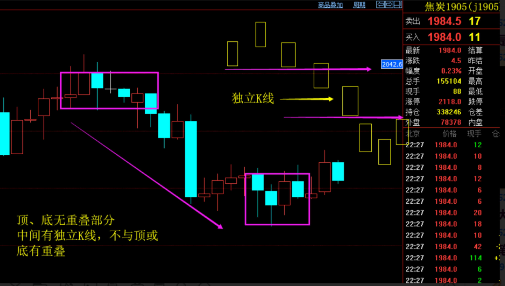
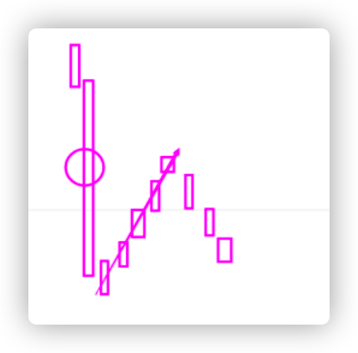

严格笔

**纲要：**

**笔是不可以完全量化的，所以放弃用软件画笔。**

**画笔顺序：先看大级别是否成笔，再看本级别是否成笔，第三看次级别能否递归过来（段内笔）。按顺序来，前面满足了就不用看后面的。**

**画笔是描述波动和延伸的一种基本单位，碰到不清楚不好画按上述原则。小级别要更严格一点。**

**严格笔定义见上文。**

**新人用严格笔，等看清走势之后结合动力学体会再研究不严格笔，甚至在顺势逆势情况灵活组笔。**

**成交量约足，笔效用率越高。例子在于老大可以用老笔分析上证，也会在节假日后一瞬间的高低点作为扩张理解。**

**严格笔讨论见上文，不好判断用波动和延伸原则考虑，还不行这一笔就不画了。**

一 笔定义：每一笔都由一个顶底分型构成，同时顶底分型最高和最低**最好**绝对意义不能重叠（**最好**顶底分型三根K都不重叠最标准)，并且俩分型中间必须有一根K线不同时与顶底分型重叠或重合

***

二、师兄们的理解和讲解分享

证明力度，顶底分型转折后，有一块力度延伸出去了，然后延伸不动又再次转折了。太短还是不合适。看上边字的含义，为的是转折有延伸，延伸等于波动率。这玩意实战到后期，可以模糊下。

首先我们要定义一个A0,A0必定要按严格笔来定义，看日线图的笔，必须要结合次级别去看，次级别是线段了，本级别笔画不出来的情况如何处理？从实战的角度，日线图也是要画笔才行，这样级别才不会乱。而且这个5分、3分图的A0定义非常严格的意义在于，提供波动率，有波动率的结构才有稳定性，有稳定性才能提高操作成功率，这是10倍、20倍资金区县打出来的实战经验。

中间笔最好不要有重叠，特别是在小级别的图上

严格笔最本质是描述波动率，两个最好是对波动率的最接近的量化描述，尽量往两个最好上靠。拿捏不准的时候，就看看波动率是否足够。

**画笔的时候三个级别相互套，先看大级别是否成笔，再看本级别是否成笔，第三看次级别能否递归过来，按顺序来，前面满足了就不用看后面的。

再一个是暴涨暴跌的时候不看外侧，举个例子：

笔段这东西对走势的划分确实影响很大，刚开始还是严格按照定义来比较好，熟悉了以后可以根据实际的走势来划分，怎么对处理走势有帮助就怎么画，但有个前提是级别不能乱。

